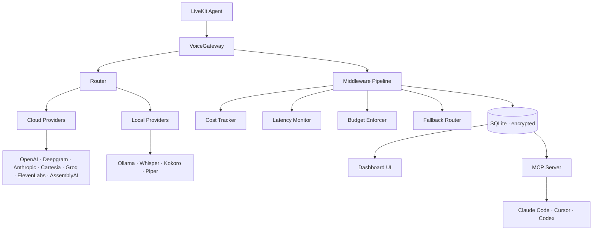

<div align="center">

# VoiceGateway

**Self-hosted inference gateway for voice AI.**
**Unified STT + LLM + TTS routing. Your API keys. Local models included. Agent-managed via MCP.**

[](https://pypi.org/project/voicegateway/)
[](https://www.python.org/downloads/)
[](LICENSE)
[](tests/)

[**Docs**](https://docs.voicegateway.dev) · [**Quick Start**](#quick-start) · [**MCP Setup**](#manage-from-your-coding-agent-mcp) · [**Deploy**](#deploy)

</div>

---

## Why VoiceGateway

Every LLM gateway routes LLMs. None routes the full voice pipeline STT, LLM, and TTS through one unified interface with local model support, project-based budgeting, and agent-native management.

VoiceGateway is that missing layer. Drop-in LiveKit compatibility, bring your own API keys, optional local-only operation, and a first-class MCP server that lets Claude Code, Cursor, or Codex configure it for you.

|                          | LiteLLM | Cloudflare AI Gateway | LiveKit Inference (Cloud) | **VoiceGateway** |
| ------------------------ | :-----: | :-------------------: | :-----------------------: | :--------------: |
| LLM routing              |    ✅   |           ✅          |             ✅            |        ✅        |
| STT routing              |    ❌   |           ❌          |             ✅            |        ✅        |
| TTS routing              |    ❌   |           ❌          |             ✅            |        ✅        |
| Local models             | Partial |           ❌          |             ❌            |        ✅        |
| Self-hostable            |    ✅   |           ❌          |             ❌            |        ✅        |
| Project-based budgets    |    ✅   |           ❌          |             ❌            |        ✅        |
| Fallback chains          | Limited |           ✅          |           Limited         |        ✅        |
| MCP server               |    ❌   |           ❌          |             ❌            |        ✅        |
| LiveKit plugin native    |    ❌   |           ❌          |             ✅            |        ✅        |
| License                  |   MIT   |        Commercial     |         Commercial        |        MIT       |

---

## Deploy

**One command to Fly.io**  public HTTPS URL, persistent storage, MCP-ready.

```bash
git clone https://github.com/mahimailabs/voicegateway
cd voicegateway/deploy/fly
./deploy.sh
```

You get a `*.fly.dev` URL, an MCP endpoint your coding agent can connect to, and encrypted API key storage. Fly uses pay-as-you-go pricing (~$1-3/month for light use; volumes billed even when suspended). [Deployment guide →](deploy/fly/README.md)

**Other options**: Docker Compose locally, Hetzner/Oracle for cheap self-host, or any Docker host. See [docs.voicegateway.dev/guide/installation](https://docs.voicegateway.dev/guide/installation).

---

## Quick Start

### Option 1: pip install (recommended for development)

```bash
pip install "voicegateway[cloud,dashboard,mcp]"

voicegw init              # creates voicegw.yaml
voicegw status            # verify providers
voicegw dashboard         # http://localhost:9090
```

### Option 2: Docker Compose (recommended for self-hosting)

```bash
git clone https://github.com/mahimailabs/voicegateway.git
cd voicegateway
cp .env.example .env      # edit with your API keys
docker compose up -d
open http://localhost:9090
```

### Your first agent

```python
from voicegateway import Gateway
from livekit.agents import AgentSession

gw = Gateway()

session = AgentSession(
    stt=gw.stt("deepgram/nova-3"),
    llm=gw.llm("openai/gpt-4o-mini"),
    tts=gw.tts("cartesia/sonic-3:voice_id"),
)
```

Full tutorial: [docs.voicegateway.dev/guide/first-agent](https://docs.voicegateway.dev/guide/first-agent)

---

## Manage from your coding agent (MCP)

VoiceGateway ships a first-class [Model Context Protocol](https://modelcontextprotocol.io) server. Your Claude Code, Cursor, or Codex instance can configure providers, create projects, check costs, and tail logs all through natural language.

### Local (stdio)

```bash
pip install "voicegateway[mcp]"
claude mcp add voicegateway --command "voicegw mcp --transport stdio"
```

### Remote (HTTP/SSE with bearer auth)

```bash
export VOICEGW_MCP_TOKEN=$(openssl rand -hex 32)
voicegw mcp --transport http --port 8090
```

Then in Claude Code:

```bash
claude mcp add voicegateway \
  --transport sse \
  --url https://your-host.fly.dev/mcp/sse \
  --header "Authorization: Bearer $VOICEGW_MCP_TOKEN"
```

### What you can ask your agent

- "List all my providers"
- "Add Deepgram with API key dg_live_..."
- "Create a project for Tony's Pizza with a $5 daily budget using the premium stack"
- "Show me yesterday's costs for tonys-pizza"
- "What's our P95 TTFB this week?"
- "Delete the dev-testing project" *(agent shows preview, asks for confirmation)*

### 17 tools available

| Category | Tools |
|---|---|
| **Observability** | `get_health`, `get_provider_status`, `get_costs`, `get_latency_stats`, `get_logs` |
| **Providers** | `list_providers`, `get_provider`, `test_provider`, `add_provider`, `delete_provider` |
| **Models** | `list_models`, `register_model`, `delete_model` |
| **Projects** | `list_projects`, `get_project`, `create_project`, `delete_project` |

Destructive operations (`delete_*`) require explicit `confirm=True` the agent receives a preview with impact details first and only deletes after you confirm. [Full tool reference →](https://docs.voicegateway.dev/mcp/)

---

## Projects

Organize agents into projects for per-project budgets and cost tracking:

```yaml
# voicegw.yaml
projects:
  restaurant-agent:
    name: "Restaurant Receptionist"
    description: "AI receptionist for Tony's Pizza"
    default_stack: premium
    daily_budget: 5.00
    budget_action: warn       # warn | throttle | block
    tags: ["production", "client-ian"]

  dev-testing:
    name: "Development Testing"
    default_stack: local
    daily_budget: 0.00
    tags: ["development"]

stacks:
  premium:
    stt: deepgram/nova-3
    llm: openai/gpt-4o-mini
    tts: cartesia/sonic-3
  local:
    stt: local/whisper-large-v3
    llm: ollama/qwen2.5:3b
    tts: local/kokoro
```

Use in code:

```python
gw = Gateway()

# Tag requests with a project for cost attribution
stt = gw.stt("deepgram/nova-3", project="restaurant-agent")

# Or use a named stack (all three modalities at once)
stt, llm, tts = gw.stack("premium", project="restaurant-agent")

# Query project costs
gw.costs("today", project="restaurant-agent")
```

CLI:

```bash
voicegw projects                          # list all projects
voicegw project restaurant-agent          # project details
voicegw costs --project restaurant-agent  # project costs today
voicegw logs --project restaurant-agent   # recent requests
```

[Projects guide →](https://docs.voicegateway.dev/configuration/projects)

---

## Fallback Chains

Automatic failover across providers stay running even when a cloud provider has an outage.

```yaml
# voicegw.yaml
fallbacks:
  stt: [deepgram/nova-3, groq/whisper-large-v3, local/whisper-large-v3]
  llm: [openai/gpt-4o-mini, groq/llama-3.3-70b, ollama/qwen2.5:7b]
  tts: [cartesia/sonic-3, elevenlabs/eleven_turbo_v2_5, local/kokoro]
```

```python
session = AgentSession(
    stt=gw.stt_with_fallback(),
    llm=gw.llm_with_fallback(),
    tts=gw.tts_with_fallback(),
)
```

If Deepgram returns 500s, requests automatically route to Groq. If both fail, local Whisper kicks in. Your agent never goes offline.

---

## Supported Models

**11 providers across cloud and local.** Add more with one line in `voicegw.yaml` or let your coding agent do it via MCP.

### STT

| Model ID | Provider | Type |
|----------|----------|------|
| `deepgram/nova-3` | Deepgram | cloud |
| `deepgram/nova-2-conversationalai` | Deepgram | cloud |
| `assemblyai/universal-2` | AssemblyAI | cloud |
| `openai/whisper-1` | OpenAI | cloud |
| `groq/whisper-large-v3` | Groq | cloud |
| `local/whisper-large-v3` | faster-whisper | **local** |
| `local/whisper-turbo` | faster-whisper | **local** |

### LLM

| Model ID | Provider | Type |
|----------|----------|------|
| `openai/gpt-4.1` | OpenAI | cloud |
| `openai/gpt-4o` | OpenAI | cloud |
| `openai/gpt-4o-mini` | OpenAI | cloud |
| `anthropic/claude-opus-4-7` | Anthropic | cloud |
| `anthropic/claude-sonnet-4-6` | Anthropic | cloud |
| `anthropic/claude-haiku-4-5` | Anthropic | cloud |
| `groq/llama-3.3-70b-versatile` | Groq | cloud |
| `groq/llama-3.1-8b-instant` | Groq | cloud |
| `ollama/qwen2.5:7b` | Ollama | **local** |
| `ollama/qwen2.5:3b` | Ollama | **local** |
| `ollama/llama3.2:3b` | Ollama | **local** |

### TTS

| Model ID | Provider | Type |
|----------|----------|------|
| `cartesia/sonic-3` | Cartesia | cloud |
| `elevenlabs/eleven_turbo_v2_5` | ElevenLabs | cloud |
| `elevenlabs/eleven_flash_v2_5` | ElevenLabs | cloud |
| `deepgram/aura-2` | Deepgram | cloud |
| `openai/tts-1-hd` | OpenAI | cloud |
| `local/kokoro` | Kokoro ONNX | **local** |
| `local/piper` | Piper | **local** |

Full reference: [docs.voicegateway.dev/configuration/providers](https://docs.voicegateway.dev/configuration/providers)

---

## Architecture



[Architecture deep dive →](https://docs.voicegateway.dev/architecture/)

---

## Dashboard

A self-hosted web UI at `http://localhost:9090` with:

- **Overview** - total requests, cost today, active models, project summary cards
- **Settings** - add/edit providers, register models, manage general config with Source badges (YAML vs Custom vs Env)
- **Projects** - full CRUD with budget gauges, cost charts, recent requests per project
- **Costs** - daily spend with per-provider/model/project breakdown
- **Latency** - P50/P95/P99 TTFB and total latency per model
- **Logs** - recent requests with filters for project, modality, status

API keys are encrypted with Fernet before storage. The sidebar project switcher filters every page.

<!-- Screenshot: Settings page with Providers tab (see https://github.com/mahimailabs/voicegateway/issues) -->

---

## HTTP API

```bash
voicegw serve --port 8080
```

| Endpoint | Purpose |
|----------|---------|
| `GET /health` | Health check |
| `GET /v1/status` | Provider health + model count |
| `GET /v1/models` | List registered models |
| `GET /v1/providers` + CRUD | Manage providers |
| `GET /v1/projects` + CRUD | Manage projects |
| `GET /v1/costs?period=today&project=X` | Cost summary |
| `GET /v1/latency?period=week` | Latency stats |
| `GET /v1/logs?project=X&modality=stt` | Request logs |
| `GET /v1/audit-log` | Config change history |
| `GET /v1/metrics` | Prometheus-format metrics |

Full reference: [docs.voicegateway.dev/api/http-api](https://docs.voicegateway.dev/api/http-api)

---

## Installation

```bash
# Core engine
pip install voicegateway

# With web dashboard
pip install "voicegateway[dashboard]"

# With cloud providers (OpenAI, Deepgram, Anthropic, etc.)
pip install "voicegateway[cloud]"

# With local model runtimes (Whisper, Kokoro, Piper)
pip install "voicegateway[local]"

# With MCP server for agent management
pip install "voicegateway[mcp]"

# Everything
pip install "voicegateway[all,dashboard,mcp]"
```

Python 3.11+. MCP extra pulls in `mcp>=1.2.0`. Local extras pull larger ML runtimes.

---

## Docker Compose

```yaml
services:
  voicegateway:
    image: mahimailabs/voicegateway:latest
    ports: ["8080:8080"]
    env_file: .env
    volumes:
      - ./voicegw.yaml:/app/voicegw.yaml:ro
      - voicegw_data:/data

  dashboard:
    image: mahimailabs/voicegateway-dashboard:latest
    ports: ["9090:9090"]
    depends_on: [voicegateway]

  # Optional: local LLM with Ollama
  ollama:
    image: ollama/ollama
    profiles: [local]
    ports: ["11434:11434"]
```

```bash
docker compose up -d                      # core + dashboard
docker compose --profile local up -d      # + Ollama for local LLMs
docker exec voicegateway-ollama ollama pull qwen2.5:3b
```

---

## Contributing

We welcome provider additions, bug fixes, and documentation improvements.

```bash
git clone https://github.com/mahimailabs/voicegateway
cd voicegateway
pip install -e ".[all,dashboard,mcp,dev]"
pytest
```

**Add a provider** (10-step guide): [docs.voicegateway.dev/contributing/adding-a-provider](https://docs.voicegateway.dev/contributing/adding-a-provider)

Before submitting a PR, please read [CONTRIBUTING.md](https://docs.voicegateway.dev/contributing/) and [CODE_OF_CONDUCT.md](CODE_OF_CONDUCT.md).

---

## License

MIT © [Mahimai Labs](https://github.com/mahimailabs)


Built on the shoulders of giants: [LiveKit Agents](https://github.com/livekit/agents), [FastAPI](https://fastapi.tiangolo.com/), [Pydantic](https://docs.pydantic.dev/), [cryptography](https://cryptography.io/), [Model Context Protocol](https://modelcontextprotocol.io/).