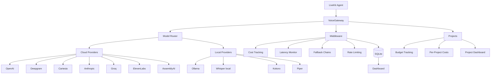

# VoiceGateway

**Self-hosted inference gateway for voice AI. One config. Any provider. Local models included.**

**Full docs: [docs.voicegateway.dev](https://docs.voicegateway.dev)**

A drop-in routing layer that gives self-hosters the same `provider/model` developer experience as LiveKit Inference Cloud — but with *your* API keys, local models (Ollama, Whisper, Kokoro, Piper), automatic fallback chains, project-based cost tracking, and a web dashboard.

---

## Quick Start (Docker Compose)

```bash
# 1. Clone
git clone https://github.com/mahimailabs/voicegateway.git
cd voicegateway

# 2. Configure
cp .env.example .env
# Edit .env with your API keys

# 3. Start everything
docker compose up -d

# 4. Open the dashboard
open http://localhost:9090

# 5. (Optional) Start with local LLM
docker compose --profile local up -d
docker exec voicegateway-ollama ollama pull qwen2.5:3b
```

## Installation

**Core engine (recommended):**
```bash
pip install voicegateway
```

**With web dashboard:**
```bash
pip install "voicegateway[dashboard]"
```

**With all cloud providers:**
```bash
pip install "voicegateway[cloud]"
```

**Everything:**
```bash
pip install "voicegateway[all,dashboard]"
```

## Quick Start (pip install)

```bash
pip install "voicegateway[cloud,dashboard]"

voicegw init              # creates voicegw.yaml
# edit voicegw.yaml with your API keys
voicegw status            # check provider status
voicegw dashboard         # http://localhost:9090
```

Then in your agent:

```python
from voicegateway import Gateway
from livekit.agents import AgentSession, Agent

gw = Gateway()

session = AgentSession(
    stt=gw.stt("deepgram/nova-3"),
    llm=gw.llm("openai/gpt-4.1-mini"),
    tts=gw.tts("cartesia/sonic-3:voice_id"),
)
```

---

## Manage from your coding agent (MCP)

VoiceGateway ships a first-class Model Context Protocol (MCP) server. Your
Claude Code, Cursor, or Codex instance can manage the gateway conversationally —
list providers, add API keys, register models, create projects, inspect
costs and latency, tail logs.

**Install:**

```bash
pip install "voicegateway[mcp]"
```

**Claude Code:**

```bash
claude mcp add voicegateway --command "voicegw mcp --transport stdio"
```

Now in Claude Code you can say things like:

- "List all my providers"
- "Add Deepgram with API key dg_live_..."
- "Create a project for Tony's Pizza with a $5 daily budget using the premium stack"
- "Show me yesterday's costs for tonys-pizza"
- "What's our P95 TTFB this week?"

**Remote / team deployment (HTTP/SSE):**

```bash
export VOICEGW_MCP_TOKEN=$(openssl rand -hex 32)
voicegw mcp --transport http --port 8090
```

Then point your agent's MCP config at `http://your-host:8090/sse` with the
token as a bearer header.

**Available tools (17):** `get_health`, `get_provider_status`, `get_costs`,
`get_latency_stats`, `list_providers`, `get_provider`, `test_provider`,
`add_provider`, `delete_provider`, `list_models`, `register_model`,
`delete_model`, `list_projects`, `get_project`, `create_project`,
`delete_project`, `get_logs`.

Destructive operations (`delete_*`) require an explicit `confirm=True` — the
agent first receives a preview with impact details, shows it to you, and
only deletes after you confirm.

Full tool reference in [`docs/mcp.md`](docs/mcp.md).

---

## Architecture



---

## Projects

Organize agents into projects for per-project cost tracking and budgets:

```yaml
# voicegw.yaml
projects:
  restaurant-agent:
    name: "Restaurant Receptionist"
    description: "AI receptionist for Tony's Pizza"
    default_stack: premium
    daily_budget: 5.00
    tags: ["production", "client-ian"]

  dev-testing:
    name: "Development Testing"
    default_stack: local
    daily_budget: 0.00
    tags: ["development"]

stacks:
  premium:
    stt: deepgram/nova-3
    llm: openai/gpt-4.1-mini
    tts: cartesia/sonic-3
  local:
    stt: local/whisper-large-v3
    llm: ollama/qwen2.5:3b
    tts: local/kokoro
```

Use in code:

```python
gw = Gateway()

# Tag requests with a project
stt = gw.stt("deepgram/nova-3", project="restaurant-agent")

# Or use a named stack
stt, llm, tts = gw.stack("premium", project="restaurant-agent")

# Query project costs
gw.costs("today", project="restaurant-agent")
```

CLI:

```bash
voicegw projects                          # list all projects
voicegw project restaurant-agent          # project details
voicegw costs --project restaurant-agent  # project costs
voicegw logs --project restaurant-agent   # project logs
```

---

## Supported Models

### STT

| Model ID | Provider | Type |
|----------|----------|------|
| `deepgram/nova-3` | Deepgram | cloud |
| `deepgram/nova-2` | Deepgram | cloud |
| `assemblyai/universal-2` | AssemblyAI | cloud |
| `openai/whisper-1` | OpenAI | cloud |
| `groq/whisper-large-v3` | Groq | cloud |
| `local/whisper-large-v3` | faster-whisper | **local** |
| `local/whisper-turbo` | faster-whisper | **local** |
| `local/whisper-base` | faster-whisper | **local** |

### LLM

| Model ID | Provider | Type |
|----------|----------|------|
| `openai/gpt-4.1-mini` | OpenAI | cloud |
| `openai/gpt-4o` | OpenAI | cloud |
| `openai/gpt-4o-mini` | OpenAI | cloud |
| `anthropic/claude-3.5-sonnet` | Anthropic | cloud |
| `groq/llama-3.1-70b` | Groq | cloud |
| `groq/llama-3.1-8b` | Groq | cloud |
| `ollama/qwen2.5:3b` | Ollama | **local** |
| `ollama/qwen2.5:7b` | Ollama | **local** |
| `ollama/llama3.2:3b` | Ollama | **local** |
| `ollama/phi4-mini` | Ollama | **local** |

### TTS

| Model ID | Provider | Type |
|----------|----------|------|
| `cartesia/sonic-3` | Cartesia | cloud |
| `elevenlabs/eleven_turbo_v2_5` | ElevenLabs | cloud |
| `deepgram/aura-2` | Deepgram | cloud |
| `openai/tts-1` | OpenAI | cloud |
| `local/kokoro` | Kokoro ONNX | **local** |
| `local/piper` | Piper | **local** |

---

## Fallback Chains

```yaml
fallbacks:
  stt: [deepgram/nova-3, groq/whisper-large-v3, local/whisper-large-v3]
  llm: [openai/gpt-4.1-mini, groq/llama-3.1-70b, ollama/qwen2.5:3b]
  tts: [cartesia/sonic-3, elevenlabs/eleven_turbo_v2_5, local/kokoro]
```

```python
session = AgentSession(
    stt=gw.stt_with_fallback(),
    llm=gw.llm_with_fallback(),
    tts=gw.tts_with_fallback(),
)
```

---

## HTTP API (`voicegw serve`)

```bash
voicegw serve --port 8080
```

| Endpoint | Description |
|----------|-------------|
| `GET /health` | Health check |
| `GET /v1/status` | Provider health |
| `GET /v1/models` | Available models |
| `GET /v1/costs?period=today&project=X` | Cost summary |
| `GET /v1/projects` | Project list with stats |
| `GET /v1/projects/:id` | Project details |
| `GET /v1/logs?project=X&modality=stt` | Request logs |
| `GET /v1/metrics` | Prometheus metrics |

---

## Dashboard

`voicegw dashboard` starts a web UI on port 9090 with Neo-Brutalism styling:

- **Overview** — total requests, cost today, active models; project summary cards
- **Models** — every configured model with provider and status
- **Costs** — daily cost, per-provider/model/project breakdown
- **Latency** — TTFB/total per model, P50/P95/P99
- **Logs** — recent requests with modality and project filters

The sidebar includes a **project switcher** — selecting a project filters every page.

---

## Docker Compose

| Service | Port | Description |
|---------|------|-------------|
| `voicegateway` | 8080 | HTTP API + model router |
| `dashboard` | 9090 | Web dashboard |
| `ollama` (optional) | 11434 | Local LLM (start with `--profile local`) |

```bash
docker compose up -d                        # API + dashboard
docker compose --profile local up -d        # + Ollama
```

Config: `./voicegw.yaml` mounted read-only. API keys in `.env`.

---

## Comparison with LiveKit Inference

| Feature | LiveKit Inference (Cloud) | VoiceGateway (self-host) |
|---------|---------------------------|--------------------------|
| `provider/model` string interface | Yes | **Yes** |
| Cloud providers | Managed by LiveKit | Bring your own API keys |
| Local models (Ollama, Whisper, Kokoro) | No | **Yes** |
| Project-based organization | No | **Yes** |
| Cost tracking | Per-account | **Per-request, per-project** |
| Fallback chains | Limited | **Fully configurable** |
| Dashboard | LiveKit Cloud UI | **Self-hosted** |
| Docker Compose | N/A | **One command** |
| Works offline | No | **Yes (with local models)** |
| License | Commercial | **MIT** |

---

## Contributing

```bash
pip install -e ".[dev]"
pytest
```

To add a new provider: see `voicegateway/core/registry.py` and `CLAUDE.md`.

---

## License

MIT
