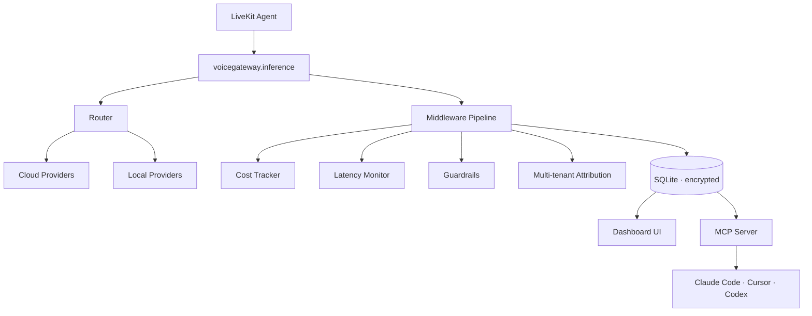

<div align="center">

# 🎙️ VoiceGateway

**Voice AI cost transparency. Self-hosted, on your keys.**

Drop-in for `livekit.agents.inference`. Per-call cost rows, voice metrics, conversation replay, multi-tenant attribution, cross-modality routing, voice guardrails. All open source.

[](https://pypi.org/project/voicegateway)
[](LICENSE)
[](https://www.python.org)
[](https://docs.livekit.io/agents)
[](https://github.com/mahimailabs/voicegateway/actions/workflows/test-coverage.yml)
[](https://github.com/mahimailabs/voicegateway/stargazers)

[**🚀 Install in 60 seconds**](#-install-in-60-seconds) · [**📚 Docs**](https://voicegateway.mahimai.ca/docs) · [**📊 Dashboard**](#-the-dashboard) · [**🎯 Roadmap**](#-up-next) · [**🤝 Contributing**](CONTRIBUTING.md)

</div>

```python
from livekit.agents import AgentSession
from voicegateway import inference          # <- the only line that changed

session = AgentSession(
    stt=inference.STT("deepgram/nova-3"),
    llm=inference.LLM("openai/gpt-4o-mini"),
    tts=inference.TTS("cartesia/sonic-3"),
)
# every call logged: provider, model, tokens, $cost, latency, session_id
```

A drop-in cost and quality observability layer for [LiveKit Agents](https://docs.livekit.io/agents). Modality-aware unit accounting (audio-minutes, tokens, characters) with LLM prices from [pydantic/genai-prices](https://github.com/pydantic/genai-prices). Reconcile recorded numbers against your actual provider invoices with one command. Self-hosted. Your keys. No data leaves your infra.

## 🚀 Install in 60 seconds

```sh
curl -fsSL https://voicegateway.mahimai.ca/install.sh | bash
voicegw onboard --install-daemon
```

The installer detects your OS, ensures Python 3.11+ and `pipx`, installs `voicegateway[cloud,dashboard]`, runs a five-question wizard, validates your provider key, and registers a per-user daemon (LaunchAgent / systemd / Scheduled Task). Open the dashboard at `http://localhost:9090` to see your first cost row land.

If [`uv`](https://docs.astral.sh/uv/) is already on your PATH, the installer auto-detects it and uses `uv tool install` instead of pipx. Same `~/.local/bin/voicegw` outcome, faster cold install.

Prefer manual install? `pipx install "voicegateway[cloud,dashboard,mcp]"` then `voicegw init && voicegw dashboard`.

## 🎯 Why VoiceGateway

Voice AI vendors hide three numbers. VoiceGateway exposes them.

**Is this working?** Voice has metrics text stacks do not: latency p50/p95 across the STT → LLM → TTS loop, interruption rate, dead air, talk-over. The dashboard shows all of them per call.

**What does it cost?** STT bills by audio seconds, LLM bills by tokens, TTS bills by characters. Every call is broken down by modality and totaled to the cent. Run `voicegw reconcile` to verify recorded numbers against your actual provider invoices.

**How do I make it cheaper?** Route by combined STT + LLM + TTS latency budget across providers. Switch models per call type. Per-tenant cost attribution so agency clients see only their own usage.

If you are building a text-only LLM application without a voice component, [LiteLLM](https://docs.litellm.ai/) is likely a better fit. See the [decision tree](https://voicegateway.mahimai.ca/docs/guide/decision-tree).

## 📦 What ships now

Every capability lands as a minor version. Same Python API across all of them.

| Version | Capability | What it gives you |
|:---:|:---|:---|
| **v0.0.5** | LiveKit Cloud parity | Drop-in for `livekit.agents.inference`. Your keys, your config |
| **v0.1.0** | Daemon-first onboarding | Curl-bash install, OS daemon, five-question wizard, `voicegw doctor` |
| **v0.1.1** | Terminal UI | `voicegw tui` opens a vim-key Textual UI for SSH-in inspection |
| **v0.1.2** | Project polish | Subpackage refactor, CHANGELOG, CONTRIBUTING, SECURITY, public-API discipline |
| **v0.2.0** | Voice-conversation metrics | Per-minute cost, latency p50/p95, interruptions, dead air, talk-over |
| **v0.3.0** | Conversation replay | Scrub any past call. STT chunks, LLM tokens, TTS frames with timing and cost |
| **v0.4.0** | Multi-tenant attribution | Per-tenant cost, virtual API keys per team, agency-ready |
| **v0.5.0** | Cross-modality routing | Route by combined STT + LLM + TTS latency budget. Per-project rosters. White-label branding |
| **v0.6.0** | Voice-specific guardrails | Real-time PII detection in STT, prompt-injection detection, compliance hooks |

Full per-version detail: [CHANGELOG.md](CHANGELOG.md).

## 🚧 Up next

| Version | Capability | Status |
|:---:|:---|:---:|
| **v0.7.0** | Enterprise auth, audit log, SOC 2 prep | 🟡 In flight |
| **v0.8.0** | One-tap latency probe | ⚪ Planned |
| **v1.0.0** | Stability commitment, LTS branch policy | ⚪ Planned |

## 📊 The dashboard

A self-hosted web UI at `http://localhost:9090`. Bundled. No SaaS account. No data leaves your stack.

- **Overview** — total requests, cost today, active models, per-project summary cards
- **Costs** — daily spend with per-provider / model / project / tenant breakdown
- **Sessions** — every call, every cost row, routing decisions, budget overruns
- **Metrics** — p50/p95/p99 latency, interruption rate, dead air, talk-over
- **Replay** — scrub through STT chunks, LLM tokens, TTS frames with timing
- **Routing** — live per-provider latency observations, sortable
- **Virtual Keys** — issue + revoke per-team scoped keys
- **Guardrails** — PII / prompt-injection counts per project, session drilldown
- **Settings** — providers, projects, branding (logo, accent color, product name)

White-label brand support since v0.5.0: upload a logo, pick an accent color, set a product name; the whole dashboard re-skins for your project.

## 🤖 Manage from your coding agent (MCP)

VoiceGateway ships a first-class [Model Context Protocol](https://modelcontextprotocol.io) server. Claude Code, Cursor, Codex, Cline can configure providers, create projects, check costs, and tail logs through natural language.

**Local (stdio):**

```bash
pipx inject voicegateway "voicegateway[mcp]"
claude mcp add voicegateway --command "voicegw mcp --transport stdio"
```

**Remote (HTTP/SSE with bearer auth):**

```bash
export VOICEGW_MCP_TOKEN=$(openssl rand -hex 32)
voicegw mcp --transport http --port 8090
```

```bash
claude mcp add voicegateway \
  --transport sse \
  --url https://your-host.fly.dev/mcp/sse \
  --header "Authorization: Bearer $VOICEGW_MCP_TOKEN"
```

17 tools exposed: observability, providers, models, projects. Destructive ops (`delete_*`) require explicit `confirm=True` after a preview. [Full MCP reference →](https://voicegateway.mahimai.ca/docs/mcp/)

## 🛠️ Supported providers

11 providers across cloud and local. Mix and match per call.

| Modality | Cloud | Local |
|:---|:---|:---|
| **STT** | Deepgram, OpenAI Whisper, AssemblyAI, Groq, Cartesia | `faster-whisper` |
| **LLM** | OpenAI, Anthropic, Groq | Ollama (any compatible) |
| **TTS** | Cartesia, ElevenLabs, Deepgram Aura-2, OpenAI | Kokoro, Piper |
| **VAD** | Silero | Silero |
| **Turn detector** | LiveKit MultilingualModel | — |

Per-model IDs: [voicegateway.mahimai.ca/docs/configuration/providers](https://voicegateway.mahimai.ca/docs/configuration/providers). Adding a provider takes ~10 steps: [contributing/adding-a-provider](https://voicegateway.mahimai.ca/docs/contributing/adding-a-provider).

## 🧱 Architecture


```mermaid
flowchart TB
    A[LiveKit Agent] --> B[voicegateway.inference]
    B --> C[Router]
    C --> D[Cloud Providers]
    C --> E[Local Providers]
    B --> F[Middleware Pipeline]
    F --> F1[Cost Tracker]
    F --> F2[Latency Monitor]
    F --> F3[Guardrails]
    F --> F4[Multi-tenant Attribution]
    F --> G[(SQLite · encrypted)]
    G --> H[Dashboard UI]
    G --> I[MCP Server]
    I --> J[Claude Code · Cursor · Codex]
```

Async throughout. Modular provider installs: `pip install "voicegateway[openai,deepgram]"` pulls only what you use. YAML config with `${ENV_VAR}` substitution. SQLite at the bottom for portability; encrypted with Fernet at rest.

[Architecture deep dive →](https://voicegateway.mahimai.ca/docs/architecture/)

## 🐳 Docker Compose

```yaml
services:
  voicegateway:
    image: mahimailabs/voicegateway:latest
    ports: ["8080:8080"]
    env_file: .env
    volumes:
      - ./voicegw.yaml:/app/voicegw.yaml:ro
      - voicegw_data:/data

  dashboard:
    image: mahimailabs/voicegateway-dashboard:latest
    ports: ["9090:9090"]
    depends_on: [voicegateway]
```

```bash
docker compose up -d                      # core + dashboard
docker compose --profile local up -d      # + Ollama for local LLMs
```

## 🌐 HTTP API

```bash
voicegw serve --port 8080
```

| Endpoint | Purpose |
|----------|---------|
| `GET /health` | Health check |
| `GET /v1/status` | Provider health + model count |
| `GET /v1/models` · `GET /v1/providers` · `GET /v1/projects` | Resource CRUD |
| `GET /v1/costs?period=today&project=X&tenant=Y` | Cost summary |
| `GET /v1/sessions/{id}/turns` · `/v1/sessions/{id}/replay` · `/v1/sessions/{id}/dead_air` | Voice-conversation surfaces (v0.2+) |
| `GET /v1/routing/observations` | Live per-provider latency (v0.5+) |
| `GET /v1/virtual_keys` + CRUD | Per-team scoped keys (v0.4+) |
| `GET /v1/audit-log` · `GET /v1/metrics` | Audit + Prometheus metrics |

Full reference: [voicegateway.mahimai.ca/docs/api/http-api](https://voicegateway.mahimai.ca/docs/api/http-api).

## 📦 Install options

```bash
pip install voicegateway                              # core engine
pip install "voicegateway[dashboard]"                 # + web UI
pip install "voicegateway[cloud]"                     # + cloud provider plugins
pip install "voicegateway[local]"                     # + local runtimes (Whisper, Kokoro, Piper)
pip install "voicegateway[mcp]"                       # + MCP server
pip install "voicegateway[tui]"                       # + voicegw tui
pip install "voicegateway[all,dashboard,mcp,tui]"     # everything
```

Python 3.11+. Local extras pull larger ML runtimes.

**Zero-install one-shot ([uvx](https://uvx.sh)).** For CI smoke tests, status checks, or quick runs without a persistent install:

```bash
uvx --from "voicegateway[cloud]" voicegw status
uvx --from "voicegateway[cloud,dashboard]" voicegw serve --port 8080
```

uvx pulls the wheel into a throwaway environment per run; uv's wheel cache makes second runs fast. Pin a version in scripts (`uvx --from "voicegateway[cloud]==0.5.0" voicegw status`) to avoid surprise upgrades. Not for daemon mode: uvx cannot register a LaunchAgent / systemd unit; use the [curl-bash installer](#-install-in-60-seconds) for the persistent flow.

## 📚 Docs

Full documentation: [voicegateway.mahimai.ca/docs](https://voicegateway.mahimai.ca/docs).

Quick links: [Quick start](https://voicegateway.mahimai.ca/docs/guide/quick-start) · [First agent](https://voicegateway.mahimai.ca/docs/guide/first-agent) · [Projects](https://voicegateway.mahimai.ca/docs/configuration/projects) · [Configuration](https://voicegateway.mahimai.ca/docs/configuration/voicegw-yaml) · [CLI reference](https://voicegateway.mahimai.ca/docs/cli) · [Migration from LiveKit Cloud Inference](https://voicegateway.mahimai.ca/docs/migration/from-livekit-inference) · [Decision tree](https://voicegateway.mahimai.ca/docs/guide/decision-tree)

## 🤝 Contributing

Issues and PRs welcome. We follow a Refinery → Foundry → Ralph workflow to plan each minor version (specs live in Linear; the SDK code lives here).

```bash
git clone https://github.com/mahimailabs/voicegateway
cd voicegateway
pip install -e ".[all,dashboard,mcp,dev]"
pytest
```

Before submitting a PR, read [CONTRIBUTING.md](CONTRIBUTING.md) and [CODE_OF_CONDUCT.md](CODE_OF_CONDUCT.md). Security issues go through the disclosure flow in [SECURITY.md](SECURITY.md), not a public issue.

## ⭐ Stargazers and contributors

[](https://star-history.com/#mahimailabs/voicegateway&Date)

<a href="https://github.com/mahimailabs/voicegateway/graphs/contributors">
  
</a>

## 📜 License

[MIT](LICENSE). Fork it, ship it.

## 🙌 Built by

[Mahimai Raja](https://mahimai.dev), founder of [Mahimai AI](https://mahimai.ca), a voice AI company. Building VoiceGateway in public, one minor version at a time.

Built on the shoulders of giants: [LiveKit Agents](https://github.com/livekit/agents), [FastAPI](https://fastapi.tiangolo.com/), [Pydantic](https://docs.pydantic.dev/), [pydantic/genai-prices](https://github.com/pydantic/genai-prices), [cryptography](https://cryptography.io/), [Model Context Protocol](https://modelcontextprotocol.io/).
