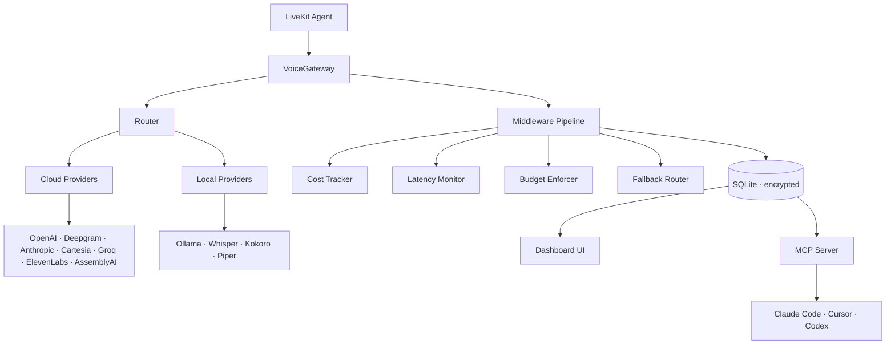

<div align="center">

# VoiceGateway

**Cost tracking and reconciliation for LiveKit voice agents.**
**Modality-aware unit accounting (audio-minutes, tokens, characters). LLM prices from [`pydantic/genai-prices`](https://github.com/pydantic/genai-prices). Verify against provider invoices with `voicegw reconcile`.**

[](https://pypi.org/project/voicegateway/)
[](https://www.python.org/downloads/)
[](LICENSE)
[](https://github.com/mahimailabs/voicegateway/actions/workflows/test-coverage.yml)
[](https://codecov.io/gh/mahimailabs/voicegateway)

[**Docs**](https://docs.voicegateway.dev) · [**Quick Start**](#quick-start) · [**MCP Setup**](#manage-from-your-coding-agent-mcp) · [**Deploy**](#deploy)

</div>

---

## Why VoiceGateway

VoiceGateway is purpose-built for LiveKit voice agents. Five things make it different from general-purpose LLM gateways. v0.1.0 (current) ships a daemon-first onboarding flow: one curl command, a five-question wizard, your first provider call lands in the dashboard inside 60 seconds.

### 1. One-line drop-in for `livekit.agents.inference`

`voicegateway.inference.STT/LLM/TTS` mirror LiveKit's inference module signature for signature. Swap the import line, point your YAML at your provider keys, and the rest of your agent code works unchanged.

```python
from livekit.agents import AgentSession
from voicegateway import inference          # <- the only line that changed

session = AgentSession(
    stt=inference.STT("deepgram/nova-3"),
    llm=inference.LLM("openai/gpt-4o-mini"),
    tts=inference.TTS("cartesia/sonic-3"),
)
```

Per-conversation cost, latency, and session correlation are recorded transparently. Pick a project explicitly with `inference.set_project("my-app")` or set `default_project: my-app` in `voicegw.yaml`; otherwise requests fall through to the auto-created `default` project.

### 2. Modality-aware unit accounting

LLM cost is per-1k-token, STT cost is per-audio-minute, TTS cost is per-character. Each modality is billed natively against its own provider unit rather than flattened to a single token-equivalent.

LLM prices come from [`pydantic/genai-prices`](https://github.com/pydantic/genai-prices): 1,100+ models, monthly releases, historic price tracking. VG does not maintain its own LLM pricing catalog. STT and TTS prices live in a local catalog with an explicit `pricing_source_date` per entry; CI fails when any entry is more than 60 days old, forcing a manual refresh per release.

### 3. Reconciliation tooling

```bash
voicegw export-costs --start 2026-04-01 --end 2026-04-30 --format csv
voicegw reconcile --provider openai --provider-usage-file openai-usage.csv
```

Per-request line items carry `pricing_source` attribution (`genai-prices@<version>` for LLM, `voicegateway-catalog@<date>` for STT/TTS). The `reconcile` command compares VG's logged costs against your provider's usage export and produces a per-model diff. LLM costs are estimated and may drift up to ~5%; reconciliation against your provider invoice is the verification path.

### 4. MCP server for agent-managed configuration

A first-class [Model Context Protocol](https://modelcontextprotocol.io) server exposes 17 tools (configure providers, create projects with daily budgets, query costs, tail logs, run health checks) over stdio and HTTP/SSE. Claude Code, Cursor, Codex, and Cline can all manage your gateway conversationally.

### 5. Voice-specific guardrails

Project policies can add LLM-side guardrails for `pii`, `financial`, `medical`, `prompt_injection`, and `off_topic` categories. Guardrails stay in the LiveKit drop-in path: `voicegateway.inference.LLM.chat(...)` appends a versioned prompt block, registers the reserved `report_guardrail_action` tool, and writes audit events without changing how you construct `AgentSession`.

```yaml
projects:
  support:
    guardrails:
      enabled: true
      categories:
        pii: redact
        prompt_injection: block
```

Use `voicegw guardrails show|set|clear|dry-run --project <id>` to manage policies from the CLI, or use the Dashboard Guardrails page for counts and session drilldown.

**Is VoiceGateway right for you?** If you are building a text-only LLM application without a voice component, [LiteLLM](https://docs.litellm.ai/) is likely a better fit. It has a broader LLM-provider catalog and an OpenAI-compatible HTTP proxy. See the [decision tree](https://docs.voicegateway.dev/guide/decision-tree) for a longer breakdown.

---

## Deploy

**One command to Fly.io**  public HTTPS URL, persistent storage, MCP-ready.

```bash
git clone https://github.com/mahimailabs/voicegateway
cd voicegateway/deploy/fly
./deploy.sh
```

You get a `*.fly.dev` URL, an MCP endpoint your coding agent can connect to, and encrypted API key storage. Fly uses pay-as-you-go pricing (~$1-3/month for light use; volumes billed even when suspended). [Deployment guide →](deploy/fly/README.md)

**Other options**: Docker Compose locally, Hetzner/Oracle for cheap self-host, or any Docker host. See [docs.voicegateway.dev/guide/installation](https://docs.voicegateway.dev/guide/installation).

---

## Quick Start

### Option 1: One-line install (recommended)

```bash
curl -fsSL https://voicegateway.mahimai.ca/install.sh | bash
voicegw onboard --install-daemon
```

The installer detects your OS (macOS / Linux / WSL), refuses cleanly if Python 3.11+ is missing, ensures `pipx` is on PATH, then `pipx install voicegateway[cloud,dashboard]`. The wizard collects project / provider / API key / port / install-daemon, validates the key against the upstream API, registers a per-user daemon (LaunchAgent / systemd `--user` / Scheduled Task), and offers an end-to-end smoke test.

For ad-hoc operations once the daemon is running:

```bash
voicegw status            # daemon + provider status
voicegw doctor            # ten-check punch list with fix steps
voicegw start / stop / restart
voicegw uninstall-daemon  # remove registration; preserves config + DB
voicegw tui               # four-tab terminal UI (Sessions / Costs / Logs / Providers)
```

`voicegw tui` opens a Textual-based terminal UI with vim navigation: live monitoring of sessions, costs, logs, and providers without leaving the shell. Polls the daemon at 1 s in Gateway mode (default), or pass `--local` for read-only inspection of the SQLite call DB when the daemon is down. Install the extra with `pipx inject voicegateway "voicegateway[tui]"` after the one-line install, or include it directly in any manual `pip install` (`pip install "voicegateway[tui]"`). [Full reference →](https://docs.voicegateway.dev/cli/tui)

If you prefer to skip the curl-bash one-liner, run the same `pipx` step manually:

```bash
pipx install "voicegateway[cloud,dashboard,mcp]"
voicegw onboard --install-daemon
```

For pip-based installs (e.g. inside an existing virtualenv):

```bash
pip install "voicegateway[cloud,dashboard,mcp]"
voicegw init              # creates voicegw.yaml
voicegw status            # verify providers
voicegw dashboard         # http://localhost:9090
```

### Option 2: Docker (production-ready)

Pull the official image from Docker Hub (no build required):

```bash
docker run -p 8080:8080 \
  -v $(pwd)/voicegw-data:/data \
  -e OPENAI_API_KEY=sk-... \
  -e DEEPGRAM_API_KEY=dg_... \
  mahimairaja/voicegateway:latest
```

Multi-arch images for `linux/amd64` and `linux/arm64`.
[Docker Hub →](https://hub.docker.com/r/mahimairaja/voicegateway)

### Option 3: Docker Compose (recommended for self-hosting)

```yaml
# docker-compose.yml
services:
  voicegateway:
    image: mahimairaja/voicegateway:latest
    ports: ["8080:8080"]
    volumes: ["./voicegw-data:/data"]
    env_file: .env

  dashboard:
    image: mahimairaja/voicegateway-dashboard:latest
    ports: ["9090:9090"]
    volumes: ["./voicegw-data:/data:ro"]
    depends_on: [voicegateway]
```

```bash
cp .env.example .env      # edit with your API keys
docker compose up -d
open http://localhost:9090
```

### Your first agent

The example below runs a LiveKit Agents worker. You need a LiveKit server and credentials before it will connect.

**LiveKit Cloud (free tier):** sign up at [livekit.io](https://livekit.io/), create a project, and copy the URL plus API key and secret from project settings.

**Self-hosted (local dev):**

```bash
docker run --rm -p 7880:7880 -p 7881:7881 -p 7882:7882/udp \
  livekit/livekit-server --dev
```

Default keys are `devkey` / `secret`. Full self-host guide: [livekit.io self-hosting](https://docs.livekit.io/home/self-hosting/local/).

Install the agents SDK and export credentials:

```bash
pip install livekit-agents
export LIVEKIT_URL=wss://<project>.livekit.cloud   # or ws://localhost:7880
export LIVEKIT_API_KEY=<key>                       # `devkey` for local --dev
export LIVEKIT_API_SECRET=<secret>                 # `secret` for local --dev
```

Without these the agent fails with `ConnectionError: Failed to connect`.

```python
from livekit.agents import AgentSession
from voicegateway import inference

session = AgentSession(
    stt=inference.STT("deepgram/nova-3"),
    llm=inference.LLM("openai/gpt-4o-mini"),
    tts=inference.TTS("cartesia/sonic-3:voice_id"),
)
```

Full tutorial: [docs.voicegateway.dev/guide/first-agent](https://docs.voicegateway.dev/guide/first-agent)

---

## Manage from your coding agent (MCP)

VoiceGateway ships a first-class [Model Context Protocol](https://modelcontextprotocol.io) server. Your Claude Code, Cursor, or Codex instance can configure providers, create projects, check costs, and tail logs all through natural language.

### Local (stdio)

```bash
pip install "voicegateway[mcp]"
claude mcp add voicegateway --command "voicegw mcp --transport stdio"
```

### Remote (HTTP/SSE with bearer auth)

```bash
export VOICEGW_MCP_TOKEN=$(openssl rand -hex 32)
voicegw mcp --transport http --port 8090
```

Then in Claude Code:

```bash
claude mcp add voicegateway \
  --transport sse \
  --url https://your-host.fly.dev/mcp/sse \
  --header "Authorization: Bearer $VOICEGW_MCP_TOKEN"
```

### What you can ask your agent

- "List all my providers"
- "Add Deepgram with API key dg_live_..."
- "Create a project for Tony's Pizza with a $5 daily budget using the premium stack"
- "Show me yesterday's costs for tonys-pizza"
- "What's our P95 TTFB this week?"
- "Delete the dev-testing project" *(agent shows preview, asks for confirmation)*

### 17 tools available

| Category | Tools |
|---|---|
| **Observability** | `get_health`, `get_provider_status`, `get_costs`, `get_latency_stats`, `get_logs` |
| **Providers** | `list_providers`, `get_provider`, `test_provider`, `add_provider`, `delete_provider` |
| **Models** | `list_models`, `register_model`, `delete_model` |
| **Projects** | `list_projects`, `get_project`, `create_project`, `delete_project` |

Destructive operations (`delete_*`) require explicit `confirm=True` the agent receives a preview with impact details first and only deletes after you confirm. [Full tool reference →](https://docs.voicegateway.dev/mcp/)

---

## Projects

Organize agents into projects for per-project provider keys, budgets, and cost tracking:

```yaml
# voicegw.yaml
projects:
  restaurant-agent:
    name: "Restaurant Receptionist"
    description: "AI receptionist for Tony's Pizza"
    daily_budget: 5.00
    budget_action: warn       # warn | throttle | block
    tags: ["production", "client-ian"]
    providers:
      openai:
        api_key: ${RESTAURANT_OPENAI_KEY}
      deepgram:
        api_key: ${RESTAURANT_DEEPGRAM_KEY}
      cartesia:
        api_key: ${RESTAURANT_CARTESIA_KEY}

  dev-testing:
    name: "Development Testing"
    daily_budget: 0.00
    tags: ["development"]

default_project: restaurant-agent
```

Use in code:

```python
from voicegateway import inference

# Either set a default_project: in voicegw.yaml, or pick the project
# explicitly per call context:
inference.set_project("restaurant-agent")

stt = inference.STT("deepgram/nova-3")
llm = inference.LLM("openai/gpt-4o-mini")
tts = inference.TTS("cartesia/sonic-3")
```

CLI:

```bash
voicegw projects                          # list all projects
voicegw project restaurant-agent          # project details
voicegw costs --project restaurant-agent  # project costs today
voicegw logs --project restaurant-agent   # recent requests
```

[Projects guide →](https://docs.voicegateway.dev/configuration/projects)

---

## Fallback Chains

Resolver-time fallback at agent startup. Walk a chain manually and pass the first model whose provider plugin imports cleanly and whose key resolves into the `inference` factory; the rest are kept as backups for the next worker spawn:

```yaml
# voicegw.yaml
fallbacks:
  stt: [deepgram/nova-3, groq/whisper-large-v3, local/whisper-large-v3]
  llm: [openai/gpt-4o-mini, groq/llama-3.3-70b, ollama/qwen2.5:7b]
  tts: [cartesia/sonic-3, elevenlabs/eleven_turbo_v2_5, local/kokoro]
```

See [`examples/fallback_agent.py`](examples/fallback_agent.py) for the worked startup-walk pattern. Once `AgentSession` starts, the resolved model is used for the whole call: VoiceGateway does not swap providers mid-call. For runtime mid-call failover, compose [LiveKit's FallbackAdapter](https://docs.voicegateway.dev/examples/livekit-fallback-adapter) around VG `inference.*` instances. v0.0.6 adds a first-class `fallback=` parameter to the inference factories so the manual walk goes away.

---

## Supported Models

**11 providers across cloud and local.** Add more with one line in `voicegw.yaml` or let your coding agent do it via MCP.

### STT

| Model ID | Provider | Type |
|----------|----------|------|
| `deepgram/nova-3` | Deepgram | cloud |
| `deepgram/nova-2-conversationalai` | Deepgram | cloud |
| `assemblyai/universal-2` | AssemblyAI | cloud |
| `openai/whisper-1` | OpenAI | cloud |
| `groq/whisper-large-v3` | Groq | cloud |
| `local/whisper-large-v3` | faster-whisper | **local** |
| `local/whisper-turbo` | faster-whisper | **local** |

### LLM

| Model ID | Provider | Type |
|----------|----------|------|
| `openai/gpt-4.1` | OpenAI | cloud |
| `openai/gpt-4o` | OpenAI | cloud |
| `openai/gpt-4o-mini` | OpenAI | cloud |
| `anthropic/claude-opus-4-7` | Anthropic | cloud |
| `anthropic/claude-sonnet-4-6` | Anthropic | cloud |
| `anthropic/claude-haiku-4-5` | Anthropic | cloud |
| `groq/llama-3.3-70b-versatile` | Groq | cloud |
| `groq/llama-3.1-8b-instant` | Groq | cloud |
| `ollama/qwen2.5:7b` | Ollama | **local** |
| `ollama/qwen2.5:3b` | Ollama | **local** |
| `ollama/llama3.2:3b` | Ollama | **local** |

### TTS

| Model ID | Provider | Type |
|----------|----------|------|
| `cartesia/sonic-3` | Cartesia | cloud |
| `elevenlabs/eleven_turbo_v2_5` | ElevenLabs | cloud |
| `elevenlabs/eleven_flash_v2_5` | ElevenLabs | cloud |
| `deepgram/aura-2` | Deepgram | cloud |
| `openai/tts-1-hd` | OpenAI | cloud |
| `local/kokoro` | Kokoro ONNX | **local** |
| `local/piper` | Piper | **local** |

Full reference: [docs.voicegateway.dev/configuration/providers](https://docs.voicegateway.dev/configuration/providers)

---

## Architecture


```mermaid
flowchart TB
    A[LiveKit Agent] --> B[VoiceGateway]
    B --> C[Router]
    C --> D[Cloud Providers]
    C --> E[Local Providers]
    D --> D1[OpenAI · Deepgram · Anthropic · Cartesia · Groq · ElevenLabs · AssemblyAI]
    E --> E1[Ollama · Whisper · Kokoro · Piper]
    B --> F[Middleware Pipeline]
    F --> F1[Cost Tracker]
    F --> F2[Latency Monitor]
    F --> F3[Budget Enforcer]
    F --> F4[Fallback Router]
    F --> G[(SQLite · encrypted)]
    G --> H[Dashboard UI]
    G --> I[MCP Server]
    I --> J[Claude Code · Cursor · Codex]
```

[Architecture deep dive →](https://docs.voicegateway.dev/architecture/)

---

## Dashboard

A self-hosted web UI at `http://localhost:9090` with:

- **Overview** - total requests, cost today, active models, project summary cards
- **Settings** - add/edit providers, register models, manage general config with Source badges (YAML vs Custom vs Env)
- **Projects** - full CRUD with budget gauges, cost charts, recent requests per project
- **Costs** - daily spend with per-provider/model/project breakdown
- **Latency** - P50/P95/P99 TTFB and total latency per model
- **Logs** - recent requests with filters for project, modality, status

API keys are encrypted with Fernet before storage. The sidebar project switcher filters every page.

<!-- Screenshot: Settings page with Providers tab (see https://github.com/mahimailabs/voicegateway/issues) -->

---

## HTTP API

```bash
voicegw serve --port 8080
```

| Endpoint | Purpose |
|----------|---------|
| `GET /health` | Health check |
| `GET /v1/status` | Provider health + model count |
| `GET /v1/models` | List registered models |
| `GET /v1/providers` + CRUD | Manage providers |
| `GET /v1/projects` + CRUD | Manage projects |
| `GET /v1/costs?period=today&project=X` | Cost summary |
| `GET /v1/latency?period=week` | Latency stats |
| `GET /v1/logs?project=X&modality=stt` | Request logs |
| `GET /v1/audit-log` | Config change history |
| `GET /v1/metrics` | Prometheus-format metrics |

Full reference: [docs.voicegateway.dev/api/http-api](https://docs.voicegateway.dev/api/http-api)

---

## Installation

```bash
# Core engine
pip install voicegateway

# With web dashboard
pip install "voicegateway[dashboard]"

# With cloud providers (OpenAI, Deepgram, Anthropic, etc.)
pip install "voicegateway[cloud]"

# With local model runtimes (Whisper, Kokoro, Piper)
pip install "voicegateway[local]"

# With MCP server for agent management
pip install "voicegateway[mcp]"

# With the four-tab terminal UI (voicegw tui)
pip install "voicegateway[tui]"

# Everything
pip install "voicegateway[all,dashboard,mcp,tui]"
```

Python 3.11+. MCP extra pulls in `mcp>=1.2.0`. Local extras pull larger ML runtimes.

---

## Docker Compose

```yaml
services:
  voicegateway:
    image: mahimailabs/voicegateway:latest
    ports: ["8080:8080"]
    env_file: .env
    volumes:
      - ./voicegw.yaml:/app/voicegw.yaml:ro
      - voicegw_data:/data

  dashboard:
    image: mahimailabs/voicegateway-dashboard:latest
    ports: ["9090:9090"]
    depends_on: [voicegateway]

  # Optional: local LLM with Ollama
  ollama:
    image: ollama/ollama
    profiles: [local]
    ports: ["11434:11434"]
```

```bash
docker compose up -d                      # core + dashboard
docker compose --profile local up -d      # + Ollama for local LLMs
docker exec voicegateway-ollama ollama pull qwen2.5:3b
```

---

## Contributing

We welcome provider additions, bug fixes, and documentation improvements.

```bash
git clone https://github.com/mahimailabs/voicegateway
cd voicegateway
pip install -e ".[all,dashboard,mcp,dev]"
pytest
```

**Add a provider** (10-step guide): [docs.voicegateway.dev/contributing/adding-a-provider](https://docs.voicegateway.dev/contributing/adding-a-provider)

Before submitting a PR, please read [CONTRIBUTING.md](CONTRIBUTING.md) and [CODE_OF_CONDUCT.md](CODE_OF_CONDUCT.md). Found a security issue? Do not open a public issue: follow the disclosure flow in [SECURITY.md](SECURITY.md).

---

## Project metadata

- [CHANGELOG.md](CHANGELOG.md) -- canonical changelog (mirrored into the docs site at build time).
- [CONTRIBUTING.md](CONTRIBUTING.md) -- one-page contribution flow; deeper guides under [`docs/contributing/`](docs/contributing/).
- [SECURITY.md](SECURITY.md) -- vulnerability disclosure policy and supported-versions matrix.
- [CODE_OF_CONDUCT.md](CODE_OF_CONDUCT.md) -- Contributor Covenant.
- [LICENSE](LICENSE) -- MIT.
- [`docker/`](docker/) -- both Dockerfiles live here as of v0.1.2 (`voicegateway.Dockerfile`, `dashboard.Dockerfile`); `docker-compose.yml` at repo root references these paths.

---

## License

MIT © [Mahimai Labs](https://github.com/mahimailabs)


Built on the shoulders of giants: [LiveKit Agents](https://github.com/livekit/agents), [FastAPI](https://fastapi.tiangolo.com/), [Pydantic](https://docs.pydantic.dev/), [cryptography](https://cryptography.io/), [Model Context Protocol](https://modelcontextprotocol.io/).
