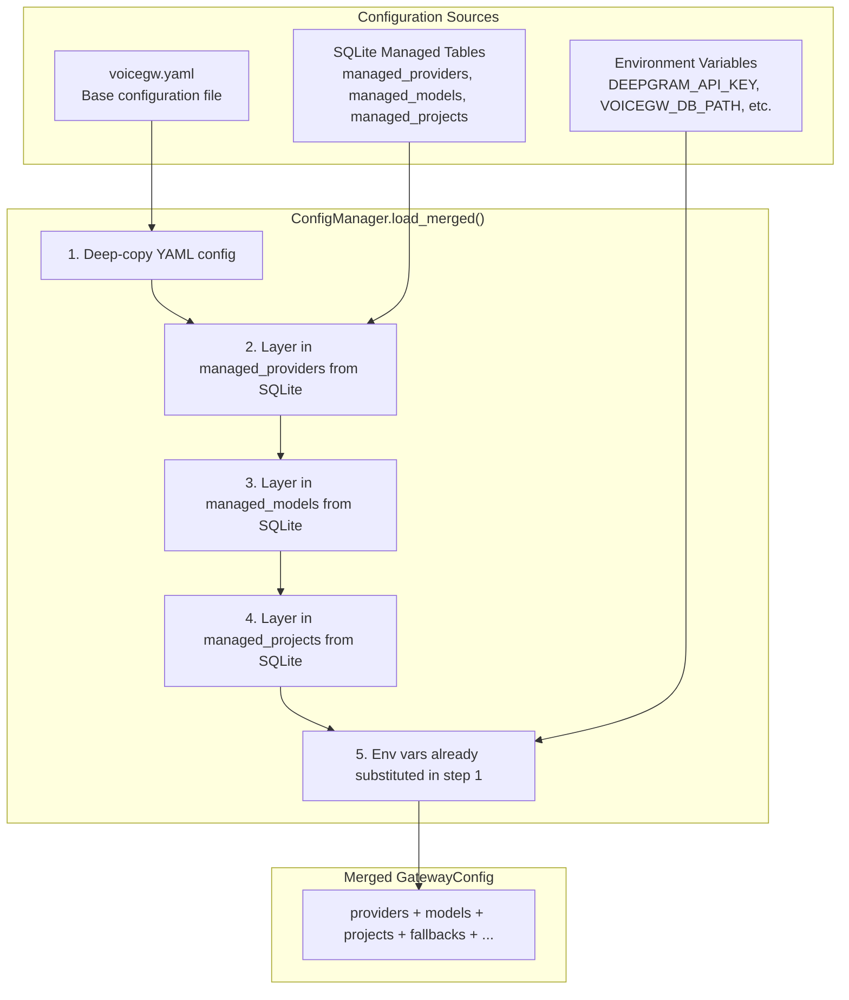
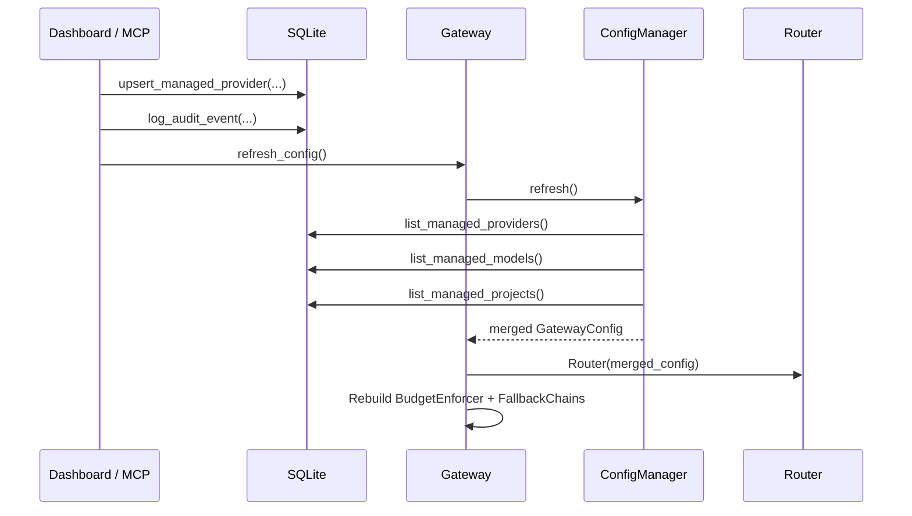

# Configuration Layers

VoiceGateway merges configuration from three sources with a clear priority order. This allows base configuration in YAML, dynamic management via the dashboard/MCP, and environment-level overrides.

## Priority Order

```
ENV variables (highest)  >  SQLite managed tables  >  YAML file (lowest)
```



## ConfigManager

**File:** `voicegateway/core/config_manager.py`

The `ConfigManager` is responsible for merging YAML and SQLite sources into a single `GatewayConfig`.

```python
class ConfigManager:
    def __init__(self, yaml_config: GatewayConfig, storage: SQLiteStorage | None):
        self._yaml = yaml_config
        self._storage = storage

    async def load_merged(self) -> GatewayConfig:
        """Return a GatewayConfig with managed_* rows merged in."""
        merged = copy.deepcopy(self._yaml)
        # Layer in managed providers, models, projects from SQLite
        ...
        return merged

    async def refresh(self) -> GatewayConfig:
        """Reload after a write. Called by Gateway.refresh_config()."""
        return await self.load_merged()
```

### Merge Rules

The key rule is: **YAML always takes precedence**. If a provider, model, or project exists in both YAML and SQLite, the YAML version wins.

```python
for row in await self._storage.list_managed_providers():
    pid = row["provider_id"]
    if pid in merged.providers:
        continue  # YAML takes precedence -- don't overwrite
```

This means you can "pin" critical configuration in YAML and use the dashboard/MCP for everything else, without worrying about managed resources overwriting your file-based config.

### The `source` Field

Each `ProjectConfig` carries a `source` field indicating where it came from:

| `source` Value | Meaning |
|----------------|---------|
| `"yaml"` | Defined in `voicegw.yaml` |
| `"db"` | Created via dashboard or MCP, stored in `managed_projects` |

For providers and models, the `_source` key is injected into the config dict:

```python
merged.providers[pid] = {
    "api_key": plaintext_key,
    "base_url": row.get("base_url"),
    "_source": "db",
    **(row.get("extra_config") or {}),
}
```

## YAML Configuration

**File:** `voicegateway/core/config.py`

### Environment Variable Substitution

YAML values containing `${ENV_VAR}` are replaced with the corresponding environment variable at load time:

```yaml
providers:
  openai:
    api_key: ${OPENAI_API_KEY}
  deepgram:
    api_key: ${DEEPGRAM_API_KEY}
```

The substitution is recursive -- it works inside strings, dicts, and lists. Missing env vars resolve to empty strings.

### Config File Search

When no explicit path is provided:

1. Check `VOICEGW_CONFIG` env var (or legacy `INFERENCE_GATEWAY_CONFIG`)
2. Search these paths in order:
   - `./voicegw.yaml`
   - `~/.config/voicegateway/voicegw.yaml`
   - `/etc/voicegateway/voicegw.yaml`
3. Fall back to legacy paths (with deprecation warning):
   - `./gateway.yaml`
   - `~/.config/inference-gateway/gateway.yaml`
   - `/etc/inference-gateway/gateway.yaml`

### Pydantic Validation

**File:** `voicegateway/core/schema.py`

Before parsing, the raw YAML dict is validated against a Pydantic model (`VoiceGatewayConfig`). Validation errors are formatted with field paths and messages:

```
Configuration validation failed:
  - providers.openai.api_key: field required
  - cost_tracking.db_path: str type expected

Check your voicegw.yaml for typos or invalid values.
```

### GatewayConfig Dataclass

The parsed config is stored as a `GatewayConfig` dataclass with these fields:

| Field | Type | Description |
|-------|------|-------------|
| `providers` | `dict[str, dict]` | Provider configs keyed by name |
| `models` | `dict[str, dict[str, dict]]` | Models keyed by modality, then model ID |
| `fallbacks` | `dict[str, list[str]]` | Fallback chains per modality |
| `cost_tracking` | `dict` | DB path, enabled flag |
| `latency` | `dict` | TTFB warning threshold |
| `rate_limits` | `dict[str, dict]` | RPM limits per provider |
| `dashboard` | `dict` | Dashboard config |
| `projects` | `dict[str, ProjectConfig]` | Project configs |
| `stacks` | `dict[str, dict[str, str]]` | Named model bundles |
| `observability` | `dict` | Feature flags for tracking |

## Refresh Cycle

When the dashboard or MCP server creates/updates/deletes a managed resource:



This ensures that newly added providers and models are immediately available for routing, without requiring a server restart.

## Example Configuration

```yaml
providers:
  openai:
    api_key: ${OPENAI_API_KEY}
  deepgram:
    api_key: ${DEEPGRAM_API_KEY}
  cartesia:
    api_key: ${CARTESIA_API_KEY}

models:
  stt:
    deepgram/nova-3:
      provider: deepgram
      model: nova-3
  llm:
    openai/gpt-4.1-mini:
      provider: openai
      model: gpt-4.1-mini
  tts:
    cartesia/sonic-3:
      provider: cartesia
      model: sonic-3
      default_voice: 794f9389-aac1-45b6-b726-9d9369183238

fallbacks:
  stt:
    - deepgram/nova-3
    - openai/whisper-1
  tts:
    - cartesia/sonic-3
    - elevenlabs/turbo-v2.5

stacks:
  premium:
    stt: deepgram/nova-3
    llm: openai/gpt-4.1-mini
    tts: cartesia/sonic-3

projects:
  prod:
    name: Production
    daily_budget: 50.00
    budget_action: throttle
    default_stack: premium
    tags: [production]

cost_tracking:
  enabled: true
  db_path: ~/.config/voicegateway/voicegw.db

rate_limits:
  openai:
    requests_per_minute: 60
  deepgram:
    requests_per_minute: 100

latency:
  ttfb_warning_ms: 500

observability:
  latency_tracking: true
  cost_tracking: true
  request_logging: true
```
