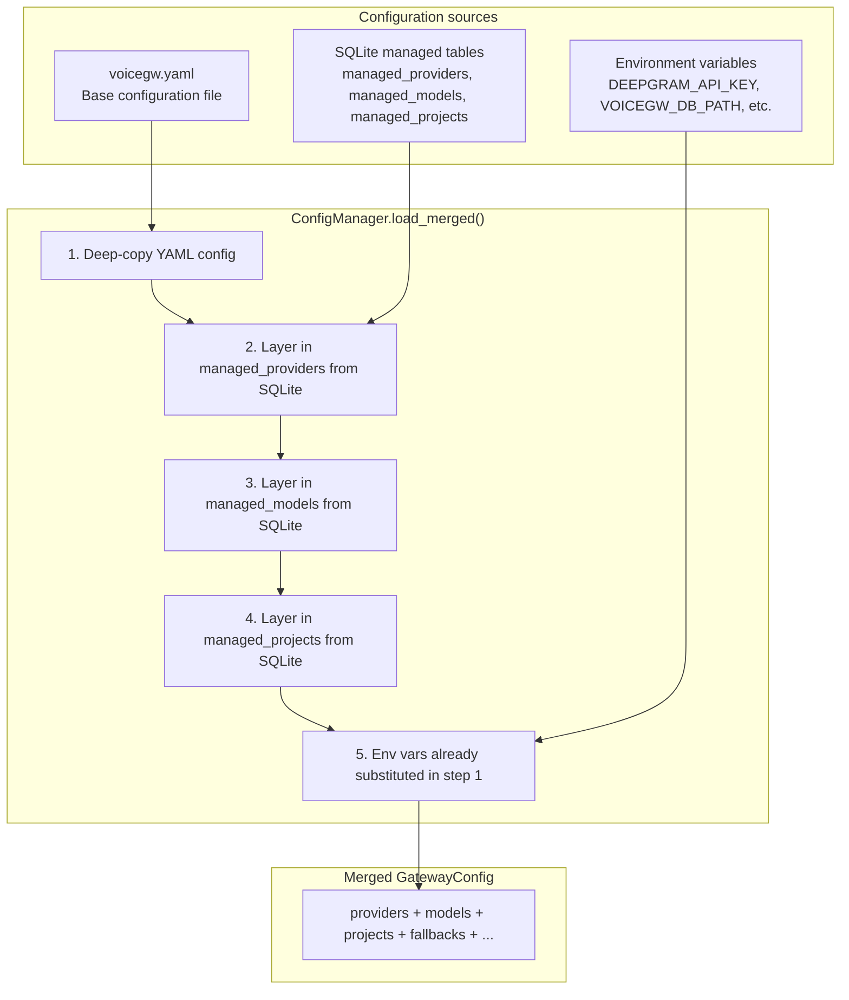
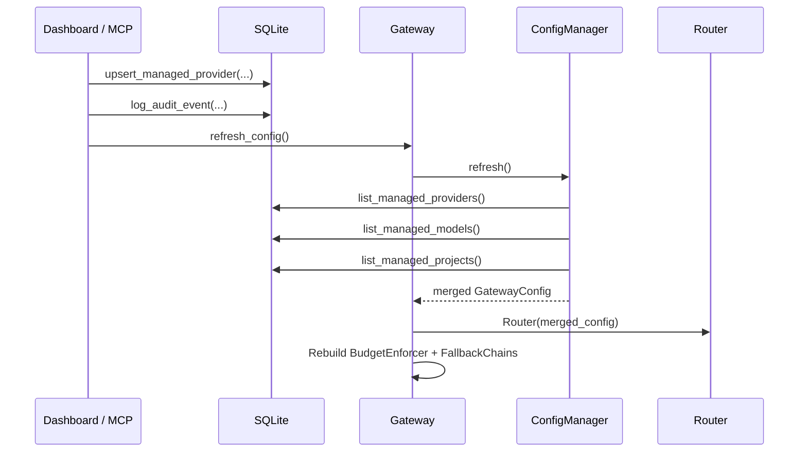

# Configuration layers

VoiceGateway merges configuration from three sources with a clear priority order. You can pin critical settings in YAML, manage everything else through the dashboard or MCP server, and override individual values at runtime with environment variables.

## Priority order

```
ENV variables (highest)  >  SQLite managed tables  >  YAML file (lowest)
```


```mermaid
graph TB
    subgraph Sources["Configuration sources"]
        ENV["Environment variables<br/>DEEPGRAM_API_KEY, VOICEGW_DB_PATH, etc."]
        DB["SQLite managed tables<br/>managed_providers, managed_models, managed_projects"]
        YAML["voicegw.yaml<br/>Base configuration file"]
    end

    subgraph Merge["ConfigManager.load_merged()"]
        M1["1. Deep-copy YAML config"]
        M2["2. Layer in managed_providers from SQLite"]
        M3["3. Layer in managed_models from SQLite"]
        M4["4. Layer in managed_projects from SQLite"]
        M5["5. Env vars already substituted in step 1"]
    end

    subgraph Result["Merged GatewayConfig"]
        R["providers + models + projects + fallbacks + ..."]
    end

    YAML --> M1
    M1 --> M2
    DB --> M2
    M2 --> M3
    M3 --> M4
    M4 --> M5
    ENV --> M5
    M5 --> R
```

## ConfigManager

**File:** `src/voicegateway/core/config_manager.py`

`ConfigManager` merges the YAML config and SQLite managed rows into a single `GatewayConfig`.

```python
class ConfigManager:
    def __init__(self, yaml_config: GatewayConfig, storage: SQLiteStorage | None):
        self._yaml = yaml_config
        self._storage = storage

    async def load_merged(self) -> GatewayConfig:
        """Return a GatewayConfig with managed_* rows merged in."""
        merged = copy.deepcopy(self._yaml)
        # Layer in managed providers, models, projects from SQLite
        ...
        return merged

    async def refresh(self) -> GatewayConfig:
        """Reload after a write. Called by Gateway.refresh_config()."""
        return await self.load_merged()
```

### Merge rules

YAML always takes precedence. If a provider, model, or project exists in both YAML and SQLite, the YAML version wins.

```python
for row in await self._storage.list_managed_providers():
    pid = row["provider_id"]
    if pid in merged.providers:
        continue  # YAML takes precedence -- don't overwrite
```

This lets you pin critical configuration in `voicegw.yaml` and use the dashboard or MCP for everything else, without risk of managed resources overwriting file-based config.

### The `source` field

Each `ProjectConfig` carries a `source` field indicating origin:

| `source` value | Meaning |
|---|---|
| `"yaml"` | Defined in `voicegw.yaml` |
| `"db"` | Created via the dashboard or MCP, stored in `managed_projects` |

For providers and models, the `_source` key is injected into the config dict:

```python
merged.providers[pid] = {
    "api_key": plaintext_key,
    "base_url": row.get("base_url"),
    "_source": "db",
    **(row.get("extra_config") or {}),
}
```

## YAML configuration

**File:** `src/voicegateway/core/config.py`

### Environment variable substitution

YAML values containing `${ENV_VAR}` are replaced with the corresponding environment variable at load time:

```yaml
providers:
  openai:
    api_key: ${OPENAI_API_KEY}
  deepgram:
    api_key: ${DEEPGRAM_API_KEY}
```

Substitution is recursive: it works inside strings, dicts, and lists. Missing env vars resolve to empty strings.

### Config file search

When no explicit path is provided, VoiceGateway searches in this order:

1. `VOICEGW_CONFIG` environment variable.
2. `./voicegw.yaml` in the current directory.
3. `~/.config/voicegateway/voicegw.yaml`.
4. `/etc/voicegateway/voicegw.yaml`.

### Pydantic validation

**File:** `src/voicegateway/core/schema.py`

The raw YAML dict is validated against `VoiceGatewayConfig` before use. Validation errors include field paths and messages:

```
Configuration validation failed:
  - providers.openai.api_key: field required
  - cost_tracking.db_path: str type expected

Check your voicegw.yaml for typos or invalid values.
```

### GatewayConfig dataclass

The parsed config is stored as a `GatewayConfig` dataclass:

| Field | Type | Description |
|---|---|---|
| `providers` | `dict[str, dict]` | Provider configs keyed by name |
| `models` | `dict[str, dict[str, dict]]` | Models keyed by modality, then model ID |
| `fallbacks` | `dict[str, list[str]]` | Fallback chains per modality |
| `cost_tracking` | `dict` | DB path, enabled flag |
| `latency` | `dict` | TTFB warning threshold |
| `rate_limits` | `dict[str, dict]` | RPM limits per provider |
| `dashboard` | `dict` | Dashboard config |
| `projects` | `dict[str, ProjectConfig]` | Project configs |
| `stacks` | `dict[str, dict[str, str]]` | Named model bundles |
| `observability` | `dict` | Feature flags for tracking |

## Refresh cycle

When the dashboard or MCP server creates, updates, or deletes a managed resource, the config is refreshed without a server restart:


```mermaid
sequenceDiagram
    participant API as Dashboard / MCP
    participant DB as SQLite
    participant GW as Gateway
    participant CM as ConfigManager
    participant R as Router

    API->>DB: upsert_managed_provider(...)
    API->>DB: log_audit_event(...)
    API->>GW: refresh_config()
    GW->>CM: refresh()
    CM->>DB: list_managed_providers()
    CM->>DB: list_managed_models()
    CM->>DB: list_managed_projects()
    CM-->>GW: merged GatewayConfig
    GW->>R: Router(merged_config)
    GW->>GW: Rebuild BudgetEnforcer + FallbackChains
```

<Note>
Newly added providers and models are immediately available for routing after the refresh. No restart needed.
</Note>

## Example configuration

```yaml
providers:
  openai:
    api_key: ${OPENAI_API_KEY}
  deepgram:
    api_key: ${DEEPGRAM_API_KEY}
  cartesia:
    api_key: ${CARTESIA_API_KEY}

models:
  stt:
    deepgram/nova-3:
      provider: deepgram
      model: nova-3
  llm:
    openai/gpt-4.1-mini:
      provider: openai
      model: gpt-4.1-mini
  tts:
    cartesia/sonic-3:
      provider: cartesia
      model: sonic-3
      default_voice: 794f9389-aac1-45b6-b726-9d9369183238

fallbacks:
  stt:
    - deepgram/nova-3
    - openai/whisper-1
  tts:
    - cartesia/sonic-3
    - elevenlabs/turbo-v2.5

stacks:
  premium:
    stt: deepgram/nova-3
    llm: openai/gpt-4.1-mini
    tts: cartesia/sonic-3

projects:
  prod:
    name: Production
    daily_budget: 50.00
    budget_action: throttle
    default_stack: premium
    tags: [production]

cost_tracking:
  enabled: true
  db_path: ~/.config/voicegateway/voicegw.db

rate_limits:
  openai:
    requests_per_minute: 60
  deepgram:
    requests_per_minute: 100

latency:
  ttfb_warning_ms: 500

observability:
  latency_tracking: true
  cost_tracking: true
  request_logging: true
```

## Related pages

<CardGroup cols={2}>
  <Card title="voicegw.yaml reference" href="/configuration/voicegw-yaml">
    Full YAML schema with all fields and defaults.
  </Card>
  <Card title="Environment variables" href="/configuration/environment-variables">
    All supported environment variables and their defaults.
  </Card>
  <Card title="Storage" href="/architecture/storage">
    The SQLite tables that back managed configuration.
  </Card>
  <Card title="Security" href="/architecture/security">
    How managed provider API keys are encrypted at rest.
  </Card>
</CardGroup>
