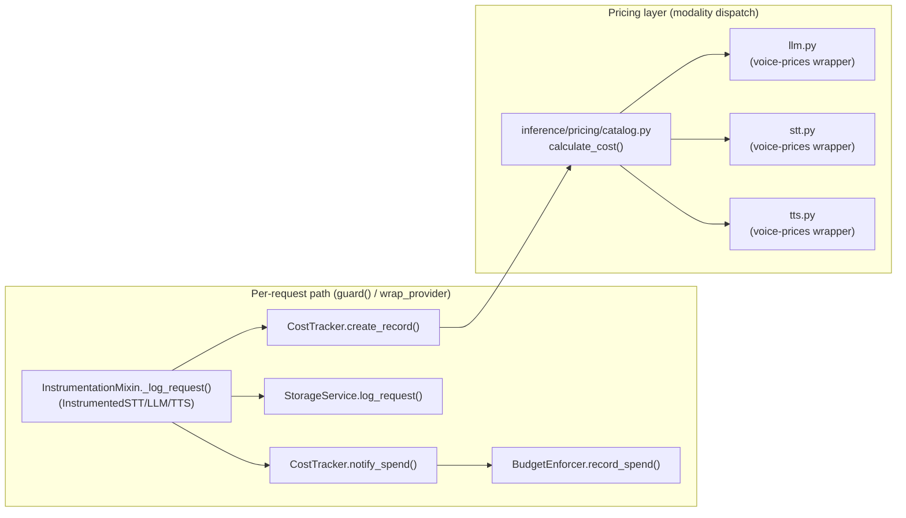

VoiceGateway records the cost of every request that flows through it: tokens for LLM, audio seconds for STT, characters for TTS. Cost data lands in the [storage layer](/architecture/storage) alongside latency metrics and is the source of truth for the dashboard, the `voicegw reconcile` command, and per-project spend tracking.

This page covers the cost-tracking subsystem end-to-end: the pricing layer, the per-request flow, and the substitute-validation strategy that backs the streaming cost accuracy claim.

## Architecture



`attach()` meters through its own capture path (`inference/session/capture.py`, owned by [attach](/guide/attach)), which calls the same `CostTracker.create_record()` and the same pricing facade; only the event-hook mechanics differ from the `guard()`/`wrap_provider` path diagrammed above.

## Pricing layer

The pricing facade in `src/voicegateway/inference/pricing/catalog.py` exposes two functions:

```python
calculate_cost(
    modality: str,
    model: str,
    *,
    audio_seconds: float = 0.0,
    input_tokens: int = 0,
    output_tokens: int = 0,
    cached_input_tokens: int = 0,
    character_count: int = 0,
) -> Decimal | None

pricing_source(modality: str) -> str
```

`calculate_cost` dispatches by modality:

- **LLM** (`modality="llm"`): uses `input_tokens`, `output_tokens`, and `cached_input_tokens` (the subset of `input_tokens` served from the provider's prompt cache). Routes to `inference/pricing/llm.py`, which wraps `voice-prices`.
- **STT** (`modality="stt"`): uses `audio_seconds`. Routes to `inference/pricing/stt.py`, which maps the duration onto a `voice-prices` lookup.
- **TTS** (`modality="tts"`): uses `character_count`. Routes to `inference/pricing/tts.py`, same `voice-prices` pattern as STT.
- **Self-hosted** (`local/*`, `ollama/*`): priced at `$0` by a facade guard, attributed as `voicegateway-local`.

All three modalities return `None` for unknown models (never silent zero), so callers can distinguish "free" from "unknown."

## Per-request flow

Every wrapped request flows through `InstrumentationMixin._log_request` (`src/voicegateway/middleware/base_middleware.py`, the mixin behind `InstrumentedSTT`/`InstrumentedLLM`/`InstrumentedTTS`):

1. **Compute total latency** as `now - start_time`.
2. **Compute TTFB** as `first_byte_time - start_time` if the streaming hook fired (an explicit `_mark_first_byte()` call, or the wrapped LiveKit plugin's own `ttft`/`ttfb` metric field); otherwise fall back to total latency.
3. **Build a `RequestRecord`** via `CostTracker.create_record(...)`, which calls into the pricing facade to set `cost_usd`/`pricing_source`, then rates the request against the active rate card to set `rated_price_usd`/`rate_rule` (see [Rating](/architecture/rating)).
4. **Write to storage** via `StorageService.log_request(...)`. A failure logs at warning and is swallowed; in-memory accounting must not break because the disk is full.
5. **Notify the budget enforcer** via `CostTracker.notify_spend(...)`, which calls `BudgetEnforcer.record_spend()`. This runs even when the storage write above failed, so the per-project spend total stays accurate during a storage outage. `record_spend` only updates that total, the number the dashboard and MCP tools read back as `ok`/`warning`/`exceeded`; `budget_action` (`warn`/`throttle`/`block`) does not itself slow, reroute, or reject anything, see the budgets caveat in [Projects](/configuration/projects#budgets).

Each `RequestRecord` carries the same `pricing_source` string the catalog returned, so `voicegw reconcile` can attribute the recorded number to a specific upstream catalog version.

## RequestRecord fields

| Field | Type | Source |
|-------|------|--------|
| `model_id` | `str` | Parsed from the `"provider/model"` string |
| `modality` | `str` | `"llm"`, `"stt"`, or `"tts"` |
| `project` | `str` | `ContextVar` set by `attach()` or `guard()` |
| `tenant_id` | `str \| None` | `ContextVar` set by `attach(tenant_id=...)`, or stamped server-side on ingest |
| `agent_id` | `str \| None` | Fleet: self-reported agent/instance label |
| `input_units` | `float` | Tokens, audio minutes, or characters |
| `output_units` | `float` | Output tokens (LLM only) |
| `cached_input_units` | `float` | Cached prompt tokens (LLM only; 0 for STT/TTS) |
| `cost_usd` | `float` | Recorded provider cost, from `calculate_cost()` |
| `pricing_source` | `str` | `voice-prices@<version>` or `voicegateway-local` |
| `rated_price_usd` | `float` | Billable price the active rate card stamped at write time; see [Rating](/architecture/rating) |
| `rate_rule` | `str` | Audit token for the rule applied, e.g. `"cost_plus:1.3"` |
| `ttfb_ms` | `float \| None` | Time to first byte in milliseconds |
| `total_latency_ms` | `float \| None` | End-to-end latency in milliseconds |
| `timestamp` | `float` | Unix epoch seconds of the request |

## How streaming cost accounting is meant to be validated

Streaming is where real-world cost-tracking bugs hide: tokens that double at chunk boundaries, audio-second accumulators that drift, character counts that miss SSML markup. VoiceGateway has a fixture-replay suite designed to close that validation gap without requiring real production traffic.

<Warning>
The suite is built but not activated. `src/voicegateway/tests/fixtures/streaming/` holds the recorder script, the JSON schema, and the loader, but zero fixture JSON files are committed: recording them costs real provider money and is a manual step (`PLACEHOLDER.md` in that directory is the runbook). Until someone runs it, every parameterized case in `test_streaming_cost_accounting.py` is skipped, not passing. The description below is what the suite asserts once fixtures exist, not a claim that it is asserting today.
</Warning>

### The substitute strategy

Rather than relying on production traffic, VoiceGateway is designed to record real provider streaming responses once via `src/voicegateway/tests/fixtures/streaming/record_streaming_fixtures.py` and replay them in CI. Each fixture is a JSON file with three load-bearing sections:

- `request`: the literal payload VoiceGateway sent.
- `response_stream`: the chunks the provider returned, with `received_at_ms` timestamps.
- `provider_reported_usage`: the usage block the provider reported at end-of-stream (tokens for LLM, duration for STT, character count for TTS).

The fixture also pins `expected_cost_usd`, computed at recording time by passing `provider_reported_usage` through `calculate_cost`, quantized to 8 decimal places. This is meant to lock the cost math at the recording's price: if a catalog updates later, the fixture's `expected_cost_usd` stays at the price-at-recording, so the fixture validates VoiceGateway's math, not "today's price."

Filename convention: `<provider>_<model>_<modality>_<mode>_<YYYY-MM-DD>.json`. The date is for a human doing the quarterly refresh; no CI job currently parses it or fails a build on an old date.

### What the replay tests are designed to assert

`src/voicegateway/tests/middleware/test_streaming_cost_accounting.py` parameterizes over every committed fixture. Once fixtures are recorded, it asserts three things per fixture:

1. **Unit-count consistency.** `provider_reported_usage` agrees with the actual contents of `response_stream`. For LLM, normalized `input_tokens` / `output_tokens` / `total_tokens` must equal the values inside the trailing ChatCompletion usage chunk. For STT, `audio_seconds` must equal Deepgram's `metadata.duration`. For TTS, `character_count` must equal `len(request.transcript)`. Catches recorder field-name typos, provider schema drift, and off-by-one normalization.
2. **Cost calculation.** `calculate_cost(provider_reported_usage)` quantized to 8 dp must equal `fixture.expected_cost_usd` quantized to 8 dp. Catches cost-layer regressions (modality-dispatch bugs, pricing-source attribution drift, Decimal precision losses).
3. **TTFB hook behavior** (stream fixtures only). A wrapper that calls `_mark_first_byte` partway through must produce `ttfb_ms < total_latency_ms`. A wrapper that never calls it must produce `ttfb_ms == total_latency_ms` (the documented fallback). Catches modality refactors that forget to wire TTFB.

A separate `src/voicegateway/tests/middleware/test_ttfb_hook_coverage.py` runs the TTFB-hook contract against synthetic streams for every modality (this one does run today; it needs no recorded fixtures), gated against `wrap_provider`'s dispatch table so a future modality cannot land without TTFB coverage.

### Honest limits of the substitute strategy

Even once activated, fixture replay is not a complete substitute for production traffic. It would not catch:

- **Real-time streaming behavior.** Replay is sequential and synchronous. Network jitter, partial chunks split across TCP packets, and out-of-order delivery are not simulated.
- **Provider-side correctness.** If Deepgram's reported usage is off by 0.1 seconds, the fixture accepts that as ground truth. The suite validates VoiceGateway's accounting matches the provider's, not whether the provider is right.
- **Stale fixtures.** Recorded fixtures capture provider behavior at a point in time; if a provider changes its streaming format, the fixture's `response_stream` no longer matches what VoiceGateway would see today, and nothing currently flags that automatically.
- **End-to-end LiveKit session validation.** The wrappers are tested in isolation, not as part of a real `AgentSession`. Session-level integration testing is deferred.

## Where to find each piece

| Component | Path |
|-----------|------|
| Pricing facade | `src/voicegateway/inference/pricing/catalog.py` |
| LLM pricing | `src/voicegateway/inference/pricing/llm.py` |
| STT pricing | `src/voicegateway/inference/pricing/stt.py` |
| TTS pricing | `src/voicegateway/inference/pricing/tts.py` |
| CostTracker | `src/voicegateway/middleware/cost_tracker_middleware.py` |
| InstrumentationMixin + wrap_provider | `src/voicegateway/middleware/base_middleware.py`, `instrumented_provider_middleware.py` |
| Streaming fixtures (schema, loader, recorder; zero fixtures committed) | `src/voicegateway/tests/fixtures/streaming/` |
| Replay test suite (skips until fixtures exist) | `src/voicegateway/tests/middleware/test_streaming_cost_accounting.py` |
| TTFB hook coverage (runs today) | `src/voicegateway/tests/middleware/test_ttfb_hook_coverage.py` |
