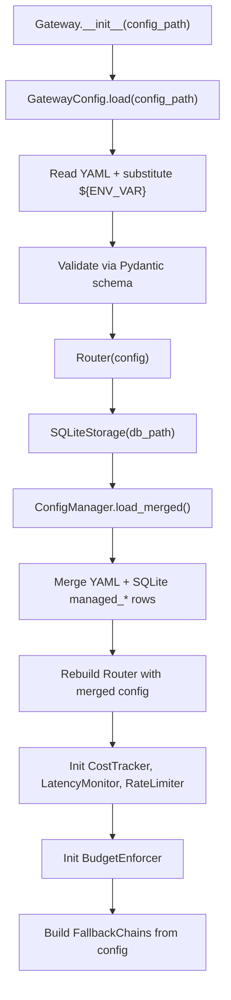
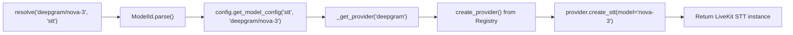

# Gateway Core

The core layer is the brain of VoiceGateway. It parses configuration, resolves model identifiers to provider instances, and orchestrates the middleware pipeline.

## Gateway Class

**File:** `voicegateway/core/gateway.py`

The `Gateway` class is the single entry point for all inference requests. It wires together configuration, routing, middleware, and storage.

### Initialization

```python
from voicegateway import Gateway

# Auto-discovers voicegw.yaml from standard locations
gw = Gateway()

# Or specify a config path explicitly
gw = Gateway(config_path="/path/to/voicegw.yaml")
```

Config file search order (when no path is given):

1. `./voicegw.yaml` (and legacy `./gateway.yaml` with deprecation warning)
2. `~/.config/voicegateway/voicegw.yaml`
3. `/etc/voicegateway/voicegw.yaml`
4. `VOICEGW_CONFIG` environment variable

### What happens at `Gateway.__init__`



The database path is resolved as: `VOICEGW_DB_PATH` env > `cost_tracking.db_path` in YAML > default `~/.config/voicegateway/voicegw.db`.

### Model Factory Methods

The Gateway exposes three primary factory methods that return LiveKit-compatible instances:

```python
# Speech-to-Text
stt = gw.stt("deepgram/nova-3", project="my-project")

# Language Model
llm = gw.llm("openai/gpt-4.1-mini", project="my-project")

# Text-to-Speech
tts = gw.tts("cartesia/sonic-3", project="my-project")
```

Each method follows the same internal sequence:

1. Resolve `project` (defaults to `"default"`)
2. Run `BudgetEnforcer.check_budget(project)` -- may raise `BudgetExceededError` or `BudgetThrottleSignal`
3. Call `Router.resolve(model_id, modality, project=project)` to get the raw provider instance
4. Wrap the instance with `InstrumentedSTT/LLM/TTS` for automatic metrics recording

### Stacks

Stacks are named bundles of STT + LLM + TTS models:

```yaml
# voicegw.yaml
stacks:
  premium:
    stt: deepgram/nova-3
    llm: openai/gpt-4.1-mini
    tts: cartesia/sonic-3
  local:
    stt: whisper/large-v3
    llm: ollama/qwen2.5:3b
    tts: kokoro/default
```

```python
stt, llm, tts = gw.stack("premium", project="prod")
```

### Fallback Methods

When fallback chains are configured, the Gateway provides `*_with_fallback()` methods that try each model in sequence:

```python
stt = gw.stt_with_fallback(project="prod")
llm = gw.llm_with_fallback(project="prod")
tts = gw.tts_with_fallback(project="prod")
```

### Config Refresh

After the dashboard or MCP server writes to managed tables, the Gateway reloads its merged config:

```python
await gw.refresh_config()
```

This rebuilds the `Router`, `BudgetEnforcer`, and all `FallbackChain` instances with the updated config.

## Router

**File:** `voicegateway/core/router.py`

The Router resolves a model ID string (like `"deepgram/nova-3"`) into a concrete provider instance.



Key behaviors:

- **Lazy instantiation:** providers are created on first use and cached in `_providers`.
- **Config-driven model names:** the actual model name passed to the provider can differ from the ID. The `model` key in model config overrides the parsed model name.
- **Voice/variant extraction:** for TTS, the `variant` from the model ID (or `default_voice` from config) is passed as the `voice` parameter.

### Error Types

| Exception | When |
|-----------|------|
| `ModelNotFoundError` | Model ID not found in the `models.<modality>` config section |
| `ProviderNotConfiguredError` | Provider package not installed or credentials missing |

## Registry

**File:** `voicegateway/core/registry.py`

The Registry maps provider names to their implementation classes via lazy import. No provider module is imported until it is actually needed.

```python
_PROVIDER_REGISTRY = {
    "openai":     ("voicegateway.providers.openai_provider", "OpenAIProvider"),
    "deepgram":   ("voicegateway.providers.deepgram_provider", "DeepgramProvider"),
    "cartesia":   ("voicegateway.providers.cartesia_provider", "CartesiaProvider"),
    "anthropic":  ("voicegateway.providers.anthropic_provider", "AnthropicProvider"),
    "groq":       ("voicegateway.providers.groq_provider", "GroqProvider"),
    "elevenlabs": ("voicegateway.providers.elevenlabs_provider", "ElevenLabsProvider"),
    "assemblyai": ("voicegateway.providers.assemblyai_provider", "AssemblyAIProvider"),
    "ollama":     ("voicegateway.providers.ollama_provider", "OllamaProvider"),
    "whisper":    ("voicegateway.providers.whisper_provider", "WhisperProvider"),
    "kokoro":     ("voicegateway.providers.kokoro_provider", "KokoroProvider"),
    "piper":      ("voicegateway.providers.piper_provider", "PiperProvider"),
}
```

`create_provider(name, config)` calls `importlib.import_module()` to load the module, then instantiates the class with the provider config dict. If the import fails (missing SDK), it raises an `ImportError` with an install hint:

```
Could not import provider 'deepgram': No module named 'deepgram'.
Install with: pip install voicegateway[deepgram]
```

## ModelId

**File:** `voicegateway/core/model_id.py`

A frozen dataclass that parses `"provider/model[:variant]"` strings:

```python
from voicegateway.core.model_id import ModelId

# Standard model
mid = ModelId.parse("deepgram/nova-3")
# ModelId(provider="deepgram", model="nova-3", variant=None)

# TTS with voice variant
mid = ModelId.parse("local/kokoro:af_heart")
# ModelId(provider="local", model="kokoro", variant="af_heart")

# Ollama models keep the colon in the model name
mid = ModelId.parse("ollama/qwen2.5:3b")
# ModelId(provider="ollama", model="qwen2.5:3b", variant=None)
```

### Properties

| Property | Description |
|----------|-------------|
| `full_id` | Canonical string with variant: `"local/kokoro:af_heart"` |
| `config_key` | Lookup key without variant: `"local/kokoro"` |
| `provider` | Provider name: `"deepgram"` |
| `model` | Model name: `"nova-3"` |
| `variant` | Optional voice/variant: `"af_heart"` or `None` |

The variant is only extracted for the `"local"` provider (where colons separate model from voice). For all other providers, the full string after `"/"` is treated as the model name, preserving Ollama's `model:tag` format.
