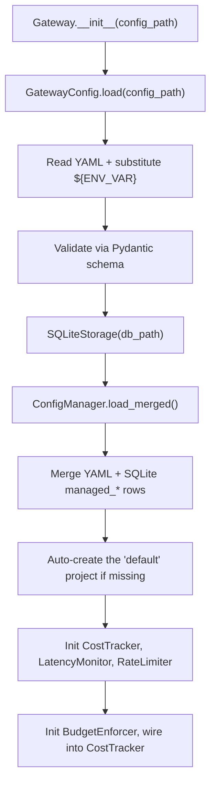

The core layer connects configuration, storage, and middleware so the public `attach()` and `guard()` helpers, the CLI, the HTTP server, and the MCP runtime all share one source of truth.

## Gateway class

**File:** `src/voicegateway/core/gateway.py`

`Gateway` is an internal container. It is not part of the public Python SDK. The `attach()` and `guard()` helpers hold a process-wide singleton, obtained via an internal factory. The CLI, HTTP server, and MCP runtime each instantiate it directly because they own their own process lifecycle.

### Initialization

```python
# Internal use only -- not on the public SDK surface.
from voicegateway.core.gateway import Gateway

# Auto-discovers voicegw.yaml from standard locations.
gw = Gateway()

# Or specify a config path explicitly.
gw = Gateway(config_path="/path/to/voicegw.yaml")
```

Config file search order (when no path is given):

1. `VOICEGW_CONFIG` environment variable.
2. `./voicegw.yaml`
3. `~/.config/voicegateway/voicegw.yaml`
4. `/etc/voicegateway/voicegw.yaml`

### Startup sequence


```mermaid
graph TD
    A["Gateway.__init__(config_path)"] --> B["GatewayConfig.load(config_path)"]
    B --> C["Read YAML + substitute ${ENV_VAR}"]
    C --> D["Validate via Pydantic schema"]
    D --> F["SQLiteStorage(db_path)"]
    F --> G["ConfigManager.load_merged()"]
    G --> H["Merge YAML + SQLite managed_* rows"]
    H --> I["Auto-create the 'default' project if missing"]
    I --> J["Init CostTracker, LatencyMonitor, RateLimiter"]
    J --> K["Init BudgetEnforcer, wire into CostTracker"]
```

The database path resolves as: `VOICEGW_DB_PATH` env > `cost_tracking.db_path` in YAML > default `~/.config/voicegateway/voicegw.db`.

### What Gateway exposes internally

| Surface | Purpose |
|---|---|
| `gw.config` | The merged `GatewayConfig` object (read-only). |
| `gw.storage` | `SQLiteStorage` or `None` when cost tracking is disabled. |
| `gw.cost_tracker` | The `CostTracker` middleware used by attach(). |
| `gw.costs(period, project=...)` | Cost summary helper used by the CLI and HTTP API. |
| `gw.list_projects()` | Project list for the CLI, dashboard, and MCP. |
| `await gw.refresh_config()` | Re-merges YAML and SQLite after a managed_* write. |

The public surface is `from voicegateway import attach, guard`. Both functions call the internal singleton and read the same merged config.

### Config refresh

After the dashboard or MCP server writes to managed tables, the Gateway reloads its merged config:

```python
await gw.refresh_config()
```

This re-runs `ConfigManager.load_merged()` and rebuilds `BudgetEnforcer` so it sees newly added projects.

## ConfigManager

**File:** `src/voicegateway/core/config_manager.py`

`ConfigManager.load_merged()` deep-copies the YAML config and layers in `managed_providers`, `managed_models`, and `managed_projects` rows from SQLite. Per-project provider rows (those with a non-null `project` column) merge into `merged.projects[<id>].providers[<provider_type>]` so the resolver finds them via `GatewayConfig.get_provider_config_for_project`. YAML always wins on conflict.

See [Config Layers](/architecture/config-layers) for the full merge rules.

## Model ID resolution

**File:** `src/voicegateway/core/registry.py` (via an inline parser in the provider layer)

The `attach()` and `guard()` helpers parse `"provider/model"` strings and validate the provider against the registry. The variant suffix (language for STT, voice for TTS) is parsed before resolution; LLM strings keep their trailing colon segments verbatim so Ollama tags survive.

```python
# Examples of model strings VoiceGateway accepts
"deepgram/nova-3"           # STT
"openai/gpt-4.1-mini"       # LLM
"cartesia/sonic-3"          # TTS
"ollama/qwen2.5:3b"         # local LLM with tag
```

| Exception | When |
|---|---|
| `ModelResolutionError` | Empty string, missing slash, empty halves, or unknown provider name. |

## Registry

**File:** `src/voicegateway/core/registry.py`

The Registry maps provider names to their implementation classes via lazy import. No provider module is imported until it is needed.

```python
_PROVIDER_REGISTRY = {
    "openai":     ("voicegateway.providers.openai_provider", "OpenAIProvider"),
    "deepgram":   ("voicegateway.providers.deepgram_provider", "DeepgramProvider"),
    "cartesia":   ("voicegateway.providers.cartesia_provider", "CartesiaProvider"),
    "anthropic":  ("voicegateway.providers.anthropic_provider", "AnthropicProvider"),
    "groq":       ("voicegateway.providers.groq_provider", "GroqProvider"),
    "elevenlabs": ("voicegateway.providers.elevenlabs_provider", "ElevenLabsProvider"),
    "assemblyai": ("voicegateway.providers.assemblyai_provider", "AssemblyAIProvider"),
    "ollama":     ("voicegateway.providers.ollama_provider", "OllamaProvider"),
    "whisper":    ("voicegateway.providers.whisper_provider", "WhisperProvider"),
    "kokoro":     ("voicegateway.providers.kokoro_provider", "KokoroProvider"),
    "piper":      ("voicegateway.providers.piper_provider", "PiperProvider"),
}
```

`create_provider(name, config)` calls `importlib.import_module()` to load the module, then instantiates the class with the provider config dict. If the import fails (missing SDK), it raises an `ImportError` with an install hint:

```
Could not import provider 'deepgram': No module named 'deepgram'.
Install with: pip install voicegateway[deepgram]
```

<Note>
The Registry is an internal detail. You never call `create_provider` directly. Use `from voicegateway import attach, guard` and pass `"provider/model"` strings; the registry is invoked automatically.
</Note>
