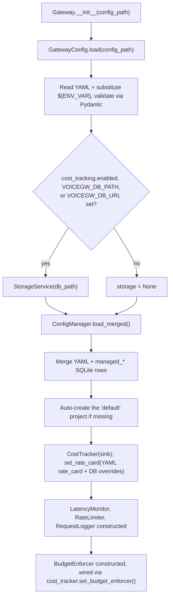

The core layer connects configuration, storage, and middleware so the CLI, HTTP server, and MCP runtime share one source of truth. `attach()` and `guard()` do not go through this container: each builds its own lightweight `CostTracker`/`RateLimiter` per call. See [Architecture Overview](/architecture/index) for how the two paths relate.

## Gateway class

**File:** `src/voicegateway/core/gateway.py`

`Gateway` is an internal container, not part of the public Python SDK (`from voicegateway import attach, guard` is the public surface). The CLI, HTTP server, and MCP runtime each construct one via `core/gateway_factory.py`'s process-wide singleton and own its lifecycle.

### Initialization

```python
# Internal use only -- not on the public SDK surface.
from voicegateway.core.gateway import Gateway

# Auto-discovers voicegw.yaml from standard locations.
gw = Gateway()

# Or specify a config path explicitly.
gw = Gateway(config_path="/path/to/voicegw.yaml")
```

Config file search order (when no path is given):

1. `VOICEGW_CONFIG` environment variable.
2. `./voicegw.yaml`
3. `~/.config/voicegateway/voicegw.yaml`
4. `/etc/voicegateway/voicegw.yaml`

### Startup sequence


```mermaid
graph TD
    A["Gateway.__init__(config_path)"] --> B["GatewayConfig.load(config_path)"]
    B --> C["Read YAML + substitute ${ENV_VAR}, validate via Pydantic"]
    C --> D{"cost_tracking.enabled, VOICEGW_DB_PATH,<br/>or VOICEGW_DB_URL set?"}
    D -->|yes| E["StorageService(db_path)"]
    D -->|no| F["storage = None"]
    E --> G["ConfigManager.load_merged()"]
    F --> G
    G --> H["Merge YAML + managed_* SQLite rows"]
    H --> I["Auto-create the 'default' project if missing"]
    I --> J["CostTracker(sink); set_rate_card(YAML rate_card + DB overrides)"]
    J --> K["LatencyMonitor, RateLimiter, RequestLogger constructed"]
    K --> L["BudgetEnforcer constructed, wired via cost_tracker.set_budget_enforcer()"]
```

The database is only enabled when `cost_tracking.enabled: true` is set in YAML, or `VOICEGW_DB_PATH` / `VOICEGW_DB_URL` is set in the environment. When enabled, the path resolves as: `VOICEGW_DB_PATH` env > `cost_tracking.db_path` in YAML > default `~/.config/voicegateway/voicegw.db`.

### What Gateway exposes internally

| Surface | Purpose |
|---|---|
| `gw.config` | The merged `GatewayConfig` object. |
| `gw.storage` | `StorageService` or `None` when no database is enabled. Read directly by most HTTP routes and MCP tools (`gateway.storage.get_cost_summary(...)`, etc.). |
| `gw.cost_tracker` | The Gateway's own `CostTracker`, wired with the effective rate card. Used by the fleet-ingest endpoint (`server/api/ingest.py`) to re-rate rows a collector receives from remote agents. `attach()` builds a separate `CostTracker` per call; it does not use this one. |
| `gw.costs(period, project=...)` | Convenience wrapper around `storage.get_cost_summary(...)`. Production CLI/API code mostly calls `gateway.storage` directly instead. |
| `gw.list_projects()` | Project list; used by the projects HTTP routes and dashboard project list. |
| `await gw.refresh_config()` | Re-runs `ConfigManager.load_merged()` and rebuilds `BudgetEnforcer`. Called after every dashboard/MCP write to a managed table (providers, models, projects, rate card). |

### Config refresh

After the dashboard or MCP server writes to a managed table, the caller reloads the Gateway's merged config:

```python
await gw.refresh_config()
```

## ConfigManager

**File:** `src/voicegateway/core/config_manager.py`

`ConfigManager.load_merged()` deep-copies the YAML config and layers in `managed_providers`, `managed_models`, and `managed_projects` rows from SQLite. Per-project provider rows (those with a non-null `project` column) merge into `merged.projects[<id>].providers[<provider_type>]` so the resolver finds them via `GatewayConfig.get_provider_config_for_project`. YAML always wins on conflict.

See [Configuration Layers](/architecture/config-layers) for the full merge rules.

## Registry

**File:** `src/voicegateway/core/registry.py`

Maps provider names to their implementation classes in `inference/providers/`, via lazy import: no provider module is imported until `create_provider()` is called for it.

```python
_PROVIDER_REGISTRY = {
    "openai":     ("voicegateway.inference.providers.openai_provider", "OpenAIProvider"),
    "deepgram":   ("voicegateway.inference.providers.deepgram_provider", "DeepgramProvider"),
    "cartesia":   ("voicegateway.inference.providers.cartesia_provider", "CartesiaProvider"),
    "anthropic":  ("voicegateway.inference.providers.anthropic_provider", "AnthropicProvider"),
    "groq":       ("voicegateway.inference.providers.groq_provider", "GroqProvider"),
    "elevenlabs": ("voicegateway.inference.providers.elevenlabs_provider", "ElevenLabsProvider"),
    "assemblyai": ("voicegateway.inference.providers.assemblyai_provider", "AssemblyAIProvider"),
    "ollama":     ("voicegateway.inference.providers.ollama_provider", "OllamaProvider"),
    "whisper":    ("voicegateway.inference.providers.whisper_provider", "WhisperProvider"),
    "kokoro":     ("voicegateway.inference.providers.kokoro_provider", "KokoroProvider"),
    "piper":      ("voicegateway.inference.providers.piper_provider", "PiperProvider"),
}
```

`create_provider(name, config)` imports the module and instantiates the class. If the import fails (the plugin wheel is missing), it raises an `ImportError` pointing at the upstream wheel, not a VoiceGateway extra:

```
Could not import provider 'deepgram': No module named 'deepgram'.
VoiceGateway no longer bundles provider wheels; install the provider's own
plugin/runtime (e.g. livekit-plugins-deepgram) into your agent environment.
```

<Note>
`create_provider()` has exactly three callers in production: the `/v1/providers/{id}/test` and `/v1/providers/test` HTTP routes, `voicegw doctor`'s legacy key-validation check, and the MCP server's provider-test tools. All three exist to run a provider's `health_check()`, not to build an instance for inference. See [Provider Abstraction](/architecture/provider-abstraction) for why the registry never sits on the `attach()`/`guard()` request path.
</Note>

`core/model_resolution.py`'s `resolve_model("provider/model")` (parsing a string into a provider name and validating it against this registry) is not called from anywhere except its own test file. It is not part of the `attach()`/`guard()` path: those build `provider/model` from the plugin instance's own attributes instead of parsing one. See [Models and stacks](/configuration/models) for the format `attach()`/`guard()` actually produce.
