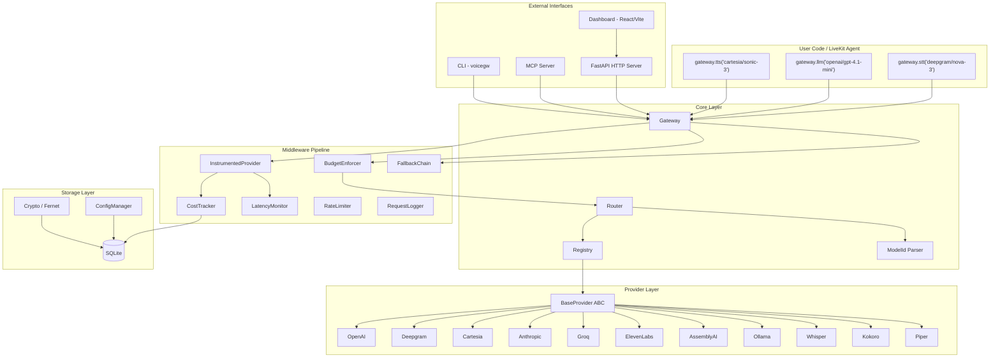
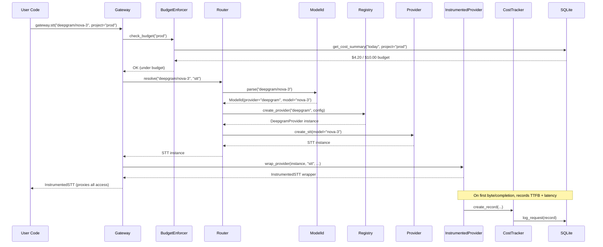

# Architecture Overview

VoiceGateway is a self-hosted inference gateway for voice AI. It provides unified routing for STT, LLM, and TTS requests across cloud providers and local models, with cost tracking, fallback chains, rate limiting, budget enforcement, and a web dashboard.

## System Architecture



## Request Flow

Every call to `gateway.stt()`, `gateway.llm()`, or `gateway.tts()` follows the same path:



## Directory Structure

```
voicegateway/
  core/
    gateway.py          # Main Gateway class — orchestrator
    config.py           # YAML config loader with ${ENV_VAR} substitution
    config_manager.py   # Merges YAML + SQLite + env (priority: env > db > yaml)
    router.py           # Resolves "provider/model" to provider instances
    registry.py         # Lazy provider factory (imports on first use)
    model_id.py         # Parses "provider/model[:variant]" format
    schema.py           # Pydantic validation for voicegw.yaml
    crypto.py           # Fernet encryption for stored secrets
  providers/
    base.py             # BaseProvider ABC (create_stt/llm/tts, health_check, get_pricing)
    openai_provider.py  # OpenAI (STT + LLM + TTS)
    deepgram_provider.py
    cartesia_provider.py
    anthropic_provider.py
    groq_provider.py
    elevenlabs_provider.py
    assemblyai_provider.py
    ollama_provider.py
    whisper_provider.py
    kokoro_provider.py
    piper_provider.py
  middleware/
    cost_tracker.py         # Per-request cost calculation and storage
    latency_monitor.py      # TTFB + total latency tracking
    rate_limiter.py         # Token bucket rate limiter per provider
    fallback.py             # Automatic model failover chains
    logger.py               # Structured request/response logging
    budget_enforcer.py      # Project budget enforcement (warn/throttle/block)
    instrumented_provider.py # Transparent proxy wrappers for metrics
  storage/
    sqlite.py           # SQLite backend (aiosqlite)
    models.py           # RequestRecord dataclass
  server.py             # FastAPI HTTP API
  mcp/
    server.py           # MCP server bootstrap
    auth.py             # API key authentication
    errors.py           # Structured error types
    schemas.py          # Input/output schemas
    tools/              # Tool implementations (providers, models, projects, observability)
  pricing/
    catalog.py          # Per-model pricing data
dashboard/
  api/                  # FastAPI backend for dashboard
  frontend/             # React + TypeScript + Vite + Recharts
```

## Design Principles

1. **Async throughout** -- all database, HTTP, and provider operations use async/await. The Gateway provides synchronous wrapper methods for convenience.

2. **Lazy loading** -- providers are only imported and instantiated on first use. `pip install voicegateway[openai]` installs only the OpenAI SDK.

3. **Transparent instrumentation** -- `InstrumentedSTT/LLM/TTS` wrappers proxy all attribute access via `__getattr__`, so user code sees the exact same API as the underlying provider instance.

4. **Config layering** -- three sources merged at startup: environment variables (highest priority), SQLite managed tables (dashboard/MCP writes), and YAML (base config). Each resource carries a `source` field (`"yaml"` or `"db"`).

5. **Encryption at rest** -- all API keys stored in SQLite are encrypted with Fernet (AES-128-CBC + HMAC-SHA256). Keys in API responses are masked to `secr...2345` format.

## Key Components

| Component | File | Purpose |
|-----------|------|---------|
| [Gateway Core](./gateway-core) | `core/gateway.py` | Main orchestrator, entry point for all requests |
| [Provider Abstraction](./provider-abstraction) | `providers/base.py` | ABC for all 11 provider implementations |
| [Middleware](./middleware) | `middleware/` | Cost, latency, rate limiting, fallback, budget |
| [Storage](./storage) | `storage/sqlite.py` | SQLite schema, tables, views, indexes |
| [Config Layers](./config-layers) | `core/config_manager.py` | YAML + SQLite + env merge strategy |
| [Security](./security) | `core/crypto.py` | Fernet encryption, secret management, masking |
