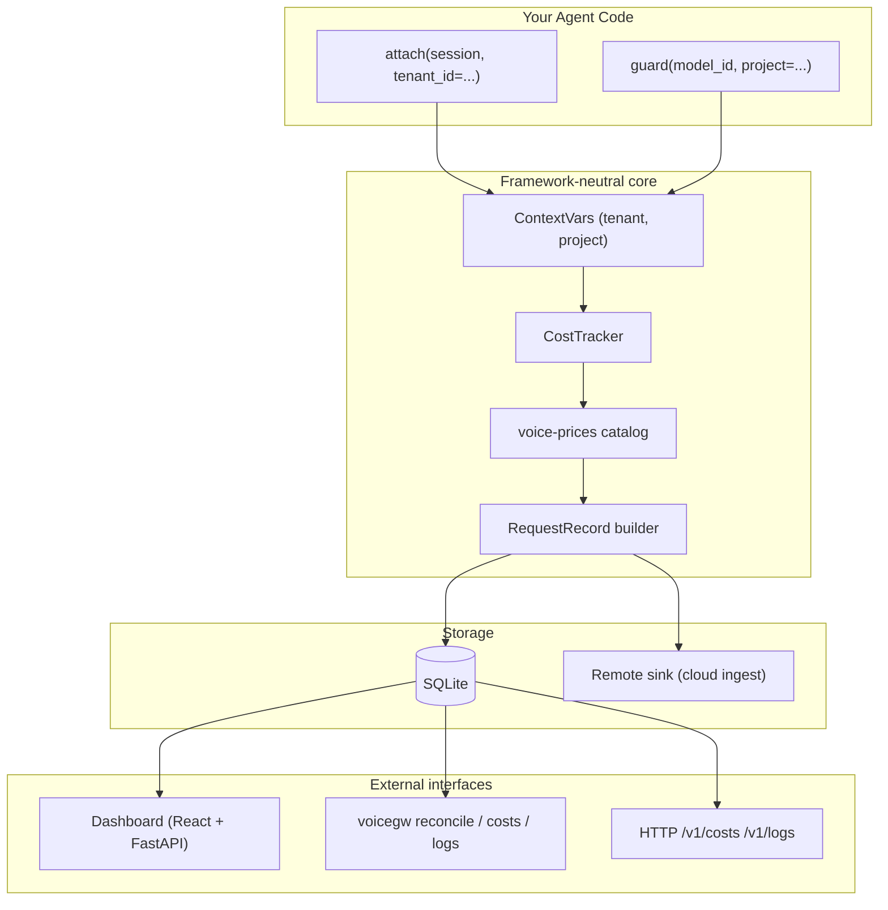

VoiceGateway is a framework-neutral observability and control layer for LiveKit voice agents. You call `attach()` as a passive observer that records every inference unit, and `guard()` as an active gate that enforces budgets and rate limits before a call is placed. Both functions share a single `RequestRecord` pipeline that lands in SQLite (or a remote sink) and feeds the dashboard and `voicegw reconcile`.

## Request flow


```mermaid
graph TD
    subgraph UserCode["Your Agent Code"]
        A["attach(session, tenant_id=...)"]
        B["guard(model_id, project=...)"]
    end

    subgraph Core["Framework-neutral core"]
        CTX["ContextVars (tenant, project)"]
        CT["CostTracker"]
        REC["RequestRecord builder"]
        VPR["voice-prices catalog"]
    end

    subgraph Storage["Storage"]
        DB[(SQLite)]
        SINK["Remote sink (cloud ingest)"]
    end

    subgraph Interfaces["External interfaces"]
        DASH["Dashboard (React + FastAPI)"]
        CLI["voicegw reconcile / costs / logs"]
        API["HTTP /v1/costs  /v1/logs"]
    end

    A --> CTX
    B --> CTX
    CTX --> CT
    CT --> VPR
    VPR --> REC
    REC --> DB
    REC --> SINK
    DB --> DASH
    DB --> CLI
    DB --> API
```

`attach()` hooks into the LiveKit `AgentSession` event stream. It reads the current `ContextVars` (tenant, project, call ID) on each event, computes cost via `voice-prices`, and writes a `RequestRecord`. `guard()` checks BudgetEnforcer and RateLimiter before the call starts and raises `BudgetExceededError` or `RateLimitExceeded` when a limit is hit.

## Directory layout

```
src/voicegateway/
├── core/
│   ├── gateway.py          # Internal orchestrator (not public API)
│   ├── config.py           # YAML parser with ${ENV_VAR} substitution
│   ├── config_manager.py   # Three-source merge: env > SQLite > YAML
│   ├── registry.py         # Lazy provider factory
│   └── schema.py           # Pydantic config models
├── providers/
│   ├── base.py             # BaseProvider ABC
│   └── *.py                # 11 provider implementations
├── middleware/
│   ├── cost_tracker.py     # RequestRecord builder, voice-prices dispatch
│   ├── latency_monitor.py  # TTFB + total-latency timers
│   ├── rate_limiter.py     # Sliding-window RPM limiter
│   ├── budget_enforcer.py  # Per-project daily-budget checks
│   ├── logger.py           # Structured request logger
│   └── instrumented_provider.py  # Transparent proxy wrappers
├── storage/
│   ├── sqlite.py           # Async SQLite backend
│   └── models.py           # RequestRecord dataclass
└── pricing/
    └── catalog.py          # voice-prices facade
dashboard/
├── api/                    # FastAPI backend
└── frontend/               # React + TypeScript + Vite + Recharts
```

## Design principles

**Async throughout.** All database, HTTP, and provider operations use `async`/`await`. The public `attach()` and `guard()` helpers are async-native.

**Framework neutral.** VoiceGateway does not own the inference path. You keep your own LiveKit plugin instances or Pipecat services; `attach()` observes them, `guard()` gates them.

**Lazy provider loading.** No provider SDK is imported until first use. `pip install voicegateway[openai]` installs only the OpenAI SDK.

**Transparent instrumentation.** `InstrumentedSTT/LLM/TTS` wrappers proxy all attribute access via `__getattr__`, so existing call sites see the identical API as the underlying plugin instance.

**Config layering.** Three sources merge at startup: environment variables (highest priority), SQLite managed tables (dashboard/MCP writes), and YAML (base config).

**Encryption at rest.** API keys stored in SQLite are encrypted with Fernet (AES-128-CBC + HMAC-SHA256). Keys in API responses are masked to the `secr...2345` format.

## Architecture pages

<CardGroup cols={2}>
  <Card title="Gateway Core" href="/architecture/gateway-core">
    Gateway orchestration, config, router, registry, and ModelId parser.
  </Card>
  <Card title="Provider Abstraction" href="/architecture/provider-abstraction">
    BaseProvider ABC and all 11 cloud and local provider implementations.
  </Card>
  <Card title="Middleware" href="/architecture/middleware">
    Cost tracking, latency, rate limiting, budget enforcement, and request logging.
  </Card>
  <Card title="Cost Tracking" href="/architecture/cost-tracking">
    Per-modality cost calculation: tokens, audio-minutes, characters, and voice-prices.
  </Card>
  <Card title="Config Layers" href="/architecture/config-layers">
    YAML + SQLite + env merge strategy and the ConfigManager.
  </Card>
  <Card title="Storage" href="/architecture/storage">
    SQLite schema, tables, views, indexes, and the remote-sink interface.
  </Card>
</CardGroup>
