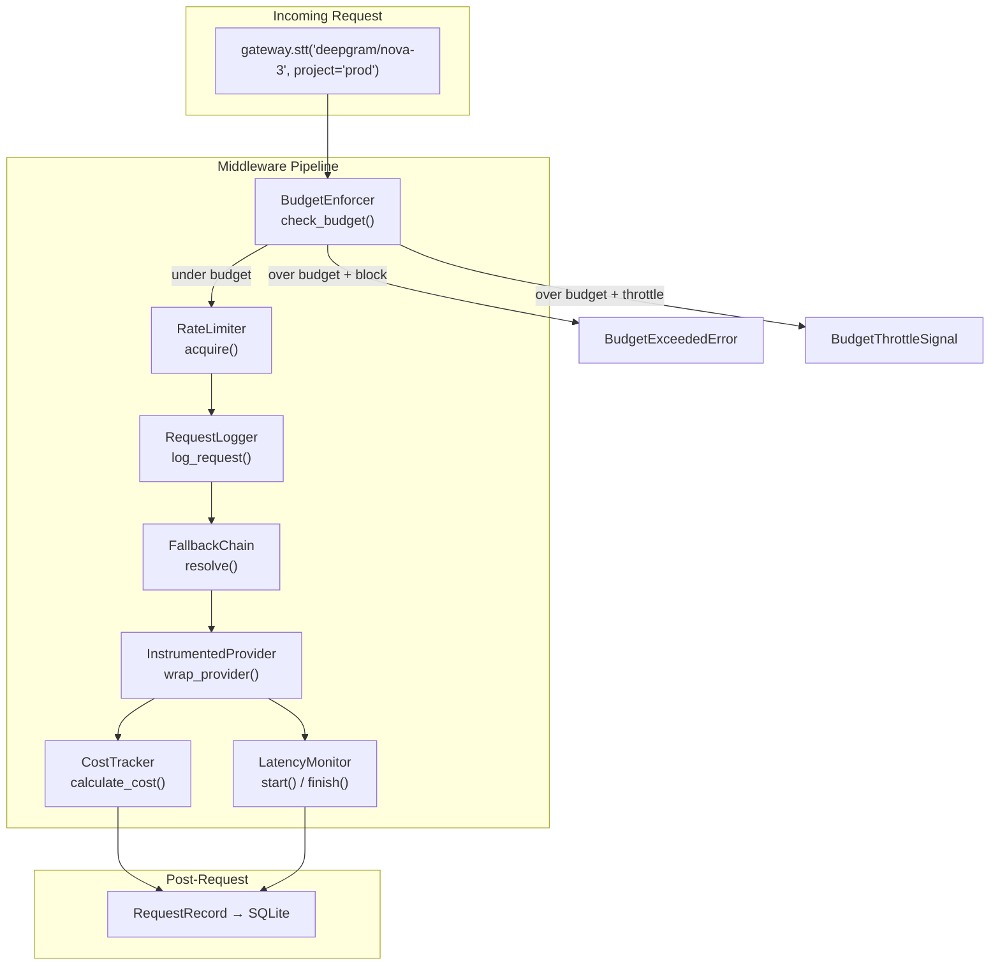
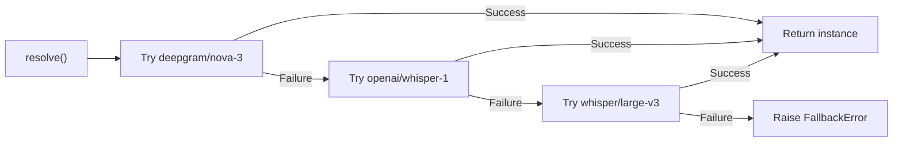
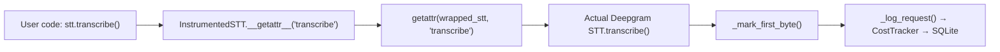

# Middleware

The middleware layer sits between the Gateway and provider instances, providing cross-cutting concerns: cost tracking, latency monitoring, rate limiting, fallback chains, budget enforcement, and request logging.

## Middleware Components



## Execution Order

When a request flows through the Gateway:

| Step | Component | Action |
|------|-----------|--------|
| 1 | **BudgetEnforcer** | Checks project's daily spend against its budget |
| 2 | **RateLimiter** | Ensures provider hasn't exceeded RPM limit |
| 3 | **RequestLogger** | Logs the incoming request |
| 4 | **FallbackChain** | Tries primary model, falls back on failure |
| 5 | **Router** | Resolves model ID to provider instance |
| 6 | **InstrumentedProvider** | Wraps the instance to record metrics |
| 7 | **CostTracker** | Calculates cost when the request completes |
| 8 | **LatencyMonitor** | Records TTFB and total latency |

## BudgetEnforcer

**File:** `voicegateway/middleware/budget_enforcer.py`

Enforces per-project daily spending limits. Budget checks are cached in memory with a **30-second TTL** to avoid hitting the database on every request.

### Three Modes

| Mode | `budget_action` | Behavior |
|------|-----------------|----------|
| **Warn** | `"warn"` | Logs a warning, allows the request to proceed |
| **Throttle** | `"throttle"` | Raises `BudgetThrottleSignal` -- caller should fall back to local models |
| **Block** | `"block"` | Raises `BudgetExceededError` -- request is rejected |

```python
class BudgetEnforcer:
    def __init__(self, config, storage, cache_ttl_seconds=30.0):
        self._cache: dict[str, tuple[float, float]] = {}

    async def check_budget(self, project: str) -> None:
        pcfg = self._get_project_config(project)
        if pcfg is None or pcfg.daily_budget <= 0:
            return  # No budget configured = unlimited

        today_spend = await self._get_today_spend(project)
        if today_spend < pcfg.daily_budget:
            return  # Under budget

        if pcfg.budget_action == "warn":
            logger.warning(...)
        elif pcfg.budget_action == "throttle":
            raise BudgetThrottleSignal(project, today_spend, pcfg.daily_budget)
        elif pcfg.budget_action == "block":
            raise BudgetExceededError(project, today_spend, pcfg.daily_budget)
```

The `get_budget_status()` method returns a status string for API responses: `"ok"`, `"warning"` (>80% spent), or `"exceeded"`.

## CostTracker

**File:** `voicegateway/middleware/cost_tracker.py`

Calculates per-request costs based on the pricing catalog and writes request records to SQLite.

### Cost Formulas

| Modality | Formula |
|----------|---------|
| STT | `audio_duration_minutes * price_per_minute` |
| LLM | `(input_tokens * input_price + output_tokens * output_price) / 1000` |
| TTS | `characters * price_per_character` |

### Key Methods

- **`calculate_cost(model_id, modality, input_units, output_units)`** -- returns cost in USD
- **`create_record(...)`** -- creates a `RequestRecord` with cost, latency, and metadata
- **`log_request(record)`** -- persists the record to SQLite (async)

## LatencyMonitor

**File:** `voicegateway/middleware/latency_monitor.py`

Tracks two timing metrics:

- **TTFB (Time to First Byte):** measured from request start to the first result/token
- **Total latency:** measured from request start to completion

```python
class LatencyMonitor:
    def __init__(self, ttfb_warning_ms: float = 500.0):
        self._ttfb_warning_ms = ttfb_warning_ms

    def start(self) -> _LatencyTimer:
        return _LatencyTimer(self._ttfb_warning_ms)
```

The `_LatencyTimer` logs a warning when TTFB exceeds the configured threshold (default 500ms). This threshold is configurable via `latency.ttfb_warning_ms` in `voicegw.yaml`.

## RateLimiter

**File:** `voicegateway/middleware/rate_limiter.py`

A sliding-window rate limiter using a token bucket pattern, enforced per provider.

```yaml
# voicegw.yaml
rate_limits:
  openai:
    requests_per_minute: 60
  deepgram:
    requests_per_minute: 100
```

```python
class RateLimiter:
    async def acquire(self, provider: str) -> None:
        """Raises RateLimitExceeded if the provider's RPM limit is hit."""
```

The limiter maintains a list of timestamps for each provider. On each `acquire()` call, it removes entries older than 60 seconds and checks whether the count exceeds the configured RPM. Uses `asyncio.Lock` for thread safety.

## FallbackChain

**File:** `voicegateway/middleware/fallback.py`

Manages automatic failover between models within a modality.

```yaml
# voicegw.yaml
fallbacks:
  stt:
    - deepgram/nova-3
    - openai/whisper-1
    - whisper/large-v3
  tts:
    - cartesia/sonic-3
    - elevenlabs/turbo-v2.5
```



When a fallback is triggered:

1. The error from the previous model is logged at `DEBUG` level
2. A `WARNING` log is emitted: `"Fallback triggered: deepgram/nova-3 -> openai/whisper-1 (reason: ...)""`
3. The `on_fallback` callback fires (if provided), which the Gateway wires to `RequestLogger.log_fallback()`

If all models in the chain fail, `FallbackError` is raised with the full chain and all accumulated errors.

## RequestLogger

**File:** `voicegateway/middleware/logger.py`

Structured logging for all gateway operations under the `gateway.requests` logger name.

| Method | Log Level | Format |
|--------|-----------|--------|
| `log_request(model_id, modality)` | INFO | `[STT] deepgram/nova-3` |
| `log_response(model_id, modality, latency_ms, cost_usd)` | INFO | `[STT] deepgram/nova-3 -> success (142ms, $0.000430)` |
| `log_fallback(original, fallback, reason)` | WARNING | `[FALLBACK] deepgram/nova-3 -> openai/whisper-1 (reason: ...)` |
| `log_error(model_id, error)` | ERROR | `[ERROR] deepgram/nova-3: Connection timeout` |

## InstrumentedProvider

**File:** `voicegateway/middleware/instrumented_provider.py`

Transparent proxy wrappers that record TTFB, total latency, and cost without changing the provider's API surface.

### How It Works



The three wrapper classes (`InstrumentedSTT`, `InstrumentedLLM`, `InstrumentedTTS`) extend `_InstrumentedBase`, which:

1. Uses `object.__setattr__` in `__init__` to store internal state without triggering the proxy
2. Implements `__getattr__` to delegate all attribute access to the wrapped instance
3. Implements `__setattr__` to delegate attribute writes to the wrapped instance
4. Records `_start_time` at construction via `time.perf_counter()`
5. Provides `_mark_first_byte()` to record TTFB
6. Provides `_log_request()` to write a `RequestRecord` to storage (with a `_logged` guard to prevent duplicates)

The wrapping is applied by the Gateway's `_wrap()` method and can be disabled by setting `observability.latency_tracking: false` in config.
