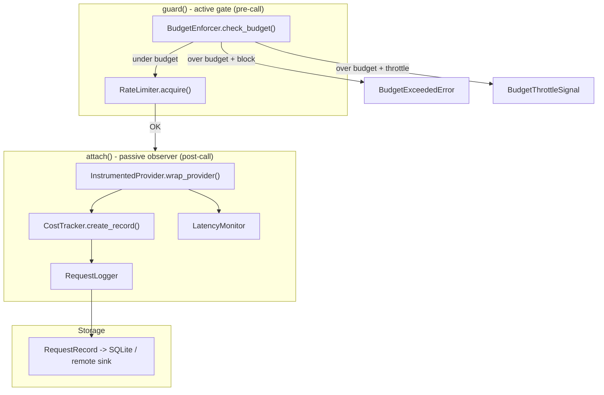
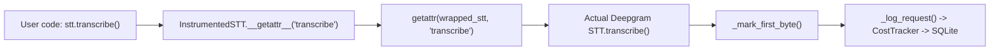

The middleware layer provides cross-cutting concerns: cost tracking, latency monitoring, rate limiting, fallback chains, budget enforcement, and request logging. `attach()` feeds completed call events through this pipeline. `guard()` runs the budget and rate checks before a call starts.

## Pipeline overview


```mermaid
graph TD
    subgraph ActivePath["guard() - active gate (pre-call)"]
        BE["BudgetEnforcer.check_budget()"]
        RL["RateLimiter.acquire()"]
    end

    subgraph PassivePath["attach() - passive observer (post-call)"]
        IP["InstrumentedProvider.wrap_provider()"]
        CT["CostTracker.create_record()"]
        LM["LatencyMonitor"]
        LG["RequestLogger"]
    end

    subgraph Storage["Storage"]
        REC["RequestRecord -> SQLite / remote sink"]
    end

    BE -->|under budget| RL
    BE -->|over budget + block| ERR["BudgetExceededError"]
    BE -->|over budget + throttle| THR["BudgetThrottleSignal"]
    RL -->|OK| PassivePath
    IP --> CT
    IP --> LM
    CT --> LG
    LG --> REC
```

## Execution order

| Step | Component | Path | Action |
|------|-----------|------|--------|
| 1 | **BudgetEnforcer** | guard() | Checks project daily spend against budget |
| 2 | **RateLimiter** | guard() | Ensures provider RPM limit is not exceeded |
| 3 | **InstrumentedProvider** | attach() | Wraps the instance to record metrics |
| 4 | **CostTracker** | attach() | Calculates cost when the call completes |
| 5 | **LatencyMonitor** | attach() | Records TTFB and total latency |
| 6 | **RequestLogger** | attach() | Writes structured log entry |

## BudgetEnforcer

**File:** `src/voicegateway/middleware/budget_enforcer.py`

Enforces per-project daily spending limits. Budget checks are cached in memory with a 30-second TTL to avoid hitting the database on every request.

### Three modes

| Mode | `budget_action` | Behavior |
|------|-----------------|----------|
| **Warn** | `"warn"` | Logs a warning, allows the request to proceed |
| **Throttle** | `"throttle"` | Raises `BudgetThrottleSignal` -- caller should fall back to local models |
| **Block** | `"block"` | Raises `BudgetExceededError` -- request is rejected |

```python
class BudgetEnforcer:
    def __init__(self, config, storage, cache_ttl_seconds=30.0):
        self._cache: dict[str, tuple[float, float]] = {}

    async def check_budget(self, project: str) -> None:
        pcfg = self._get_project_config(project)
        if pcfg is None or pcfg.daily_budget <= 0:
            return  # No budget configured = unlimited

        today_spend = await self._get_today_spend(project)
        if today_spend < pcfg.daily_budget:
            return  # Under budget

        if pcfg.budget_action == "warn":
            logger.warning(...)
        elif pcfg.budget_action == "throttle":
            raise BudgetThrottleSignal(project, today_spend, pcfg.daily_budget)
        elif pcfg.budget_action == "block":
            raise BudgetExceededError(project, today_spend, pcfg.daily_budget)
```

`get_budget_status()` returns a status string for API responses: `"ok"`, `"warning"` (>80% spent), or `"exceeded"`.

## CostTracker

**File:** `src/voicegateway/middleware/cost_tracker.py`

Calculates per-request costs based on the pricing catalog and writes request records to SQLite.

### Pricing

Costs are delegated to `voice-prices`. The cost tracker maps the recorded units onto a `voice_prices.Usage` per modality (STT: `audio_input_seconds`, LLM: `input_tokens` / `output_tokens` / `cache_read_tokens`, TTS: `characters`) and calls `voice_prices.calc_price`. Self-hosted `local/*` and `ollama/*` models price at `$0`.

See [Cost Tracking](/architecture/cost-tracking) for the full per-modality flow.

### Key methods

- `CostTracker.calculate_cost(model_id, modality, input_units, output_units, cached_input_units)` returns cost in USD (0.0 for unknown or self-hosted).
- `create_record(...)` builds a `RequestRecord` with cost, latency, and metadata.
- `log_request(record)` persists the record to SQLite (async).

## LatencyMonitor

**File:** `src/voicegateway/middleware/latency_monitor.py`

Tracks two timing metrics:

- **TTFB (Time to First Byte).** Measured from request start to the first result or token.
- **Total latency.** Measured from request start to completion.

```python
class LatencyMonitor:
    def __init__(self, ttfb_warning_ms: float = 500.0):
        self._ttfb_warning_ms = ttfb_warning_ms

    def start(self) -> _LatencyTimer:
        return _LatencyTimer(self._ttfb_warning_ms)
```

The `_LatencyTimer` logs a warning when TTFB exceeds the configured threshold (default 500 ms). Configure via `latency.ttfb_warning_ms` in `voicegw.yaml`.

## RateLimiter

**File:** `src/voicegateway/middleware/rate_limiter.py`

A sliding-window rate limiter using a token bucket pattern, enforced per provider.

```yaml
# voicegw.yaml
rate_limits:
  openai:
    requests_per_minute: 60
  deepgram:
    requests_per_minute: 100
```

```python
class RateLimiter:
    async def acquire(self, provider: str) -> None:
        """Raises RateLimitExceeded if the provider's RPM limit is hit."""
```

The limiter maintains a list of timestamps for each provider. On each `acquire()` call, it removes entries older than 60 seconds and checks whether the count exceeds the configured RPM. Uses `asyncio.Lock` for thread safety.

## Resolver-time fallback (manual walk)

VoiceGateway does not run automatic fallback middleware. Resolver-time fallback is a startup-walk pattern: you enumerate the chain and call `attach()` or `guard()` with each model ID until one succeeds, then pass the resolved instance to `AgentSession`. The chain lives in `voicegw.yaml` under `fallbacks:`.

```yaml
# voicegw.yaml
fallbacks:
  stt:
    - deepgram/nova-3
    - openai/whisper-1
    - local/whisper-large-v3
  tts:
    - cartesia/sonic-3
    - elevenlabs/turbo-v2.5
```

```python
from voicegateway import guard

def first_resolvable_stt(chain):
    for model_id in chain:
        try:
            return guard(model_id)
        except Exception:
            continue
    raise RuntimeError("every STT model in the chain failed to resolve")
```

Once a resolved model is wired into `AgentSession`, the call uses it for its lifetime. VoiceGateway does not swap providers mid-call. For runtime or mid-call failover, compose LiveKit's `FallbackAdapter` around instances created via `guard()`. See the [livekit-fallback-adapter example](/examples/livekit-fallback-adapter).

## RequestLogger

**File:** `src/voicegateway/middleware/logger.py`

Structured logging for all gateway operations under the `gateway.requests` logger name.

| Method | Log level | Format |
|--------|-----------|--------|
| `log_request(model_id, modality)` | INFO | `[STT] deepgram/nova-3` |
| `log_response(model_id, modality, latency_ms, cost_usd)` | INFO | `[STT] deepgram/nova-3 -> success (142ms, $0.000430)` |
| `log_fallback(original, fallback, reason)` | WARNING | `[FALLBACK] deepgram/nova-3 -> openai/whisper-1 (reason: ...)` |
| `log_error(model_id, error)` | ERROR | `[ERROR] deepgram/nova-3: Connection timeout` |

## InstrumentedProvider

**File:** `src/voicegateway/middleware/instrumented_provider.py`

Transparent proxy wrappers that record TTFB, total latency, and cost without changing the provider's API surface. `attach()` applies these wrappers automatically when it hooks a session.

### How it works


```mermaid
graph LR
    A["User code: stt.transcribe()"] --> B["InstrumentedSTT.__getattr__('transcribe')"]
    B --> C["getattr(wrapped_stt, 'transcribe')"]
    C --> D["Actual Deepgram STT.transcribe()"]
    D --> E["_mark_first_byte()"]
    E --> F["_log_request() -> CostTracker -> SQLite"]
```

The three wrapper classes (`InstrumentedSTT`, `InstrumentedLLM`, `InstrumentedTTS`) extend `_InstrumentedBase`, which:

1. Uses `object.__setattr__` in `__init__` to store internal state without triggering the proxy.
2. Implements `__getattr__` to delegate all attribute access to the wrapped instance.
3. Implements `__setattr__` to delegate attribute writes to the wrapped instance.
4. Records `_start_time` at construction via `time.perf_counter()`.
5. Provides `_mark_first_byte()` to record TTFB.
6. Provides `_log_request()` to write a `RequestRecord` to storage (with a `_logged` guard to prevent duplicates).

The `guard()` helper also uses `wrap_provider` internally when it creates a new plugin instance on your behalf, so both the passive (`attach()`) and active (`guard()`) paths go through the same instrumentation. Disable it via `observability.latency_tracking: false` in config.

<Tip>
You can use `from voicegateway import attach, guard` together on the same session. `attach()` instruments the existing instances; `guard()` enforces budgets before new calls start. See [Core Concepts](/guide/core-concepts).
</Tip>
