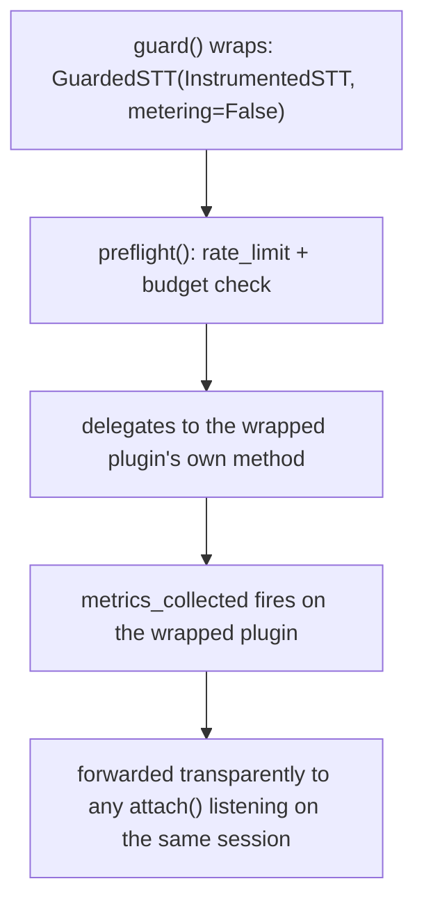

`src/voicegateway/middleware/` has more files than the request path uses. This page covers what `attach()` and `guard()` actually exercise, and says plainly where a class is constructed but never invoked.

## CostTracker

**File:** `src/voicegateway/middleware/cost_tracker_middleware.py`

The one middleware class every write path uses. `attach()` constructs a fresh `CostTracker` per session; `guard()` constructs a no-op one (`storage=None`) purely to satisfy its wrapper's constructor, since `guard()` writes no records. The Gateway singleton's own `gw.cost_tracker` is a third, separate instance, used only by the fleet-ingest endpoint to re-rate rows submitted by remote agents.

### Pricing

Costs delegate to `voice_prices.calc_price`. `_catalog_cost()` maps the recorded units onto the modality's `Usage` shape (STT: `audio_input_seconds`, LLM: `input_tokens` / `output_tokens` / `cache_read_tokens`, TTS: `characters`). Self-hosted `local/*` and `ollama/*` models price at `$0` without a catalog lookup.

See [Cost Tracking](/architecture/cost-tracking) for the full per-modality flow.

### Key methods

- `create_record(...)` builds a `RequestRecord`: resolves cost, then rates it against the active `RateCard` (see [Rating](/architecture/rating)).
- `log_request(record)` persists the record via `storage.log_request()`, then calls `notify_spend()`.
- `notify_spend(record)` calls `BudgetEnforcer.record_spend()` (below) so the cached daily-spend figure stays current for the status badge.
- `close_session(session_id)` finalizes session-aggregate metrics and replay tables on session close.

## RateLimiter

**File:** `src/voicegateway/middleware/rate_limiter_middleware.py`

A token-bucket limiter: `acquire(provider)` raises `RateLimitExceeded` if the provider's requests-in-the-last-60-seconds count is at or over its configured `requests_per_minute`.

```python
class RateLimiter:
    async def acquire(self, provider: str) -> None:
        """Raises RateLimitExceeded if the provider's RPM limit is hit."""
```

This class has two call sites, and they are not the same instance:

- **`guard(provider, rate_limit="60/min")`** builds its own `RateLimiter`, seeded from the parsed DSL string, keyed to that one provider. This is the limiter that actually runs on a call. See [guard()](/guide/guard).
- **`Gateway.__init__`** also builds a `RateLimiter` from `voicegw.yaml`'s top-level `rate_limits:` block, and stores it as `gw._rate_limiter`. Nothing calls `.acquire()` on it. The YAML block is parsed and held, not enforced.

## BudgetEnforcer

**File:** `src/voicegateway/middleware/budget_enforcer_middleware.py`

Two of its methods are live, one is not:

- **`record_spend(project, cost_usd)`**: live. `CostTracker.notify_spend()` calls this after every logged request, updating a 30-second-TTL in-memory cache of today's spend per project.
- **`get_budget_status(project, today_spend)`**: live. Returns `"ok"` / `"warning"` (≥80% of `daily_budget`) / `"exceeded"` (≥100%). The dashboard, `voicegw project <id>`, and the MCP project tools call this to render the budget badge.
- **`check_budget(project)`**: not called anywhere outside its own class and its tests. This is the method that would dispatch on `budget_action` (`warn` / `throttle` / `block`) and raise `BudgetThrottleSignal` or `BudgetExceededError`. It never runs, so `budget_action` currently has no effect on gateway behavior; see [Projects: Budgets](/configuration/projects#budgets) for the full caveat.

To actually stop or reroute a call on spend, use `guard()`'s own `budget="$X/day"` argument instead. That is a separate mechanism (`GuardControl.check_budget()` in `inference/livekit/guard_livekit.py` / `inference/pipecat/guard_pipecat.py`): it reads accumulated spend straight from storage and raises `BudgetExceededError`, without going through this class at all.

## InstrumentedSTT / InstrumentedLLM / InstrumentedTTS

**File:** `src/voicegateway/middleware/instrumented_provider_middleware.py`

`attach()` does not use these. It subscribes directly to the `metrics_collected` events a plugin already emits (see [Architecture Overview](/architecture/index)); there is nothing to wrap. These three classes have two callers instead:

- **`guard()`** subclasses them with `metering=False`: a control-only shell that forwards the inner plugin's events transparently (so an `attach()` on the same session still sees them once) but writes no `RequestRecord` itself.
- **`voicegw check`** is the sole caller of the module-level `wrap_provider()` helper, with `metering=True`, to drive one synthetic instrumented request through storage as a self-test.

Each class extends the matching `livekit.agents` base (`InstrumentedSTT(lk_stt.STT, ...)`, etc.) and overrides the methods that matter (`chat`, `recognize`, `synthesize`, `stream`) to delegate to the wrapped instance. `__getattr__` only fires as a fallback, for provider-specific attributes the LiveKit base class doesn't declare (a Cartesia-only `set_voice`, for example): it is not the primary mechanism, just a safety net after normal attribute lookup fails.


```mermaid
graph TD
    A["guard() wraps: GuardedSTT(InstrumentedSTT, metering=False)"] --> B["preflight(): rate_limit + budget check"]
    B --> C["delegates to the wrapped plugin's own method"]
    C --> D["metrics_collected fires on the wrapped plugin"]
    D --> E["forwarded transparently to any attach() listening on the same session"]
```

## Fallback

`guard()` takes a `fallback=[...]` list of already-constructed provider instances and tries them in order on a pre-first-token error, via `GuardControl.run_with_fallback()` (STT) or `iterate_with_fallback()` (streaming LLM/TTS). There is no separate "resolver-time fallback" mechanism in this package: the walk lives entirely inside `guard()`. See [guard()](/guide/guard#fallback-only-covers-pre-output-failures) for the exact semantics and its pre-first-token limitation.

## Constructed but unused

Two more classes are wired into `Gateway.__init__` and never called again: `LatencyMonitor` (`middleware/latency_monitor_middleware.py`, stored as `gw._latency_monitor`) and `RequestLogger` (`middleware/logger_middleware.py`, stored as `gw._logger`). Real TTFB/latency numbers come from LiveKit's and Pipecat's own metric fields, read directly by `MetricCapture` and `InstrumentedSTT`/`LLM`/`TTS`, not through `LatencyMonitor`.
