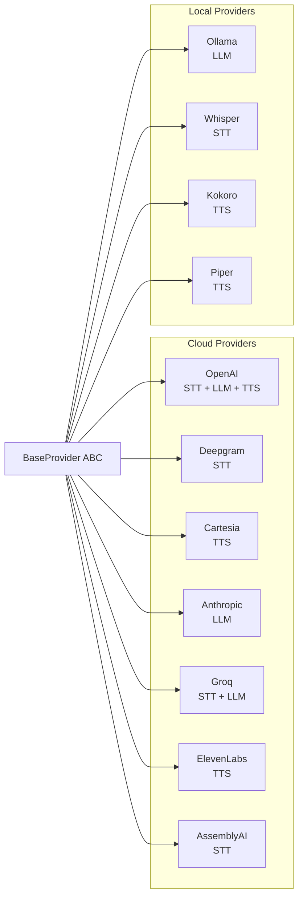

# Provider Abstraction

All 11 providers in VoiceGateway implement the same abstract base class, giving the core layer a uniform interface regardless of whether the underlying service is a cloud API or a local model.

## BaseProvider ABC

**File:** `voicegateway/providers/base.py`

```python
class BaseProvider(ABC):

    @abstractmethod
    def create_stt(self, model: str, **kwargs: Any) -> Any:
        """Create an STT instance."""
        ...

    @abstractmethod
    def create_llm(self, model: str, **kwargs: Any) -> Any:
        """Create an LLM instance."""
        ...

    @abstractmethod
    def create_tts(self, model: str, voice: str | None = None, **kwargs: Any) -> Any:
        """Create a TTS instance."""
        ...

    @abstractmethod
    async def health_check(self) -> bool:
        """Check if the provider is reachable."""
        ...

    @abstractmethod
    def get_pricing(self, model: str, modality: str) -> dict[str, float]:
        """Return pricing info (per_minute, input_per_1k, output_per_1k, per_character)."""
        ...

    def _unsupported(self, modality: str) -> None:
        """Raise NotImplementedError for unsupported modalities."""
        raise NotImplementedError(
            f"{self.__class__.__name__} does not support {modality}"
        )
```

### Method Contracts

| Method | Returns | Unsupported Behavior |
|--------|---------|---------------------|
| `create_stt(model, **kwargs)` | LiveKit-compatible STT instance | Call `self._unsupported("stt")` |
| `create_llm(model, **kwargs)` | LiveKit-compatible LLM instance | Call `self._unsupported("llm")` |
| `create_tts(model, voice, **kwargs)` | LiveKit-compatible TTS instance | Call `self._unsupported("tts")` |
| `health_check()` | `True` if reachable, `False` otherwise | Must always be implemented |
| `get_pricing(model, modality)` | Dict with pricing keys | Return `{}` for unsupported |

## Provider Registry

All 11 providers are registered in `voicegateway/core/registry.py` as `(module_path, class_name)` tuples. The Registry uses `importlib.import_module()` for lazy loading -- a provider's SDK is only imported when that provider is first used.



## Modality Support Matrix

| Provider | STT | LLM | TTS | Install Extra |
|----------|-----|-----|-----|--------------|
| OpenAI | Yes | Yes | Yes | `openai` |
| Deepgram | Yes | -- | -- | `deepgram` |
| Cartesia | -- | -- | Yes | `cartesia` |
| Anthropic | -- | Yes | -- | `anthropic` |
| Groq | Yes | Yes | -- | `groq` |
| ElevenLabs | -- | -- | Yes | `elevenlabs` |
| AssemblyAI | Yes | -- | -- | `assemblyai` |
| Ollama | -- | Yes | -- | `ollama` |
| Whisper | Yes | -- | -- | `whisper` |
| Kokoro | -- | -- | Yes | `kokoro` |
| Piper | -- | -- | Yes | `piper` |

When a provider does not support a modality, its `create_*` method calls `self._unsupported()`, which raises `NotImplementedError`. This propagates cleanly through the Router and Gateway layers.

## Implementation Pattern

Every provider follows the same structure:

```python
class DeepgramProvider(BaseProvider):
    """Deepgram STT provider."""

    def __init__(self, config: dict[str, Any]):
        self._api_key = config.get("api_key") or os.environ.get("DEEPGRAM_API_KEY", "")
        # Provider-specific initialization

    def create_stt(self, model: str, **kwargs: Any) -> Any:
        from livekit.plugins.deepgram import STT
        return STT(model=model, api_key=self._api_key, **kwargs)

    def create_llm(self, model: str, **kwargs: Any) -> Any:
        self._unsupported("llm")

    def create_tts(self, model: str, voice: str | None = None, **kwargs: Any) -> Any:
        self._unsupported("tts")

    async def health_check(self) -> bool:
        # Lightweight API call to verify credentials
        ...

    def get_pricing(self, model: str, modality: str) -> dict[str, float]:
        if modality == "stt":
            return {"per_minute": 0.0043}  # Nova-3 pricing
        return {}
```

### Key patterns:

1. **API key resolution:** `config.get("api_key")` first (from YAML or managed providers), then fall back to the standard environment variable (`DEEPGRAM_API_KEY`, `OPENAI_API_KEY`, etc.).

2. **LiveKit plugin wrapping:** each `create_*` method returns a LiveKit Agents plugin instance (`livekit.plugins.deepgram.STT`, `livekit.plugins.openai.LLM`, etc.), making VoiceGateway a drop-in replacement for direct LiveKit plugin usage.

3. **Lazy SDK import:** the `from livekit.plugins.deepgram import STT` happens inside the method, not at module level. This allows installing only the providers you need.

## Modular Installation

Each provider is an optional dependency:

```bash
# Install only what you need
pip install voicegateway[openai,deepgram,cartesia]

# Install everything
pip install voicegateway[all]

# Local-only stack (no cloud SDKs needed)
pip install voicegateway[whisper,kokoro]
```

If a provider's SDK is missing, the Registry raises a clear `ImportError`:

```
Could not import provider 'deepgram': No module named 'deepgram'.
Install with: pip install voicegateway[deepgram]
```

## Adding a New Provider

1. Create `voicegateway/providers/myprovider_provider.py` extending `BaseProvider`
2. Implement the five abstract methods (use `_unsupported()` for unsupported modalities)
3. Register it in `voicegateway/core/registry.py`:
   ```python
   "myprovider": ("voicegateway.providers.myprovider_provider", "MyProviderProvider"),
   ```
4. Add pricing data to `voicegateway/pricing/catalog.py`
5. Add the optional dependency to `pyproject.toml`
