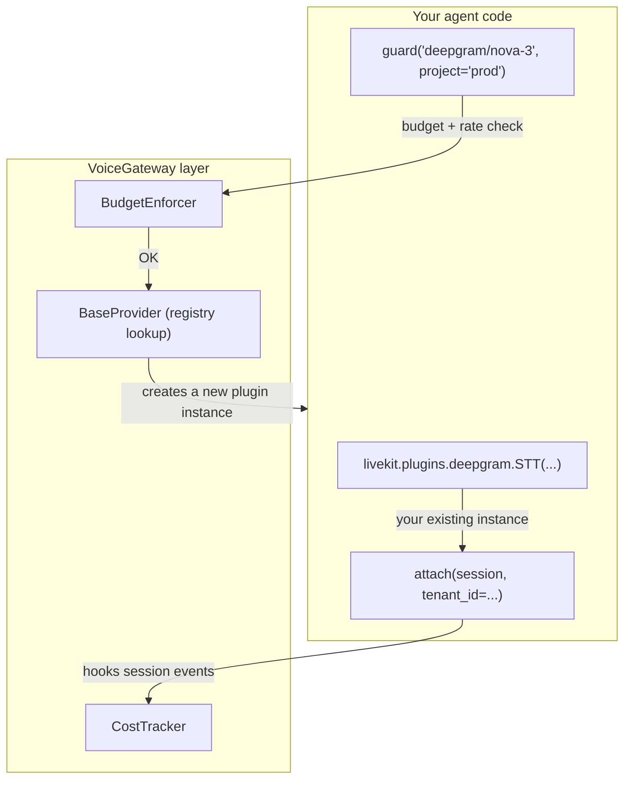
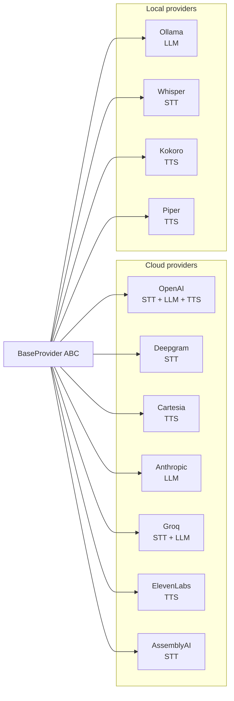

VoiceGateway does not replace your LiveKit plugin instances or Pipecat services. You keep creating them directly. `attach()` observes them as a passive hook on the `AgentSession` event stream. `guard()` gates calls before they start. The provider layer underneath exists to support the CLI health-check, the resolver-time fallback walk, and modular installation, not to intercept inference traffic.

## BaseProvider ABC

**File:** `src/voicegateway/providers/base.py`

```python
class BaseProvider(ABC):

    @abstractmethod
    def create_stt(self, model: str, **kwargs: Any) -> Any:
        """Return a LiveKit-compatible STT instance."""
        ...

    @abstractmethod
    def create_llm(self, model: str, **kwargs: Any) -> Any:
        """Return a LiveKit-compatible LLM instance."""
        ...

    @abstractmethod
    def create_tts(self, model: str, voice: str | None = None, **kwargs: Any) -> Any:
        """Return a LiveKit-compatible TTS instance."""
        ...

    @abstractmethod
    async def health_check(self) -> bool:
        """Return True if the provider is reachable."""
        ...

    def _unsupported(self, modality: str) -> None:
        """Raise NotImplementedError for unsupported modalities."""
        raise NotImplementedError(
            f"{self.__class__.__name__} does not support {modality}"
        )
```

### Method contracts

| Method | Returns | Unsupported behavior |
|--------|---------|---------------------|
| `create_stt(model, **kwargs)` | LiveKit-compatible STT instance | Call `self._unsupported("stt")` |
| `create_llm(model, **kwargs)` | LiveKit-compatible LLM instance | Call `self._unsupported("llm")` |
| `create_tts(model, voice, **kwargs)` | LiveKit-compatible TTS instance | Call `self._unsupported("tts")` |
| `health_check()` | `True` if reachable, `False` otherwise | Must always be implemented |

Pricing is not a provider-level concern. Rates for all three modalities resolve via `voice-prices` inside `src/voicegateway/pricing/catalog.py`. Providers return plain plugin instances; the cost layer wraps them separately.

## How attach() and guard() relate to providers


```mermaid
graph TD
    subgraph YourCode["Your agent code"]
        PI["livekit.plugins.deepgram.STT(...)"]
        ATT["attach(session, tenant_id=...)"]
        GRD["guard('deepgram/nova-3', project='prod')"]
    end

    subgraph VG["VoiceGateway layer"]
        BP["BaseProvider (registry lookup)"]
        CT["CostTracker"]
        BE["BudgetEnforcer"]
    end

    PI -->|your existing instance| ATT
    ATT -->|hooks session events| CT
    GRD -->|budget + rate check| BE
    BE -->|OK| BP
    BP -->|creates a new plugin instance| YourCode
```

`attach()` is the passive path: you hand it the session you already have; it records cost from the event stream without touching the plugin instance. `guard()` is the active path: it checks limits and optionally resolves a new plugin instance for you via the registry. See [attach](/guide/attach) and [guard](/guide/guard) for usage.

## Provider registry

All 11 providers are registered in `src/voicegateway/core/registry.py` as `(module_path, class_name)` tuples. The Registry uses `importlib.import_module()` for lazy loading: a provider's SDK is only imported when that provider is first used.


```mermaid
graph LR
    subgraph Cloud["Cloud providers"]
        OAI[OpenAI<br/>STT + LLM + TTS]
        DG[Deepgram<br/>STT]
        CA[Cartesia<br/>TTS]
        AN[Anthropic<br/>LLM]
        GR[Groq<br/>STT + LLM]
        EL[ElevenLabs<br/>TTS]
        AA[AssemblyAI<br/>STT]
    end

    subgraph Local["Local providers"]
        OL[Ollama<br/>LLM]
        WH[Whisper<br/>STT]
        KO[Kokoro<br/>TTS]
        PI[Piper<br/>TTS]
    end

    BP[BaseProvider ABC] --> OAI & DG & CA & AN & GR & EL & AA & OL & WH & KO & PI
```

## Modality support matrix

| Provider | STT | LLM | TTS | Install extra |
|----------|-----|-----|-----|--------------|
| OpenAI | Yes | Yes | Yes | `openai` |
| Deepgram | Yes | -- | -- | `deepgram` |
| Cartesia | -- | -- | Yes | `cartesia` |
| Anthropic | -- | Yes | -- | `anthropic` |
| Groq | Yes | Yes | -- | `groq` |
| ElevenLabs | -- | -- | Yes | `elevenlabs` |
| AssemblyAI | Yes | -- | -- | `assemblyai` |
| Ollama | -- | Yes | -- | `ollama` |
| Whisper | Yes | -- | -- | `whisper` |
| Kokoro | -- | -- | Yes | `kokoro` |
| Piper | -- | -- | Yes | `piper` |

When a provider does not support a modality, its `create_*` method calls `self._unsupported()`, which raises `NotImplementedError`. This propagates cleanly through the resolver and surfaces as a clear error before the call starts.

## Implementation pattern

Every provider follows the same structure:

```python
class DeepgramProvider(BaseProvider):
    """Deepgram STT provider."""

    def __init__(self, config: dict[str, Any]):
        self._api_key = config.get("api_key") or os.environ.get("DEEPGRAM_API_KEY", "")

    def create_stt(self, model: str, **kwargs: Any) -> Any:
        from livekit.plugins.deepgram import STT
        return STT(model=model, api_key=self._api_key, **kwargs)

    def create_llm(self, model: str, **kwargs: Any) -> Any:
        self._unsupported("llm")

    def create_tts(self, model: str, voice: str | None = None, **kwargs: Any) -> Any:
        self._unsupported("tts")

    async def health_check(self) -> bool:
        ...
```

Key patterns:

1. **API key resolution.** `config.get("api_key")` first (from YAML or managed providers), then the standard environment variable (`DEEPGRAM_API_KEY`, `OPENAI_API_KEY`, etc.).

2. **LiveKit plugin wrapping.** Each `create_*` method returns a `livekit.plugins.<provider>` instance directly, making it a drop-in replacement for direct LiveKit plugin construction.

3. **Lazy SDK import.** The `from livekit.plugins.deepgram import STT` import happens inside the method, not at module level, so you pay the import cost only when the provider is first used.

## Modular installation

Each provider is an optional dependency:

```bash
# Install only what you need
pip install voicegateway[openai,deepgram,cartesia]

# Install everything
pip install voicegateway[all]

# Local-only stack (no cloud SDKs needed)
pip install voicegateway[whisper,kokoro]
```

If a provider's SDK is missing, the Registry raises a clear `ImportError`:

```
Could not import provider 'deepgram': No module named 'deepgram'.
Install with: pip install voicegateway[deepgram]
```

## Adding a new provider

1. Create `src/voicegateway/providers/myprovider_provider.py` extending `BaseProvider`.
2. Implement the five abstract methods (use `_unsupported()` for unsupported modalities).
3. Register it in `src/voicegateway/core/registry.py`:
   ```python
   "myprovider": ("voicegateway.providers.myprovider_provider", "MyProviderProvider"),
   ```
4. Add pricing data to `src/voicegateway/pricing/catalog.py`.
5. Add the optional dependency to `pyproject.toml`.
