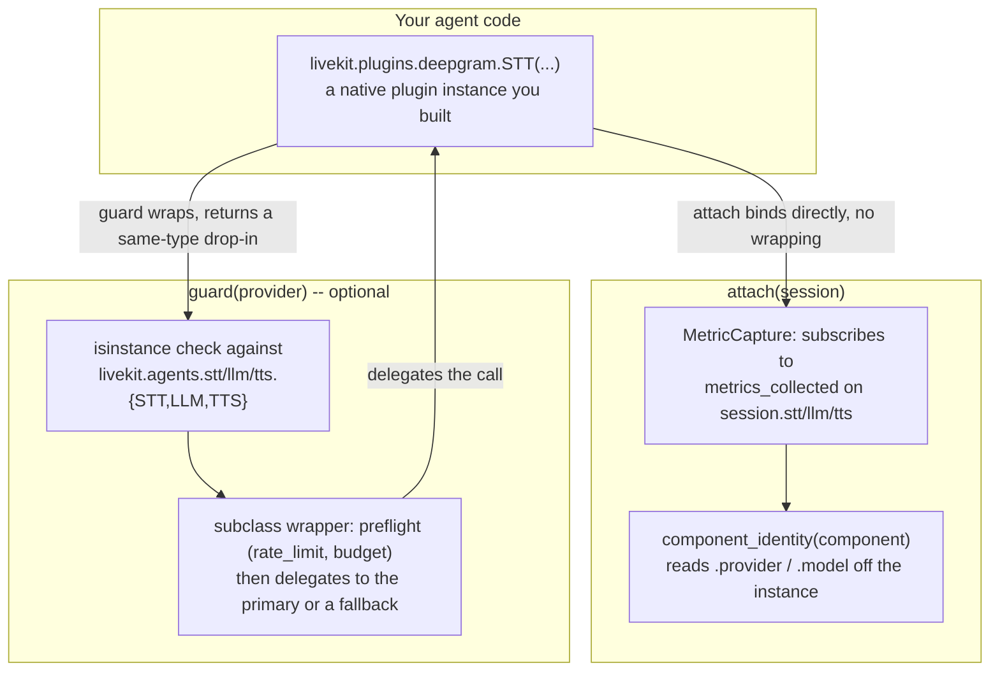
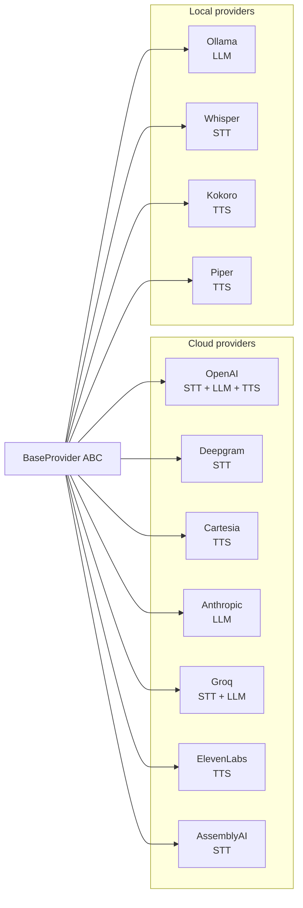

`src/voicegateway/inference/providers/` holds a `BaseProvider` ABC and 11 provider classes. Their only production use is health-checking: `POST /v1/providers/{id}/test`, `voicegw doctor`'s legacy key-validation check, and the MCP server's provider-test tools all construct one via `create_provider()` and call `await instance.health_check()`. Their `create_stt()` / `create_llm()` / `create_tts()` methods have zero production callers; only two test files exercise them.

`attach()` and `guard()` never touch this layer. You construct native `livekit.plugins.*` / `pipecat.services.*` instances yourself; `attach()` reads their `.provider`/`.model` attributes off the live instance to build `provider/model`, and `guard()` type-checks the instance against `livekit.agents.{stt,llm,tts}` base classes. Neither looks the provider up in the registry.

## BaseProvider ABC

**File:** `src/voicegateway/inference/providers/base_provider.py`

```python
class BaseProvider(ABC):

    @abstractmethod
    def create_stt(self, model: str, **kwargs: Any) -> Any:
        """Create an STT instance. Return None if provider doesn't support STT."""
        ...

    @abstractmethod
    def create_llm(self, model: str, **kwargs: Any) -> Any:
        """Create an LLM instance. Return None if provider doesn't support LLM."""
        ...

    @abstractmethod
    def create_tts(self, model: str, voice: str | None = None, **kwargs: Any) -> Any:
        """Create a TTS instance. Return None if provider doesn't support TTS."""
        ...

    @abstractmethod
    async def health_check(self) -> bool:
        """Check if the provider is reachable."""
        ...

    def _unsupported(self, modality: str) -> None:
        """Raise error for unsupported modality."""
        raise NotImplementedError(
            f"{self.__class__.__name__} does not support {modality}"
        )
```

### Method contracts

| Method | Production callers | Unsupported behavior |
|--------|---------------------|---------------------|
| `create_stt(model, **kwargs)` | None (2 test files only) | Calls `self._unsupported("stt")` |
| `create_llm(model, **kwargs)` | None (2 test files only) | Calls `self._unsupported("llm")` |
| `create_tts(model, voice, **kwargs)` | None (2 test files only) | Calls `self._unsupported("tts")` |
| `health_check()` | `/v1/providers/{id}/test`, `/v1/providers/test`, `voicegw doctor`, MCP provider-test tools | Must always be implemented |

Pricing is not a provider-level concern. It resolves via `voice_prices.calc_price` inside `src/voicegateway/inference/pricing/`, keyed entirely on the `provider/model` string; a provider class never participates.

## How attach() and guard() actually relate to providers


```mermaid
graph TD
    subgraph YourCode["Your agent code"]
        PI["livekit.plugins.deepgram.STT(...)<br/>a native plugin instance you built"]
    end

    subgraph Attach["attach(session)"]
        CI["component_identity(component)<br/>reads .provider / .model off the instance"]
        MC["MetricCapture: subscribes to<br/>metrics_collected on session.stt/llm/tts"]
    end

    subgraph Guard["guard(provider) -- optional"]
        TC["isinstance check against<br/>livekit.agents.stt/llm/tts.{STT,LLM,TTS}"]
        WRAP["subclass wrapper: preflight (rate_limit, budget)<br/>then delegates to the primary or a fallback"]
    end

    PI -->|attach binds directly, no wrapping| MC
    MC --> CI
    PI -->|guard wraps, returns a same-type drop-in| TC
    TC --> WRAP
    WRAP -->|delegates the call| PI
```

`attach()` is the passive path: it subscribes to the events the plugin already emits and never constructs or wraps anything. `guard()` is the active path: it wraps the *instance you pass it*, checking rate limit and budget before delegating, and falling back to the next instance in its `fallback=[...]` list on a pre-first-token error. Neither path calls `registry.create_provider()` or consults `BaseProvider`. See [attach()](/guide/attach) and [guard()](/guide/guard) for the full signatures.

## Provider registry

All 11 providers are registered in `src/voicegateway/core/registry.py` as `(module_path, class_name)` tuples, loaded lazily via `importlib.import_module()`. See [Gateway Core](/architecture/gateway-core#registry) for the registry table and its three health-check callers.


```mermaid
graph LR
    subgraph Cloud["Cloud providers"]
        OAI[OpenAI<br/>STT + LLM + TTS]
        DG[Deepgram<br/>STT]
        CA[Cartesia<br/>TTS]
        AN[Anthropic<br/>LLM]
        GR[Groq<br/>STT + LLM]
        EL[ElevenLabs<br/>TTS]
        AA[AssemblyAI<br/>STT]
    end

    subgraph Local["Local providers"]
        OL[Ollama<br/>LLM]
        WH[Whisper<br/>STT]
        KO[Kokoro<br/>TTS]
        PI[Piper<br/>TTS]
    end

    BP[BaseProvider ABC] --> OAI & DG & CA & AN & GR & EL & AA & OL & WH & KO & PI
```

## Modality support matrix

| Provider | STT | LLM | TTS | Wheel you install |
|----------|-----|-----|-----|--------------|
| OpenAI | Yes | Yes | Yes | `livekit-plugins-openai` |
| Deepgram | Yes | -- | Yes | `livekit-plugins-deepgram` |
| Cartesia | -- | -- | Yes | `livekit-plugins-cartesia` |
| Anthropic | -- | Yes | -- | `livekit-plugins-anthropic` |
| Groq | Yes | Yes | -- | `livekit-plugins-openai` (OpenAI-compatible endpoint) |
| ElevenLabs | -- | -- | Yes | `livekit-plugins-elevenlabs` |
| AssemblyAI | Yes | -- | -- | `livekit-plugins-assemblyai` |
| Ollama | -- | Yes | -- | `livekit-plugins-openai` + a running Ollama server |
| Whisper | Yes | -- | -- | `faster-whisper` |
| Kokoro | -- | -- | Yes | `kokoro-onnx onnxruntime` |
| Piper | -- | -- | Yes | `piper-tts` |

When a provider does not support a modality, its `create_*` method calls `self._unsupported()`, raising `NotImplementedError`. Since nothing in production calls `create_*`, this only surfaces in the two test files that exercise it directly.

## Implementation pattern

Every provider follows the same structure:

```python
class DeepgramProvider(BaseProvider):
    """Deepgram STT provider."""

    def __init__(self, config: dict[str, Any]):
        self._api_key = config.get("api_key") or os.environ.get("DEEPGRAM_API_KEY", "")

    def create_stt(self, model: str, **kwargs: Any) -> Any:
        from livekit.plugins.deepgram import STT
        return STT(model=model, api_key=self._api_key, **kwargs)

    def create_llm(self, model: str, **kwargs: Any) -> Any:
        self._unsupported("llm")

    def create_tts(self, model: str, voice: str | None = None, **kwargs: Any) -> Any:
        self._unsupported("tts")

    async def health_check(self) -> bool:
        ...
```

Key patterns:

1. **API key resolution.** `config.get("api_key")` first (from YAML or managed providers), then the standard environment variable (`DEEPGRAM_API_KEY`, `OPENAI_API_KEY`, etc.).
2. **Lazy SDK import.** The `from livekit.plugins.deepgram import STT` import happens inside the method, not at module level, so the health-check path only pays the import cost for providers it actually touches.
3. **`health_check()`** makes a minimal live request (for example, listing models) so a failed or missing key is caught at test time, not mid-call.

## Adding a new provider

1. Create `src/voicegateway/inference/providers/myprovider_provider.py` extending `BaseProvider`.
2. Implement `create_stt`/`create_llm`/`create_tts` (call `_unsupported()` for modalities it doesn't support) and `health_check()`.
3. Register it in `src/voicegateway/core/registry.py`:
   ```python
   "myprovider": ("voicegateway.inference.providers.myprovider_provider", "MyProviderProvider"),
   ```
4. No pricing step is needed: `voice_prices.calc_price` resolves cost from the `provider/model` string at request time, not from a per-provider table in this repo.
5. Point the `ImportError` install hint at the upstream plugin wheel. There is no per-provider extra in `pyproject.toml`, since VoiceGateway does not bundle provider wheels.
