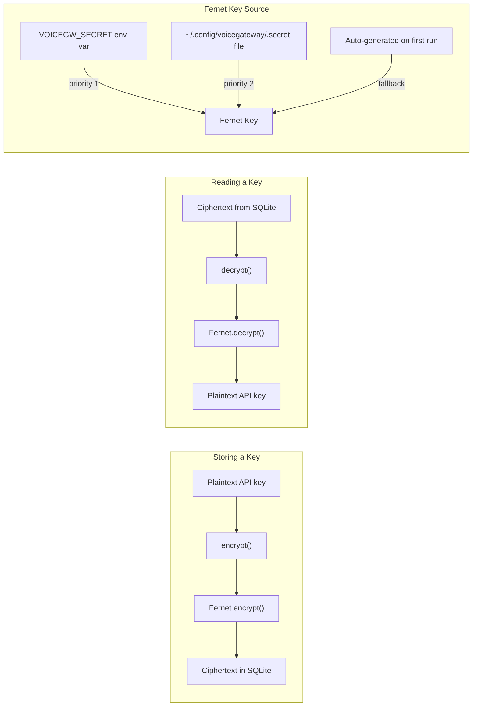

# Security

VoiceGateway encrypts all API keys stored in its database, masks secrets in API responses, and maintains an audit log of configuration changes.

## Fernet Encryption

**File:** `voicegateway/core/crypto.py`

All API keys stored in the `managed_providers` table are encrypted with **Fernet** (AES-128-CBC with HMAC-SHA256 authentication) from the `cryptography` library.

### How It Works



### Secret Key Resolution

The Fernet key is resolved in this order:

1. **`VOICEGW_SECRET` environment variable** -- highest priority, useful for containerized deployments
2. **`~/.config/voicegateway/.secret` file** -- persisted on disk with `chmod 600` permissions
3. **Auto-generated** -- on first run, a new Fernet key is generated and saved to the secret file

```python
def get_secret() -> bytes:
    # 1. Check env
    env_secret = os.environ.get("VOICEGW_SECRET")
    if env_secret:
        return env_secret.encode()

    # 2. Check file
    if _SECRET_FILE.exists():
        _SECRET_FILE.chmod(stat.S_IRUSR | stat.S_IWUSR)  # enforce 0600
        return _SECRET_FILE.read_bytes().strip()

    # 3. Generate and persist atomically
    key = Fernet.generate_key()
    # Write to .secret.tmp then os.replace() for atomicity
    ...
    return key
```

The auto-generation uses atomic file operations (`os.replace`) to prevent partial writes. The file is created with `0600` permissions (owner read/write only) from the start -- it never exists in a world-readable state.

### Encryption API

```python
from voicegateway.core.crypto import encrypt, decrypt, mask, is_fernet_token

# Encrypt a plaintext string
ciphertext = encrypt("sk-abc123...")
# "gAAAAABl..."

# Decrypt back to plaintext
plaintext = decrypt(ciphertext)
# "sk-abc123..."

# Check if a value is encrypted
is_fernet_token(ciphertext)  # True
is_fernet_token("sk-abc123")  # False

# Mask a secret for display
mask("sk-abc123456789")
# "sk-a...6789"
```

Empty strings pass through `encrypt()` and `decrypt()` unchanged.

### Key Rotation

If `VOICEGW_SECRET` changes (or the `.secret` file is deleted), existing encrypted values will fail to decrypt. The `decrypt()` function raises a clear `ValueError`:

```
Failed to decrypt managed credential. This typically means VOICEGW_SECRET
changed since the value was stored. Re-add the affected providers via the
dashboard or MCP.
```

## API Key Masking

All API responses that include provider information mask the API key using the `mask()` function:

```python
def mask(value: str) -> str:
    if len(value) <= 8:
        return "*" * len(value)
    return f"{value[:4]}...{value[-4:]}"
```

Examples:
- `"sk-proj-abc123xyz789"` becomes `"sk-p...z789"`
- `"short"` becomes `"*****"`
- `""` becomes `""`

This masking is applied in the HTTP API and MCP server responses -- plaintext keys never appear in API output.

## Plaintext Key Migration

When VoiceGateway opens a database that was created before encryption was added, it automatically detects and migrates plaintext API keys:

```python
async def _migrate_plaintext_keys(self, db):
    cursor = await db.execute(
        "SELECT provider_id, api_key_encrypted FROM managed_providers "
        "WHERE api_key_encrypted != ''"
    )
    for row in rows:
        if not is_fernet_token(raw_key):
            encrypted = encrypt(raw_key)
            await db.execute("UPDATE ... SET api_key_encrypted = ?", (encrypted,))
    if migrated:
        logger.warning("Migrated %d plaintext API key(s) to encrypted storage.", migrated)
```

This runs on first connection and logs a warning for each migrated key.

## Audit Log

**Table:** `config_audit_log`

Every create, update, or delete operation on managed resources is recorded in the audit log.

| Field | Description |
|-------|-------------|
| `timestamp` | When the change was made |
| `entity_type` | `"provider"`, `"model"`, or `"project"` |
| `entity_id` | ID of the affected resource |
| `action` | `"create"`, `"update"`, or `"delete"` |
| `changes_json` | JSON describing what changed |
| `source` | `"api"`, `"mcp"`, or `"dashboard"` |

### Querying the Audit Log

```python
# Get recent entries
entries = await storage.get_audit_log(limit=50)

# Filter by entity type
entries = await storage.get_audit_log(entity_type="provider")

# Filter by specific entity
entries = await storage.get_audit_log(entity_type="model", entity_id="openai/gpt-4.1-mini")

# Filter by action
entries = await storage.get_audit_log(action="delete")
```

The audit log write is best-effort -- it never raises exceptions, to avoid blocking the actual operation if logging fails.

## Security Checklist

| Concern | Mitigation |
|---------|------------|
| API keys at rest | Fernet encryption (AES-128-CBC + HMAC-SHA256) |
| Secret key storage | `chmod 600` file or env var |
| API key exposure in responses | `mask()` applied to all API/MCP output |
| Configuration changes | Audit log with timestamp, actor, and changes |
| Plaintext key migration | Auto-detected and encrypted on startup |
| Atomic secret file creation | `os.replace()` prevents partial writes |
| Secret key change detection | Clear error message with recovery instructions |
