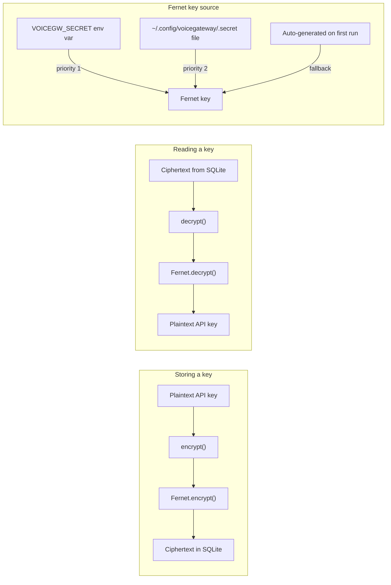

VoiceGateway encrypts all API keys stored in its database, masks secrets in API responses, and maintains an audit log of configuration changes.

## Fernet encryption

**File:** `src/voicegateway/core/crypto.py`

All API keys stored in the `managed_providers` table are encrypted with Fernet (AES-128-CBC with HMAC-SHA256 authentication) from the `cryptography` library.

### How it works


```mermaid
graph LR
    subgraph Write["Storing a key"]
        A["Plaintext API key"] --> B["encrypt()"]
        B --> C["Fernet.encrypt()"]
        C --> D["Ciphertext in SQLite"]
    end

    subgraph Read["Reading a key"]
        E["Ciphertext from SQLite"] --> F["decrypt()"]
        F --> G["Fernet.decrypt()"]
        G --> H["Plaintext API key"]
    end

    subgraph Key["Fernet key source"]
        K1["VOICEGW_SECRET env var"]
        K2["~/.config/voicegateway/.secret file"]
        K3["Auto-generated on first run"]
        K1 -->|priority 1| FK["Fernet key"]
        K2 -->|priority 2| FK
        K3 -->|fallback| FK
    end
```

### Secret key resolution

The Fernet key is resolved in this order:

1. `VOICEGW_SECRET` environment variable. Highest priority, recommended for containerized deployments.
2. `~/.config/voicegateway/.secret` file. Persisted on disk with `chmod 600` permissions.
3. Auto-generated on first run. A new Fernet key is generated and saved to the secret file.

A `VOICEGW_SECRET_FALLBACK` variable is also supported for zero-downtime key rotation: the gateway attempts decryption with the primary key first, then falls back to the secondary key.

```python
def get_secret() -> bytes:
    # 1. Check env
    env_secret = os.environ.get("VOICEGW_SECRET")
    if env_secret:
        return env_secret.encode()

    # 2. Check file
    if _SECRET_FILE.exists():
        _SECRET_FILE.chmod(stat.S_IRUSR | stat.S_IWUSR)  # enforce 0600
        return _SECRET_FILE.read_bytes().strip()

    # 3. Generate and persist atomically
    key = Fernet.generate_key()
    # Write to .secret.tmp then os.replace() for atomicity
    ...
    return key
```

The auto-generation uses `os.replace()` for atomic file creation. The file is created with `0600` permissions from the start and never exists in a world-readable state.

### Encryption API

```python
from voicegateway.core.crypto import encrypt, decrypt, mask, is_fernet_token

# Encrypt a plaintext string
ciphertext = encrypt("sk-abc123...")
# "gAAAAABl..."

# Decrypt back to plaintext
plaintext = decrypt(ciphertext)
# "sk-abc123..."

# Check if a value is encrypted
is_fernet_token(ciphertext)  # True
is_fernet_token("sk-abc123")  # False

# Mask a secret for display
mask("sk-abc123456789")
# "sk-a...6789"
```

Empty strings pass through `encrypt()` and `decrypt()` unchanged.

### Key rotation

If `VOICEGW_SECRET` changes or the `.secret` file is deleted, existing encrypted values fail to decrypt. The `decrypt()` function raises a clear `ValueError`:

```
Failed to decrypt managed credential. This typically means VOICEGW_SECRET
changed since the value was stored. Re-add the affected providers via the
dashboard or MCP.
```

<Warning>
Losing the Fernet key means losing all managed provider credentials stored in SQLite. Back up `VOICEGW_SECRET` or the `.secret` file the same way you back up any other secret.
</Warning>

## API key masking

All API responses that include provider information mask the API key using `mask()`:

```python
def mask(value: str) -> str:
    if len(value) <= 8:
        return "*" * len(value)
    return f"{value[:4]}...{value[-4:]}"
```

Examples:
- `"sk-proj-abc123xyz789"` becomes `"sk-p...z789"`
- `"short"` becomes `"*****"`
- `""` becomes `""`

Masking is applied in the HTTP API and MCP server responses. Plaintext keys never appear in API output.

## Plaintext key migration

When VoiceGateway opens a database created before encryption was added, it automatically detects and migrates plaintext API keys:

```python
async def _migrate_plaintext_keys(self, db):
    cursor = await db.execute(
        "SELECT provider_id, api_key_encrypted FROM managed_providers "
        "WHERE api_key_encrypted != ''"
    )
    for row in rows:
        if not is_fernet_token(raw_key):
            encrypted = encrypt(raw_key)
            await db.execute("UPDATE ... SET api_key_encrypted = ?", (encrypted,))
    if migrated:
        logger.warning("Migrated %d plaintext API key(s) to encrypted storage.", migrated)
```

This runs on first connection and logs a warning for each migrated key.

## MCP token authentication

The MCP server authenticates callers with a bearer token. Set `VOICEGW_MCP_TOKEN` to a strong random string. Any request without a matching `Authorization: Bearer <token>` header is rejected with 401.

If `VOICEGW_MCP_TOKEN` is not set, the MCP server starts without authentication. This is acceptable for local development but should not be used in shared or networked environments.

## Tenant isolation

In multi-tenant cloud deployments, tenant identity is derived server-side from the ingest API key (`vk_` prefix). The key is presented as a bearer token on `POST /v1/ingest` and `POST /v1/agents/heartbeat`. The tenant ID from the key is stamped on every record at ingest time.

Key rules:
- A worker or record can only be written under the key's tenant. The `tenant_id` field in request bodies is advisory only and cannot override the key-derived tenant.
- `VOICEGW_API_KEY` is the agent-side variable that holds the `vk_` key. Set it in the agent process environment.
- The cloud verifies the key and resolves the tenant before any write.

See [fleet worker heartbeat](/architecture/fleet-worker-heartbeat) for the full ingestion contract.

## Audit log

**Table:** `config_audit_log`

Every create, update, or delete on managed resources is recorded.

| Field | Description |
|---|---|
| `timestamp` | When the change was made |
| `entity_type` | `"provider"`, `"model"`, or `"project"` |
| `entity_id` | ID of the affected resource |
| `action` | `"create"`, `"update"`, or `"delete"` |
| `changes_json` | JSON describing what changed |
| `source` | `"api"`, `"mcp"`, or `"dashboard"` |

### Querying the audit log

```python
# Get recent entries
entries = await storage.get_audit_log(limit=50)

# Filter by entity type
entries = await storage.get_audit_log(entity_type="provider")

# Filter by specific entity
entries = await storage.get_audit_log(entity_type="model", entity_id="openai/gpt-4.1-mini")

# Filter by action
entries = await storage.get_audit_log(action="delete")
```

The audit log write is best-effort: it never raises exceptions, to avoid blocking the actual operation if logging fails.

## Security checklist

| Concern | Mitigation |
|---|---|
| API keys at rest | Fernet encryption (AES-128-CBC + HMAC-SHA256) |
| Secret key storage | `chmod 600` file or `VOICEGW_SECRET` env var |
| API key exposure in responses | `mask()` applied to all API/MCP output |
| Configuration changes | Audit log with timestamp, actor, and changes |
| Plaintext key migration | Auto-detected and encrypted on startup |
| Atomic secret file creation | `os.replace()` prevents partial writes |
| Secret key change detection | Clear error message with recovery instructions |
| MCP access control | Bearer token via `VOICEGW_MCP_TOKEN` |
| Tenant isolation | Key-derived tenant stamped server-side on ingest |

## Related pages

<CardGroup cols={2}>
  <Card title="Storage" href="/architecture/storage">
    The SQLite tables where encrypted keys are stored.
  </Card>
  <Card title="Fleet worker heartbeat" href="/architecture/fleet-worker-heartbeat">
    Tenant isolation rules for the heartbeat ingest contract.
  </Card>
  <Card title="Configuration layers" href="/architecture/config-layers">
    How managed provider credentials flow into the resolved config.
  </Card>
  <Card title="Environment variables" href="/configuration/environment-variables">
    All VOICEGW_SECRET, VOICEGW_MCP_TOKEN, and related env vars.
  </Card>
</CardGroup>
