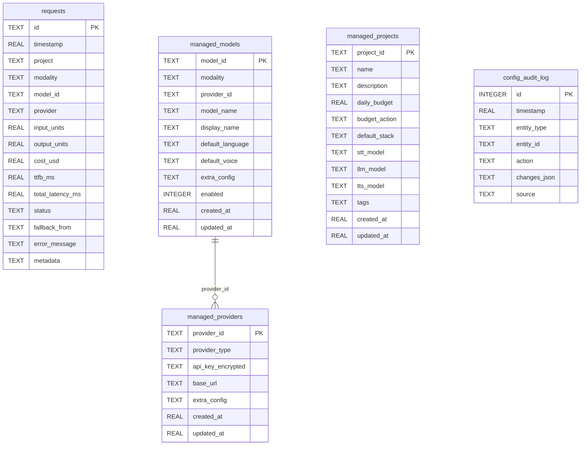

# Storage

VoiceGateway uses SQLite via `aiosqlite` for all persistent data: request logs, cost tracking, managed configuration, and audit trails.

**File:** `voicegateway/storage/sqlite.py`

## Database Location

The database path is resolved in this priority order:

1. `VOICEGW_DB_PATH` environment variable
2. `cost_tracking.db_path` in `voicegw.yaml`
3. Default: `~/.config/voicegateway/voicegw.db`

The parent directory is created automatically on first access.

## Schema Overview



## Tables

### `requests`

The primary table for all inference request logs. Every call through the Gateway that completes (or fails) is recorded here.

| Column | Type | Description |
|--------|------|-------------|
| `id` | TEXT PK | UUID v4 |
| `timestamp` | REAL | Unix epoch (seconds) |
| `project` | TEXT | Project ID (default: `"default"`) |
| `modality` | TEXT | `"stt"`, `"llm"`, or `"tts"` |
| `model_id` | TEXT | Full model ID, e.g. `"deepgram/nova-3"` |
| `provider` | TEXT | Provider name, e.g. `"deepgram"` |
| `input_units` | REAL | Minutes (STT), input tokens (LLM), characters (TTS) |
| `output_units` | REAL | Output tokens (LLM only) |
| `cost_usd` | REAL | Calculated cost in USD |
| `ttfb_ms` | REAL | Time to first byte in milliseconds |
| `total_latency_ms` | REAL | Total request latency in milliseconds |
| `status` | TEXT | `"success"` or `"error"` |
| `fallback_from` | TEXT | Original model ID if this was a fallback |
| `error_message` | TEXT | Error details if status is `"error"` |
| `metadata` | TEXT | JSON blob for additional data |

### `managed_providers`

Providers added via the dashboard or MCP server (as opposed to YAML). API keys are encrypted with Fernet.

| Column | Type | Description |
|--------|------|-------------|
| `provider_id` | TEXT PK | Unique identifier (e.g. `"my-openai"`) |
| `provider_type` | TEXT | Provider type from registry (e.g. `"openai"`) |
| `api_key_encrypted` | TEXT | Fernet-encrypted API key |
| `base_url` | TEXT | Custom base URL (for proxies or self-hosted) |
| `extra_config` | TEXT | JSON blob for additional config |
| `created_at` | REAL | Unix epoch |
| `updated_at` | REAL | Unix epoch |

### `managed_models`

Models registered via the dashboard or MCP server.

| Column | Type | Description |
|--------|------|-------------|
| `model_id` | TEXT PK | Full model ID (e.g. `"openai/gpt-4.1-mini"`) |
| `modality` | TEXT | `"stt"`, `"llm"`, or `"tts"` |
| `provider_id` | TEXT | References `managed_providers.provider_id` |
| `model_name` | TEXT | Actual model name sent to the provider API |
| `display_name` | TEXT | Human-readable name for the dashboard |
| `default_language` | TEXT | Default language code for STT |
| `default_voice` | TEXT | Default voice ID for TTS |
| `extra_config` | TEXT | JSON blob |
| `enabled` | INTEGER | `1` = active, `0` = disabled |
| `created_at` | REAL | Unix epoch |
| `updated_at` | REAL | Unix epoch |

### `managed_projects`

Projects created via the dashboard or MCP server.

| Column | Type | Description |
|--------|------|-------------|
| `project_id` | TEXT PK | Unique identifier |
| `name` | TEXT | Display name |
| `description` | TEXT | Project description |
| `daily_budget` | REAL | Daily budget in USD (0 = unlimited) |
| `budget_action` | TEXT | `"warn"`, `"throttle"`, or `"block"` |
| `default_stack` | TEXT | Default stack name |
| `stt_model` | TEXT | Default STT model ID |
| `llm_model` | TEXT | Default LLM model ID |
| `tts_model` | TEXT | Default TTS model ID |
| `tags` | TEXT | JSON array of tag strings |
| `created_at` | REAL | Unix epoch |
| `updated_at` | REAL | Unix epoch |

### `config_audit_log`

Records all changes to managed resources for compliance and debugging.

| Column | Type | Description |
|--------|------|-------------|
| `id` | INTEGER PK | Auto-increment |
| `timestamp` | REAL | Unix epoch |
| `entity_type` | TEXT | `"provider"`, `"model"`, or `"project"` |
| `entity_id` | TEXT | ID of the affected entity |
| `action` | TEXT | `"create"`, `"update"`, or `"delete"` |
| `changes_json` | TEXT | JSON blob describing what changed |
| `source` | TEXT | `"api"`, `"mcp"`, or `"dashboard"` |

## Views

### `daily_costs`

Aggregates request data by day, modality, model, and provider.

```sql
CREATE VIEW daily_costs AS
SELECT
    date(timestamp, 'unixepoch') as day,
    modality,
    model_id,
    provider,
    COUNT(*) as request_count,
    SUM(cost_usd) as total_cost,
    AVG(ttfb_ms) as avg_ttfb,
    AVG(total_latency_ms) as avg_latency
FROM requests
GROUP BY day, modality, model_id, provider;
```

### `project_daily_costs`

Aggregates request data by project, day, modality, and model.

```sql
CREATE VIEW project_daily_costs AS
SELECT
    project,
    date(timestamp, 'unixepoch') as day,
    modality,
    model_id,
    COUNT(*) as request_count,
    SUM(cost_usd) as total_cost,
    AVG(ttfb_ms) as avg_ttfb
FROM requests
GROUP BY project, day, modality, model_id;
```

## Indexes

| Index | Table | Column(s) | Purpose |
|-------|-------|-----------|---------|
| `idx_requests_timestamp` | requests | `timestamp` | Time-range queries |
| `idx_requests_model` | requests | `model_id` | Per-model aggregation |
| `idx_requests_modality` | requests | `modality` | Filter by STT/LLM/TTS |
| `idx_requests_project` | requests | `project` | Per-project queries |
| `idx_requests_project_timestamp` | requests | `project, timestamp` | Project cost summaries |
| `idx_audit_timestamp` | config_audit_log | `timestamp` | Recent audit entries |
| `idx_audit_entity` | config_audit_log | `entity_type, entity_id` | Entity history lookup |
| `idx_managed_providers_type` | managed_providers | `provider_type` | Filter by provider type |
| `idx_managed_models_modality` | managed_models | `modality` | Filter by modality |
| `idx_managed_models_provider` | managed_models | `provider_id` | Models per provider |

## Connection Management

`SQLiteStorage` opens a fresh `aiosqlite` connection per call and closes it in a `finally` block. There is no connection pooling -- this keeps things simple and avoids connection state issues with async code.

On first connection, the schema DDL is executed via `executescript()`, and a migration check adds the `project` column to older databases. The `_initialized` flag prevents re-running the schema on subsequent connections.

## Auto-Migration

When VoiceGateway opens a database created by an older version:

1. **Missing `project` column:** automatically added with `ALTER TABLE` and `DEFAULT 'default'`
2. **Plaintext API keys:** detected via `is_fernet_token()` and re-encrypted in place with a warning log
