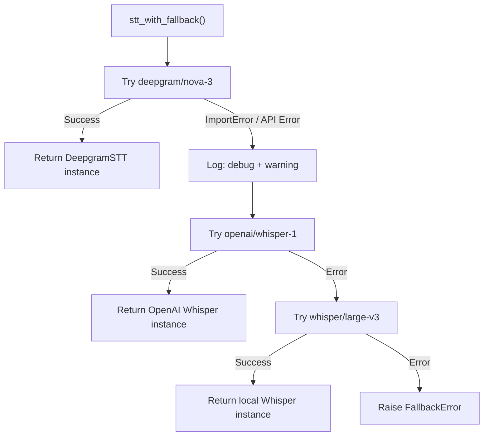

# Fallback Chains

Configure automatic failover between models so your voice agent stays available even when a provider goes down.

## Configuration

```yaml
providers:
  deepgram:
    api_key: ${DEEPGRAM_API_KEY}
  openai:
    api_key: ${OPENAI_API_KEY}
  cartesia:
    api_key: ${CARTESIA_API_KEY}
  elevenlabs:
    api_key: ${ELEVENLABS_API_KEY}
  groq:
    api_key: ${GROQ_API_KEY}

models:
  stt:
    deepgram/nova-3:
      provider: deepgram
      model: nova-3
    openai/whisper-1:
      provider: openai
      model: whisper-1
    whisper/large-v3:
      provider: whisper
      model: large-v3
  llm:
    openai/gpt-4.1-mini:
      provider: openai
      model: gpt-4.1-mini
    groq/llama-3.3-70b-versatile:
      provider: groq
      model: llama-3.3-70b-versatile
    ollama/qwen2.5:3b:
      provider: ollama
      model: qwen2.5:3b
  tts:
    cartesia/sonic-3:
      provider: cartesia
      model: sonic-3
      default_voice: 794f9389-aac1-45b6-b726-9d9369183238
    elevenlabs/turbo-v2.5:
      provider: elevenlabs
      model: eleven_turbo_v2_5
      default_voice: pNInz6obpgDQGcFmaJgB
    kokoro/default:
      provider: kokoro
      model: default

# Fallback chains: first model is primary, rest are backups
fallbacks:
  stt:
    - deepgram/nova-3       # Primary: fastest, best accuracy
    - openai/whisper-1       # Backup: good accuracy, higher latency
    - whisper/large-v3       # Last resort: local, no API dependency
  llm:
    - openai/gpt-4.1-mini   # Primary: best quality
    - groq/llama-3.3-70b-versatile  # Backup: fast, good quality
    - ollama/qwen2.5:3b     # Last resort: local
  tts:
    - cartesia/sonic-3       # Primary: lowest latency
    - elevenlabs/turbo-v2.5  # Backup: highest quality
    - kokoro/default         # Last resort: local

cost_tracking:
  enabled: true
```

## Using Fallback Chains

```python
from voicegateway import Gateway

gw = Gateway()

# Use the fallback chain -- tries each model in order
stt = gw.stt_with_fallback(project="prod")
llm = gw.llm_with_fallback(project="prod")
tts = gw.tts_with_fallback(project="prod")
```

## How Fallback Works



When a model fails:

1. The exception is caught and logged at `DEBUG` level
2. If a backup succeeds, a `WARNING` is logged: `"Fallback triggered: deepgram/nova-3 -> openai/whisper-1 (reason: Connection timeout)"`
3. The `RequestLogger.log_fallback()` callback fires
4. If all models fail, `FallbackError` is raised with the full chain and all errors

## Handling FallbackError

```python
from voicegateway.middleware.fallback import FallbackError

try:
    stt = gw.stt_with_fallback(project="prod")
except FallbackError as e:
    print(f"All STT models failed!")
    print(f"Chain tried: {e.chain}")
    for model_id, error in e.errors:
        print(f"  {model_id}: {error}")
    # Handle gracefully -- notify ops, use a cached response, etc.
```

## Mixing Direct and Fallback Calls

You can use direct model calls for some modalities and fallback chains for others:

```python
# STT with fallback (high availability)
stt = gw.stt_with_fallback(project="prod")

# LLM direct (you want a specific model for prompt compatibility)
llm = gw.llm("openai/gpt-4.1-mini", project="prod")

# TTS with fallback
tts = gw.tts_with_fallback(project="prod")
```

## Fallback Chain Properties

```python
from voicegateway.middleware.fallback import FallbackChain

# Access the chain configuration
chain = gw._fallback_chains["stt"]

# Primary model
print(chain.primary)  # "deepgram/nova-3"

# Full chain
print(chain.chain)  # ["deepgram/nova-3", "openai/whisper-1", "whisper/large-v3"]
```

## Monitoring Fallback Events

### Log Output

When fallbacks are triggered, you will see logs like:

```
WARNING - [FALLBACK] deepgram/nova-3 -> openai/whisper-1 (reason: Connection refused)
```

### Via the HTTP API

Fallback events are recorded in the `requests` table with the `fallback_from` field:

```bash
# Get recent requests, filter for fallbacks
curl "http://localhost:8080/v1/logs?limit=100" | \
  jq '[.[] | select(.fallback_from != null)]'
```

### Dashboard

The dashboard shows fallback events in the request log view, highlighted with a distinct indicator showing the original model and the fallback target.

## Cloud-to-Local Fallback Strategy

A common pattern is to configure cloud models as primaries with local models as the final fallback, ensuring your agent never goes completely offline:

```yaml
fallbacks:
  stt:
    - deepgram/nova-3       # Cloud: best accuracy
    - whisper/large-v3       # Local: works offline
  llm:
    - openai/gpt-4.1-mini   # Cloud: best quality
    - ollama/qwen2.5:3b     # Local: works offline
  tts:
    - cartesia/sonic-3       # Cloud: lowest latency
    - kokoro/default         # Local: works offline
```

This guarantees that even if all cloud providers are down, your agent can still function using local models. The quality may degrade, but the service stays available.

## LiveKit Agent with Fallback

```python
from livekit.agents import AutoSubscribe, JobContext, WorkerOptions, cli, llm as lk_llm
from livekit.agents.voice_assistant import VoiceAssistant
from voicegateway import Gateway
from voicegateway.middleware.fallback import FallbackError

gw = Gateway()


async def entrypoint(ctx: JobContext):
    await ctx.connect(auto_subscribe=AutoSubscribe.AUDIO_ONLY)

    try:
        stt = gw.stt_with_fallback(project="prod")
        llm = gw.llm_with_fallback(project="prod")
        tts = gw.tts_with_fallback(project="prod")
    except FallbackError as e:
        # All providers down -- cannot start
        print(f"Cannot start voice agent: {e}")
        return

    initial_ctx = lk_llm.ChatContext()
    initial_ctx.append(role="system", text="You are a helpful voice assistant.")

    assistant = VoiceAssistant(stt=stt, llm=llm, tts=tts, chat_ctx=initial_ctx)
    assistant.start(ctx.room)
    await assistant.say("Hello! How can I help you?")


if __name__ == "__main__":
    cli.run_app(WorkerOptions(entrypoint_fnc=entrypoint))
```
