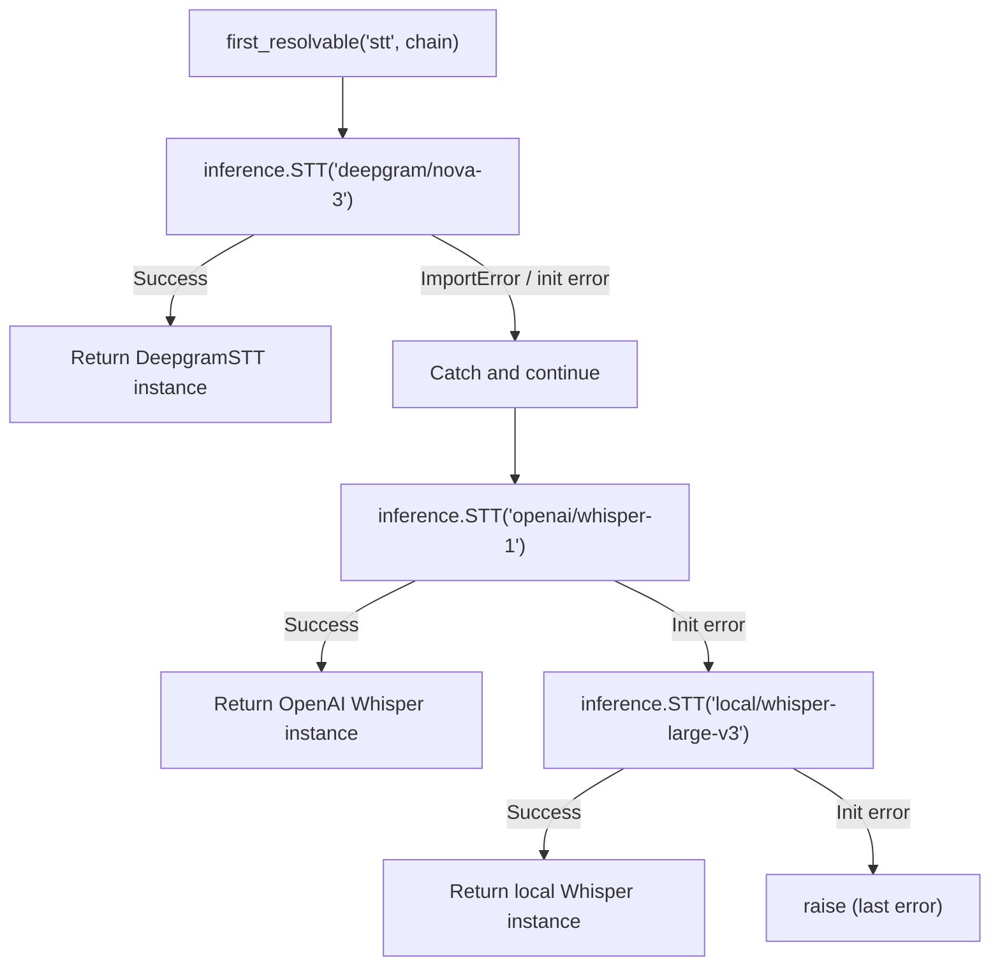

# Fallback Chains

Resolver-time fallback at agent startup: walk a chain of model ids and pass the first one whose `inference.STT/LLM/TTS` factory builds cleanly into `AgentSession`. Useful when a primary provider's credentials are temporarily wrong, its plugin SDK is missing, or its initialization handshake fails.

Once a model is wired into a LiveKit `AgentSession`, that resolved model is used for the entire call. VoiceGateway does not swap providers mid-call. For runtime failover when a provider degrades during an active call, compose LiveKit's `FallbackAdapter` around VG `inference.*` instances; see [LiveKit FallbackAdapter integration](/examples/livekit-fallback-adapter).

v0.0.5 has no built-in fallback middleware. v0.0.6 will add a first-class `fallback=` parameter to the `inference` factories so the manual walk pattern below goes away.

## Configuration

```yaml
projects:
  prod:
    name: Production
    daily_budget: 50.00
    budget_action: warn
    providers:
      deepgram:
        api_key: ${DEEPGRAM_API_KEY}
      openai:
        api_key: ${OPENAI_API_KEY}
      cartesia:
        api_key: ${CARTESIA_API_KEY}
      elevenlabs:
        api_key: ${ELEVENLABS_API_KEY}
      groq:
        api_key: ${GROQ_API_KEY}

default_project: prod

# Fallback chains: first model is primary, rest are backups. v0.0.5
# stores them in YAML for documentation and the v0.0.6 inference
# factory's fallback= parameter; the manual walk below uses them too.
fallbacks:
  stt:
    - deepgram/nova-3              # Primary: fastest, best accuracy
    - openai/whisper-1             # Backup: good accuracy, higher latency
    - local/whisper-large-v3       # Last resort: local, no API dependency
  llm:
    - openai/gpt-4.1-mini          # Primary: best quality
    - groq/llama-3.3-70b-versatile # Backup: fast, good quality
    - ollama/qwen2.5:3b            # Last resort: local
  tts:
    - cartesia/sonic-3             # Primary: lowest latency
    - elevenlabs/turbo-v2.5        # Backup: highest quality
    - local/kokoro                 # Last resort: local

cost_tracking:
  enabled: true
```

## Using Fallback Chains

```python
from voicegateway import inference


def first_resolvable(modality: str, chain: list[str]):
    """Walk the chain, return the first inference instance that builds.

    Raises the last error if every model fails.
    """
    factory = {
        "stt": inference.STT,
        "llm": inference.LLM,
        "tts": inference.TTS,
    }[modality]
    last_error: Exception | None = None
    for model_id in chain:
        try:
            return factory(model_id)
        except Exception as exc:  # noqa: BLE001
            last_error = exc
    assert last_error is not None
    raise last_error


STT_CHAIN = ["deepgram/nova-3", "openai/whisper-1", "local/whisper-large-v3"]
LLM_CHAIN = [
    "openai/gpt-4.1-mini",
    "groq/llama-3.3-70b-versatile",
    "ollama/qwen2.5:3b",
]
TTS_CHAIN = ["cartesia/sonic-3", "elevenlabs/turbo-v2.5", "local/kokoro"]

stt = first_resolvable("stt", STT_CHAIN)
llm = first_resolvable("llm", LLM_CHAIN)
tts = first_resolvable("tts", TTS_CHAIN)
```

## How Fallback Works

The factory walk runs once at construction time:


```mermaid
graph TD
    A["first_resolvable('stt', chain)"] --> B["inference.STT('deepgram/nova-3')"]
    B -->|Success| C["Return DeepgramSTT instance"]
    B -->|ImportError / init error| D["Catch and continue"]
    D --> E["inference.STT('openai/whisper-1')"]
    E -->|Success| F["Return OpenAI Whisper instance"]
    E -->|Init error| G["inference.STT('local/whisper-large-v3')"]
    G -->|Success| H["Return local Whisper instance"]
    G -->|Init error| I["raise (last error)"]
```

Errors during an `AgentSession` are not in this picture; they propagate to the caller.

## LiveKit Agent with Fallback

```python
from livekit.agents import Agent, AgentSession, JobContext, WorkerOptions, cli
from livekit.plugins import silero
from voicegateway import inference


# (paste first_resolvable / STT_CHAIN / LLM_CHAIN / TTS_CHAIN from above)


async def entrypoint(ctx: JobContext):
    await ctx.connect()

    try:
        stt = first_resolvable("stt", STT_CHAIN)
        llm = first_resolvable("llm", LLM_CHAIN)
        tts = first_resolvable("tts", TTS_CHAIN)
    except Exception as e:
        # Every model in every chain failed to resolve at startup.
        print(f"Cannot start voice agent: {e}")
        return

    session = AgentSession(
        vad=silero.VAD.load(),
        stt=stt,
        llm=llm,
        tts=tts,
    )

    await session.start(
        agent=Agent(instructions="You are a helpful voice assistant."),
        room=ctx.room,
    )


if __name__ == "__main__":
    cli.run_app(WorkerOptions(entrypoint_fnc=entrypoint))
```

## Cloud-to-Local Fallback Strategy

A common pattern is cloud models as primaries with local models as the final fallback. This guarantees an agent can come up even when every cloud provider is unreachable:

```yaml
fallbacks:
  stt:
    - deepgram/nova-3
    - local/whisper-large-v3
  llm:
    - openai/gpt-4.1-mini
    - ollama/qwen2.5:3b
  tts:
    - cartesia/sonic-3
    - local/kokoro
```

This handles the cold-start case: every cloud provider unreachable when the agent starts means the local model is selected and the agent comes up. It does not handle the warm-failure case: if Deepgram is healthy at startup and starts returning 500s mid-call, VG keeps the Deepgram instance for the rest of the call. For warm failover, see [LiveKit FallbackAdapter integration](/examples/livekit-fallback-adapter).
