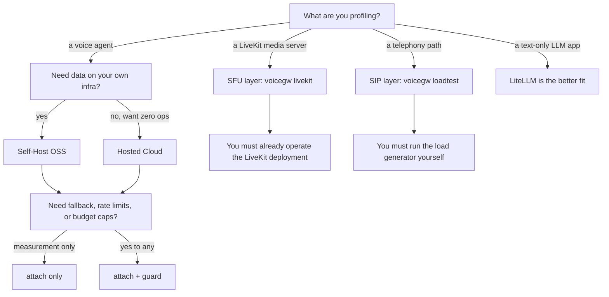

Three decisions, in this order. The first one matters most, because the three layers
need different things already running.

1. Which layer are you profiling: the agent, the SFU, or the SIP path?
2. Where does VoiceGateway run: self-hosted, or Hosted Cloud?
3. How much do you need: measurement only, or control as well?

## Decision 1: which layer

| | Agent | SFU | SIP |
|---|---|---|---|
| Answers | What did this call cost, and where did latency go? | Is the media server healthy, and what is its capacity? | Did the telephony path answer, and how fast? |
| You need | A pip install and provider API keys | A LiveKit deployment you operate, with credentials | A SIP load generator you run yourself |
| Entry point | [`attach()`](/guide/attach) | [`voicegw livekit`](/cli/livekit) | [`voicegw loadtest`](/cli/loadtest) |
| Start at | [Quickstart](/get-started) | [Distributed SFU](/deployment/distributed-sfu) | [Load test evidence](/cli/loadtest) |

The agent layer stands alone. You can profile cost and latency without operating any
infrastructure beyond your own agent process. The SFU and SIP layers assume you already
run the deployment under test, which is a different job and often a different person.

Most people start at the agent layer and stay there. That is a complete use of the
tool, not a partial one. Full detail in
[What you can profile](/guide/what-you-can-profile).

## Decision 2: self-host or Hosted Cloud

| | Self-Host (OSS) | Hosted Cloud |
|---|---|---|
| Storage | SQLite, single process | ClickHouse, multi-tenant |
| Ingest | local sink, no network hop | push to `VOICEGW_COLLECTOR_URL` |
| Dashboard | `voicegw serve` on port 8080 | `dash.voicegateway.dev` |
| Setup | `pip install voicegateway` plus `voicegw.yaml` | three env vars |
| Horizontal scale | single instance | managed |
| Right for | local dev, small teams, self-managed infra | multi-agent fleets, SaaS products, agency work |

<Note>
`attach()` and `guard()` behave identically on both. Only the sink that receives the
records changes. The SFU and SIP layers are self-host tools: they run from your CLI
against infrastructure you control.
</Note>

**Choose self-host when** you need data on your own infrastructure, you are building a
single-team product, or you want to iterate locally before paying for cloud ingest.

**Choose Hosted Cloud when** you run agents across several machines and want one
dashboard, you need per-tenant cost isolation for a SaaS product, or you want no ops.

See [Hosted Cloud quickstart](/hosted/quickstart) for the three-variable setup.

## Decision 3: measure only, or control too

| | `attach()` only | `attach()` + `guard()` |
|---|---|---|
| Per-call cost tracking | Yes | Yes |
| Per-modality latency | Yes | Yes |
| Fallback on provider error | No | Yes |
| Rate limiting | No | Yes |
| Spend caps | No | Yes |
| Change to your provider setup | None | Wrap the provider in `guard(...)` |

**Use `attach()` alone when** you want visibility without changing provider behavior,
or you are adding VoiceGateway to an existing agent and want the smallest diff.

**Add `guard()` when** you need a fallback provider, a per-project spend cap, or a rate
limit against a provider with strict quota.

## Decision flow

## Where to go next

<CardGroup cols={2}>
  <Card title="Quickstart" icon="bolt" href="/get-started">
    Agent layer, self-hosted. Install, attach, first cost row.
  </Card>
  <Card title="What you need" icon="list-check" href="/guide/prerequisites">
    Prerequisites for all three layers, side by side.
  </Card>
  <Card title="Hosted Cloud" icon="cloud" href="/hosted/quickstart">
    Three env vars and your agent reports to the cloud dashboard.
  </Card>
  <Card title="How VoiceGateway compares" icon="scale-balanced" href="/guide/comparison">
    Against LiteLLM, OpenRouter, Cloudflare AI Gateway, and LiveKit Inference.
  </Card>
</CardGroup>
