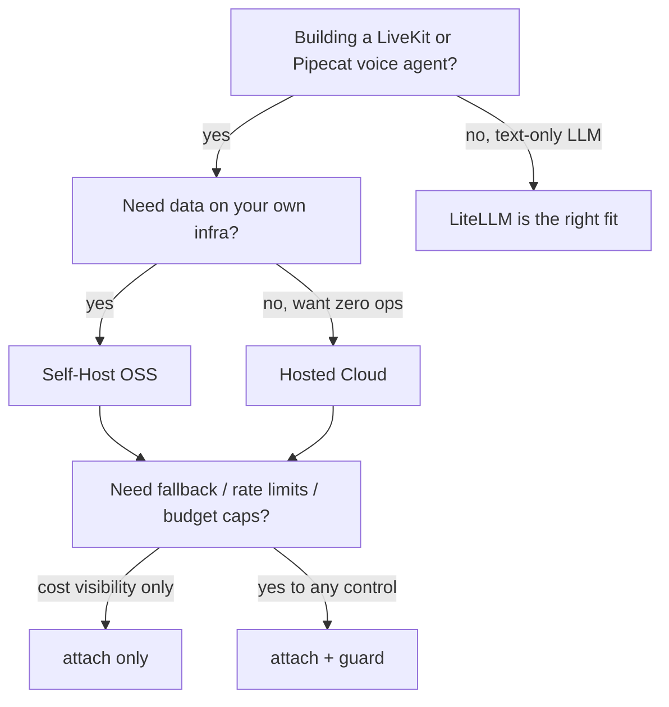

This page helps you pick the right combination before you write any code. Two decisions:

1. Where does VoiceGateway run? (self-host the OSS daemon vs use Hosted Cloud)
2. How much do you need? (cost visibility only vs control over fallback, rate limits, and budgets)

## Axis 1: self-host or Hosted Cloud

| | Self-Host (OSS) | Hosted Cloud |
|---|---|---|
| Storage | SQLite, single process | ClickHouse, multi-tenant |
| Ingest | local sink (no network hop) | push to `VOICEGW_COLLECTOR_URL` |
| Dashboard | `voicegw dashboard` (port 9090) | `dash.voicegateway.dev` |
| Setup | `pip install voicegateway` + `voicegw.yaml` | 2 env vars (`VOICEGW_COLLECTOR_URL`, `VOICEGW_API_KEY`) + `project=` in your `attach()` call |
| Horizontal scale | single instance | managed, no ops |
| Right for | local dev, small teams, self-managed infra | multi-agent fleets, SaaS products, agency work |

<Note>
The `attach()` and `guard()` seams work identically on both paths. The only difference is which sink receives the records.
</Note>

### Choose self-host when

- You need data on your own infrastructure (compliance, air-gap, cost control).
- You are building a single-team product or a personal project.
- You want to iterate locally before paying for cloud ingest.

### Choose Hosted Cloud when

- You run multiple agents across machines and want a single dashboard.
- You are building a SaaS product and need per-tenant cost isolation.
- You want zero ops: no SQLite file to manage, no dashboard process to keep running.

See [Hosted Cloud quickstart](/hosted/quickstart) for the three-env-var setup.

## Axis 2: observe-only or observe + control

| | `attach()` only | `attach()` + `guard()` |
|---|---|---|
| Per-call cost tracking | Yes | Yes |
| Per-modality latency | Yes | Yes |
| Fallback on provider error | No | Yes |
| Rate limiting | No | Yes |
| Spend caps (warn/throttle/block) | No | Yes |
| Code change to provider setup | None | Wrap provider in `guard(...)` |

### Use `attach()` only when

- You want cost and latency visibility without changing provider behavior.
- You are adding VoiceGateway to an existing agent and want the smallest diff.
- You trust your providers to be reliable and have no budget enforcement requirement.

### Add `guard()` when

- You need a fallback provider (primary goes down, switch to backup).
- You want to enforce a per-project or per-day spend cap.
- You need to rate-limit calls to a provider that has strict quota limits.

## Decision flow

## Quick-start paths

<CardGroup cols={2}>
  <Card title="Self-host: Quick start" icon="server" href="/guide/quick-start">
    Install the OSS package, write a voicegw.yaml, and attach to your first agent.
  </Card>
  <Card title="Hosted Cloud" icon="cloud" href="/hosted/quickstart">
    Two env vars plus one `attach()` call and your agent is sending data to the cloud dashboard.
  </Card>
  <Card title="attach() reference" icon="eye" href="/guide/attach">
    Full signature, options, and LiveKit / Pipecat examples.
  </Card>
  <Card title="guard() reference" icon="shield" href="/guide/guard">
    Fallback chains, rate limits, and spend caps: full reference.
  </Card>
</CardGroup>

## Comparison to other tools

| If you are... | Use |
|---|---|
| Building a LiveKit or Pipecat voice agent and want per-modality cost tracking | VoiceGateway |
| Self-hosting voice with local + cloud model unification | VoiceGateway |
| Building a text-only LLM app (chatbot, RAG, code generation) | [LiteLLM](https://docs.litellm.ai/) |
| Wanting a hosted multi-tenant LLM proxy with no infrastructure | [OpenRouter](https://openrouter.ai/) |
| At production scale on Cloudflare and want a gateway in that stack | [Cloudflare AI Gateway](https://developers.cloudflare.com/ai-gateway/) |
| On managed LiveKit Cloud and happy with bundled inference pricing | LiveKit Inference (built into LiveKit Cloud) |

<Tip>
Jump to the [quick start](/guide/quick-start) to try VoiceGateway in five minutes. The integration is small enough that finding the right shape is cheap.
</Tip>
